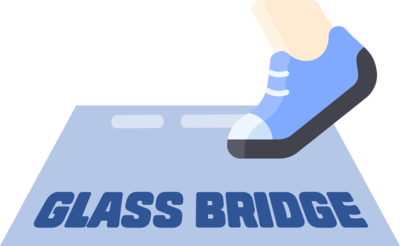

    

# 프리코스 4주차 미션 - 다리 건너기

> 📢 이번 게임은 다리 건너기입니다. 안전한 다리를 골라서 반대편까지 건너가면 우승입니다!
 

## 기능 목록

### 1. 입력값 받기 (다리 길이)
- 🚨`InputView` 클래스의 `readBridgeSize`메소드를 이용한다.
- 다리 길이를 입력 받는다.
  - 숫자인가?
  - 3 ~ 20 사이인가?
- 올바른 값이 아니면 <i><b>예외 처리 & 에러 메시지 출력 & 다시 입력</b></i> 받는다.

### 2. 답안용 다리 만들기
- 🚨`BridgeMaker` 클래스의 `makeBridge`메소드를 이용한다. (매개값은 앞서 입력 받은 다리 길이)
- 🚨다리를 생성할 때 위 칸과 아래 칸 중 건널 수 있는 칸은 0과 1 중 무작위 값을 이용해서 정한다. (`BridgeRandomNumberGenerator` 클래스의 `generate`메소드를 이용)
- 무작위 값이 0인 경우 아래 칸, 1인 경우 위 칸이 건널 수 있는 칸이 된다.
- 위 칸이면 "U", 아래 칸이면 "D"로 표현한다.

### 3. 플레이어의 이동 과정 기록하기
- 이동할 수 있는 칸을 선택한 경우 O로 표시한다.
- 이동할 수 없는 칸을 선택한 경우 X로 표시한다.
- 선택하지 않은 칸은 공백 한 칸으로 표시한다.

### 4. 입력값 받기 (이동할 칸)
- 🚨`InputView` 클래스의 `readMoving` 메소드를 이용한다.
- 이동할 칸을 입력 받는다.
  - 알파벳인가?
  - 대문자 "U" 또는 "D"인가? (대문자로 변환 후 검사)
- 올바른 값이 아니면 <i><b>예외 처리 & 에러 메시지 출력 & 다시 입력</b></i> 받는다.

### 5. 플레이어 이동
- 🚨`BridgeGame`클래스의 `move` 메소드를 이용한다.
- 플레이어가 건너기로 정한 칸과 답안용 다리의 칸이 일치하면 "O"를 반환한다.
- 플레이어의 건너기로 정한 칸과 답안용 다리의 칸이 일치하지 않으면 "X"를 반환한다.
- 매 단계마다 이동 결과를 3번에 반영한다.

### 6. 다리 건너기 결과 출력하기
- 🚨`OutputView` 클래스의 `printMap` 메소드를 이용한다.
- 다리의 시작은 `[`, 다리의 끝은 `]`으로 표시한다.
- 다리 칸의 구분은 `|`(앞뒤 공백 포함) 문자열로 구분한다.
- 현재까지 건넌 다리를 모두 출력한다.

### 7. 게임 진행 기록하기
- 시도 횟수의 초깃값은 1이다.
- 5번에서 "O"가 나오면 다리를 전부 건널 때까지 4 ~ 6번을 반복한다.
- 5번에서 "X"가 나오면 플레이어에게 게임을 다시 시도할지 묻는다.
- 🚨게임을 다시 시도한다면 시도 횟수를 +1 하고 기존의 다리를 다시 처음부터 건넌다. (`BridgeGame`클래스의 `retry` 메소드를 이용)
- 게임을 종료한다면 8번으로 간다.

### 7-1. 입력값 받기 (게임 재개 여부)
- 🚨`InputView` 클래스의 `readGameCommand` 메소드를 이용한다.
- 게임 재개 여부를 입력 받는다.
  - 알파벳인가?
  - 대문자 "R" 또는 "Q"인가? (대문자로 변환 후 검사)
- 올바른 값이 아니면 <i><b>예외 처리 & 에러 메시지 출력 & 다시 입력</b></i> 받는다.

### 8. 게임 결과 출력하기
- 🚨`OutputView`클래스의 `printResult` 메소드를 이용한다.
- 다리를 전부 건너면 성공으로 간주하고, 다리 건너기 결과와 총 시도 횟수를 출력한다.
- 7번에서 게임을 종료하면 실패로 간주하고, 다리 건너기 결과와 총 시도 횟수를 출력한다.

---
## 이미지 출처
<a href="https://www.flaticon.com/free-icons/walk" title="walk icons">Walk icons created by Vitaly Gorbachev - Flaticon</a>
