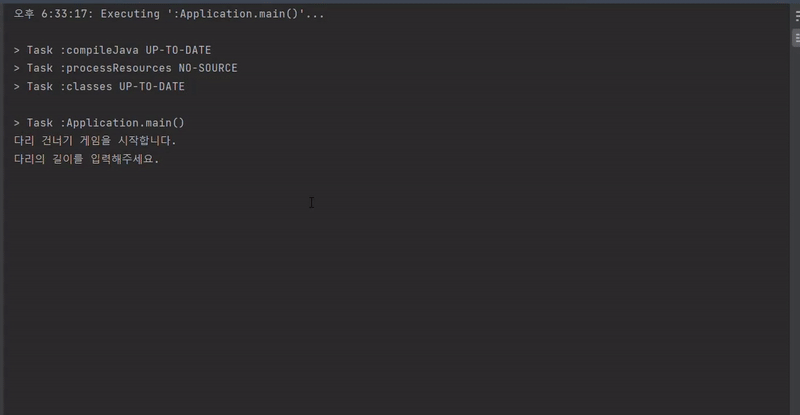

<p align="center">
    
</p>

# 미션 - 다리 건너기

###### `우아한테크코스 4주차 미션을 진행한 저장소 입니다.`


###### `WARNING 메세지는 무시하셔도 됩니다.`

## 🔍 프로그램 소개
#### 사용자의 입력으로부터 랜덤한 다리를 생성하고, 이를 건너는 프로그램 입니다.


## 🚀 사용자 유의 사항
`사용자로부터 생성할 다리의 크기와 이동 명령 등을 입력받습니다.`
```
- 다리 길이는 3 ~ 20사이의 숫자이다.
- 윗 칸으로 이동시, 'U' 명령어를 사용한다.
- 아래칸으로 이동시, 'D' 명령어를 사용한다.
- 다리를 건너다 실패할 경우, 재시작은 'R', 종료는 'Q' 명령어를 사용한다.
- 'R' 명령을 통해 게임을 재시작 할 경우, 기존에 생성된 다리를 재사용 한다.
```

