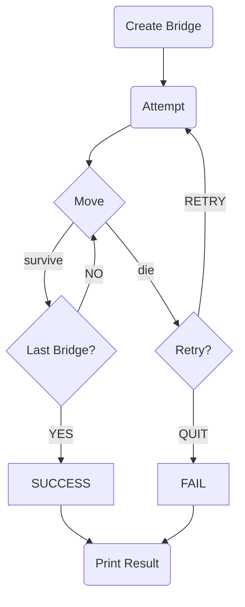

# 미션 - 다리 건너기

## ✅ 게임 플로우차트



## 📄 MVC 모델을 적용한 기능 설명

> 아래 규칙을 지키며 **MVC 패턴**을 적용하려 노력했습니다.
>- Model 내부에 Controller와 View에 관련된 코드가 있으면 안 된다. ✅
>- View는 내부에 Model의 코드만 있을 수 있고, Controller의 코드가 있으면 안 된다. ✅
>- View가 Model로부터 데이터를 받을 때는, 사용자마다 다르게 보여줘야 하는 데이터에 대해서만 받아야 한다. ✅
>- Controller 내부에는 Model과 View의 코드가 있어도 된다. ✅
>- View가 Model로부터 데이터를 받을 때, 반드시 Controller에서 받아야 한다. ✅

---

### 1. Model ✅

#### `Bridge`

- 다리를 리스트 형태로 관리한다.
- `index`와 사용자가 선택한 `position`을 받아, 사용자의 생존 여부를 `boolean` 형태로 반환한다. `isSamePosition`
- 다리의 길이를 반환한다. `size`

#### `BridgeGame`

- 전체 게임을 관리한다.
- 게임의 중요한 변수인 시도 회수`attempts`, 최종 성공 여부`successAndFail`, 다이어그램`diagram`을 관리한다.
- 다리 한 칸 이동 시에 생존 여부에 따라 다이어그램을 업데이트하고 결과를 반환한다. `move`
- 사용자가 `DIE` 후에 재시작을 선택한 경우 다이어그램을 초기화하고 시도 회수를 +1 하여 재시작을 설정한다. `retry`
- 게임의 중요 변수를 설정하고 반환한다. `getAttempts` `getSuccessOrFail` `getDiagram` `setSuccess`
- 다리의 길이를 반환한다. `getBridgeSize`

#### `Position`

- 다리 생성 시와 한 칸 이동 시에 다리의 "U", "D"와 같은 축약어를 관리한다.
- `BridgeMaker` 객체에서 0과 1의 숫자로부터 다리를 생성할 때, 숫자를 입력하면 해당하는 축약어`abbreviation`를 반환한다. `getAbbreviation`
- 사용자의 이동 방향 입력값이 해당 포지션의 축약어`abbreviation`와 동일한지 비교한다. `isSame`
- 다이어그램을 업데이트할 때, 다이어그램의 포지션이 사용자가 선택한 포지션과 동일한지 비교한다. `isRightPlace`

#### `SurviveAndDie`

- 다리 한 칸 이동의 결과를 `SURVIVE`와 `DIE`로 나누어 관리한다.
- 생존 여부를 비교하여 반환한다. `isDie`
- 다이어그램을 업데이트할 때, 추가할 내용을 반환한다. `getDisplay`

#### `SuccessAndFail`

- 게임 전체의 성공과 실패를 관리한다.
- 결과 출력 시 보여줄 부분을 반환한다. `getKoreanDisplay`

#### `RetryAndQuit`

- 사용자의 한 칸 이동 중 `DIE`한 경우 입력받는 `GameCommand`를 관리한다.

#### `Diagram`

- 매 이동 시와 최종 결과 출력 시에 함께 출력되는 `Map`을 관리한다.
- 매 이동 시에 다이어그램을 업데이트한다. `updateDiagrams`
- 다이어그램을 출력 형식에 맞게 다듬는다. `formatDiagram`
- 다이어그램을 리스트에 넣어 함께 반환한다. `getFormattedDiagrams`

### 2. View ✅

#### `InputView`

- 다리 길이를 입력받는다. `readBridgeSize`
- 사용자가 이동할 칸을 입력받는다. `readMoving`
- 사용자가 게임을 다시 시도할지 종료할지 여부를 입력받는다. `readGameCommand`

#### `OutputView`

- 현재까지 이동한 다리의 상태를 정해진 형식에 맞춰 출력한다. `printMap`
- 게임의 최종 결과를 정해진 형식에 맞춰 출력한다. `printResult`
- 에러 메세지를 출력한다. `printErrorMessage`
- 상황에 맞는 문구를 출력한다. `printStartGame` `printBridgeSizeInput` `printMoveInput` `printGameCommandInput`

### 3. Controller ✅

#### `GameController`

- 다리를 생성한다. `createBridge`
- 한 칸의 이동을 통해 생존 여부를 결정한다. `moveToDecideSurviveOrDie`
- 다리에서 최종적으로 성공`SUCCESS`하거나, 생존하지 못할 때`DIE`까지 반복한다. `moveUntilSuccessOrFail`
- 최종 성공`SUCCESS`을 처리한다. `handleSuccess`
- 생존하지 못한 경우`DIE`에 처리한다. `handleDie`
- 생존 실패`DIE` 후 재도전`RESTART` 선택 시 처리한다. `handleRetryAfterDie`
- 최종 성공 또는 실패 시 결과를 출력한다. `printResult`

## 🔍 진행 방식

- 미션은 **기능 요구 사항, 프로그래밍 요구 사항, 과제 진행 요구 사항** 세 가지로 구성되어 있다.
- 세 개의 요구 사항을 만족하기 위해 노력한다. 특히 기능을 구현하기 전에 기능 목록을 만들고, 기능 단위로 커밋 하는 방식으로 진행한다.
- 기능 요구 사항에 기재되지 않은 내용은 스스로 판단하여 구현한다.

## 📮 미션 제출 방법

- 미션 구현을 완료한 후 GitHub을 통해 제출해야 한다.
    - GitHub을 활용한 제출 방법은 [프리코스 과제 제출](https://github.com/woowacourse/woowacourse-docs/tree/master/precourse) 문서를 참고해
      제출한다.
- GitHub에 미션을 제출한 후 [우아한테크코스 지원](https://apply.techcourse.co.kr) 사이트에 접속하여 프리코스 과제를 제출한다.
    - 자세한 방법은 [제출 가이드](https://github.com/woowacourse/woowacourse-docs/tree/master/precourse#제출-가이드) 참고
    - **Pull Request만 보내고 지원 플랫폼에서 과제를 제출하지 않으면 최종 제출하지 않은 것으로 처리되니 주의한다.**

## 🚨 과제 제출 전 체크 리스트 - 0점 방지

- 기능 구현을 모두 정상적으로 했더라도 **요구 사항에 명시된 출력값 형식을 지키지 않을 경우 0점으로 처리**한다.
- 기능 구현을 완료한 뒤 아래 가이드에 따라 테스트를 실행했을 때 모든 테스트가 성공하는지 확인한다.
- **테스트가 실패할 경우 0점으로 처리**되므로, 반드시 확인 후 제출한다.

### 테스트 실행 가이드

- 터미널에서 `java -version`을 실행하여 Java 버전이 11인지 확인한다. 또는 Eclipse 또는 IntelliJ IDEA와 같은 IDE에서 Java 11로 실행되는지 확인한다.
- 터미널에서 Mac 또는 Linux 사용자의 경우 `./gradlew clean test` 명령을 실행하고,   
  Windows 사용자의 경우  `gradlew.bat clean test` 명령을 실행할 때 모든 테스트가 아래와 같이 통과하는지 확인한다.

```
BUILD SUCCESSFUL in 0s
```

---

## 🚀 기능 요구 사항

위아래 둘 중 하나의 칸만 건널 수 있는 다리를 끝까지 건너가는 게임이다.

- 위아래 두 칸으로 이루어진 다리를 건너야 한다.
    - 다리는 왼쪽에서 오른쪽으로 건너야 한다.
    - 위아래 둘 중 하나의 칸만 건널 수 있다.
- 다리의 길이를 숫자로 입력받고 생성한다.
    - 다리를 생성할 때 위 칸과 아래 칸 중 건널 수 있는 칸은 0과 1 중 무작위 값을 이용해서 정한다.
    - 위 칸을 건널 수 있는 경우 U, 아래 칸을 건널 수 있는 경우 D값으로 나타낸다.
    - 무작위 값이 0인 경우 아래 칸, 1인 경우 위 칸이 건널 수 있는 칸이 된다.
- 다리가 생성되면 플레이어가 이동할 칸을 선택한다.
    - 이동할 때 위 칸은 대문자 U, 아래 칸은 대문자 D를 입력한다.
    - 이동한 칸을 건널 수 있다면 O로 표시한다. 건널 수 없다면 X로 표시한다.
- 다리를 끝까지 건너면 게임이 종료된다.
- 다리를 건너다 실패하면 게임을 재시작하거나 종료할 수 있다.
    - 재시작해도 처음에 만든 다리로 재사용한다.
    - 게임 결과의 총 시도한 횟수는 첫 시도를 포함해 게임을 종료할 때까지 시도한 횟수를 나타낸다.
- 사용자가 잘못된 값을 입력할 경우 `IllegalArgumentException`를 발생시키고, "[ERROR]"로 시작하는 에러 메시지를 출력 후 그 부분부터 입력을 다시 받는다.
    - `Exception`이 아닌 `IllegalArgumentException`, `IllegalStateException` 등과 같은 명확한 유형을 처리한다.

### 입출력 요구 사항

#### 입력

- 자동으로 생성할 다리 길이를 입력 받는다. 3 이상 20 이하의 숫자를 입력할 수 있으며 올바른 값이 아니면 예외 처리한다.

```
3
```

- 라운드마다 플레이어가 이동할 칸을 입력 받는다. U(위 칸)와 D(아래 칸) 중 하나의 문자를 입력할 수 있으며 올바른 값이 아니면 예외 처리한다.

```
U
```

- 게임 재시작/종료 여부를 입력 받는다. R(재시작)과 Q(종료) 중 하나의 문자를 입력할 수 있으며 올바른 값이 아니면 예외 처리한다.

```
R
```

#### 출력

- 게임 시작 문구

```
다리 건너기 게임을 시작합니다.
```

- 게임 종료 문구

```
최종 게임 결과
[ O |   |   ]
[   | O | O ]

게임 성공 여부: 성공
총 시도한 횟수: 2
```

- 사용자가 이동할 때마다 다리 건너기 결과의 출력 형식은 실행 결과 예시를 참고한다.
    - 이동할 수 있는 칸을 선택한 경우 O 표시
    - 이동할 수 없는 칸을 선택한 경우 X 표시
    - 선택하지 않은 칸은 공백 한 칸으로 표시
    - 다리의 시작은 `[`, 다리의 끝은 `]`으로 표시
    - 다리 칸의 구분은 ` | `(앞뒤 공백 포함) 문자열로 구분
    - 현재까지 건넌 다리를 모두 출력
- 예외 상황 시 에러 문구를 출력해야 한다. 단, 에러 문구는 "[ERROR]"로 시작해야 한다.

```
[ERROR] 다리 길이는 3부터 20 사이의 숫자여야 합니다.
```

#### 실행 결과 예시

```
다리 건너기 게임을 시작합니다.

다리의 길이를 입력해주세요.
3

이동할 칸을 선택해주세요. (위: U, 아래: D)
U
[ O ]
[   ]

이동할 칸을 선택해주세요. (위: U, 아래: D)
U
[ O | X ]
[   |   ]

게임을 다시 시도할지 여부를 입력해주세요. (재시도: R, 종료: Q)
R
이동할 칸을 선택해주세요. (위: U, 아래: D)
U
[ O ]
[   ]

이동할 칸을 선택해주세요. (위: U, 아래: D)
D
[ O |   ]
[   | O ]

이동할 칸을 선택해주세요. (위: U, 아래: D)
D
[ O |   |   ]
[   | O | O ]

최종 게임 결과
[ O |   |   ]
[   | O | O ]

게임 성공 여부: 성공
총 시도한 횟수: 2
```

```
다리 건너기 게임을 시작합니다.

다리의 길이를 입력해주세요.
3

이동할 칸을 선택해주세요. (위: U, 아래: D)
U
[ O ]
[   ]

이동할 칸을 선택해주세요. (위: U, 아래: D)
U
[ O | X ]
[   |   ]

게임을 다시 시도할지 여부를 입력해주세요. (재시도: R, 종료: Q)
Q
최종 게임 결과
[ O | X ]
[   |   ]

게임 성공 여부: 실패
총 시도한 횟수: 1
```

---

## 🎯 프로그래밍 요구 사항

- JDK 11 버전에서 실행 가능해야 한다. **JDK 11에서 정상적으로 동작하지 않을 경우 0점 처리한다.**
- 프로그램 실행의 시작점은 `Application`의 `main()`이다.
- `build.gradle` 파일을 변경할 수 없고, 외부 라이브러리를 사용하지 않는다.
- [Java 코드 컨벤션](https://github.com/woowacourse/woowacourse-docs/tree/master/styleguide/java) 가이드를 준수하며 프로그래밍한다.
- 프로그램 종료 시 `System.exit()`를 호출하지 않는다.
- 프로그램 구현이 완료되면 `ApplicationTest`의 모든 테스트가 성공해야 한다. **테스트가 실패할 경우 0점 처리한다.**
- 프로그래밍 요구 사항에서 달리 명시하지 않는 한 파일, 패키지 이름을 수정하거나 이동하지 않는다.
- indent(인덴트, 들여쓰기) depth를 3이 넘지 않도록 구현한다. 2까지만 허용한다.
    - 예를 들어 while문 안에 if문이 있으면 들여쓰기는 2이다.
    - 힌트: indent(인덴트, 들여쓰기) depth를 줄이는 좋은 방법은 함수(또는 메서드)를 분리하면 된다.
- 3항 연산자를 쓰지 않는다.
- 함수(또는 메서드)가 한 가지 일만 하도록 최대한 작게 만들어라.
- JUnit 5와 AssertJ를 이용하여 본인이 정리한 기능 목록이 정상 동작함을 테스트 코드로 확인한다.
- else 예약어를 쓰지 않는다.
    - 힌트: if 조건절에서 값을 return 하는 방식으로 구현하면 else를 사용하지 않아도 된다.
    - else를 쓰지 말라고 하니 switch/case로 구현하는 경우가 있는데 switch/case도 허용하지 않는다.
- 도메인 로직에 단위 테스트를 구현해야 한다. 단, UI(System.out, System.in, Scanner) 로직은 제외한다.
    - 핵심 로직을 구현하는 코드와 UI를 담당하는 로직을 분리해 구현한다.

### 추가된 요구 사항

- 함수(또는 메서드)의 길이가 10라인을 넘어가지 않도록 구현한다.
    - 함수(또는 메서드)가 한 가지 일만 잘하도록 구현한다.
- 메서드의 파라미터 개수는 최대 3개까지만 허용한다.
- 아래 있는 `InputView`, `OutputView`, `BridgeGame`, `BridgeMaker`, `BridgeRandomNumberGenerator` 클래스의 요구사항을 참고하여 구현한다.
    - 각 클래스의 제약 사항은 아래 클래스별 세부 설명을 참고한다.
    - 이외 필요한 클래스(또는 객체)와 메서드는 자유롭게 구현할 수 있다.
    - `InputView` 클래스에서만 `camp.nextstep.edu.missionutils.Console` 의 `readLine()` 메서드를 이용해 사용자의 입력을 받을 수 있다.
    - `BridgeGame` 클래스에서 `InputView`, `OutputView` 를 사용하지 않는다.

### InputView 클래스

- 제공된 `InputView` 클래스를 활용해 구현해야 한다.
- `InputView`의 패키지는 변경할 수 있다.
- `InputView`의 메서드의 시그니처(인자, 이름)와 반환 타입은 변경할 수 있다.
- 사용자 값 입력을 위해 필요한 메서드를 추가할 수 있다.

```java
public class InputView {

    public int readBridgeSize() {
        return 0;
    }

    public String readMoving() {
        return null;
    }

    public String readGameCommand() {
        return null;
    }
}
```

### OutputView 클래스

- 제공된 `OutputView` 클래스를 활용해 구현해야 한다.
- `OutputView`의 패키지는 변경할 수 있다.
- `OutputView`의 메서드의 이름은 변경할 수 없고, 인자와 반환 타입은 필요에 따라 추가하거나 변경할 수 있다.
- 값 출력을 위해 필요한 메서드를 추가할 수 있다.

```java
public class OutputView {

    public void printMap() {
    }

    public void printResult() {
    }
}
```

### BridgeGame 클래스

- 제공된 `BridgeGame` 클래스를 활용해 구현해야 한다.
- `BridgeGame`에 필드(인스턴스 변수)를 추가할 수 있다.
- `BridgeGame`의 패키지는 변경할 수 있다.
- `BridgeGame`의 메서드의 이름은 변경할 수 없고, 인자와 반환 타입은 필요에 따라 추가하거나 변경할 수 있다.
- 게임 진행을 위해 필요한 메서드를 추가 하거나 변경할 수 있다.

```java
public class BridgeGame {

    public void move() {
    }

    public void retry() {
    }
}
```

### BridgeMaker 클래스

- 제공된 `BridgeMaker` 클래스를 활용해 구현해야 한다.
- `BridgeMaker`의 필드(인스턴스 변수)를 변경할 수 없다.
- `BridgeMaker`의 메서드의 시그니처(인자, 이름)와 반환 타입은 변경할 수 없다.

```java
public class BridgeMaker {

    public List<String> makeBridge(int size) {
        return null;
    }
}
```

### BridgeRandomNumberGenerator 클래스

- Random 값 추출은 제공된 `bridge.BridgeRandomNumberGenerator`의 `generate()`를 활용한다.
- `BridgeRandomNumberGenerator`, `BridgeNumberGenerator` 클래스의 코드는 변경할 수 없다.

#### 사용 예시

- 다리 칸을 생성하기 위한 Random 값은 아래와 같이 추출한다.

```java
int number=bridgeNumberGenerator.generate();
``` 

### 라이브러리

- [`camp.nextstep.edu.missionutils`](https://github.com/woowacourse-projects/mission-utils)에서 제공하는 `Console` API를 사용하여
  구현해야 한다.
    - 사용자가 입력하는 값은 `camp.nextstep.edu.missionutils.Console`의 `readLine()`을 활용한다.

---

## ✏️ 과제 진행 요구 사항

- 미션은 [java-bridge](https://github.com/woowacourse-precourse/java-bridge) 저장소를 Fork & Clone해 시작한다.
- **기능을 구현하기 전 `docs/README.md`에 구현할 기능 목록을 정리**해 추가한다.
- **Git의 커밋 단위는 앞 단계에서 `docs/README.md`에 정리한 기능 목록 단위**로 추가한다.
    - [커밋 메시지 컨벤션](https://gist.github.com/stephenparish/9941e89d80e2bc58a153) 가이드를 참고해 커밋 메시지를 작성한다.
- 과제 진행 및 제출 방법은 [프리코스 과제 제출](https://github.com/woowacourse/woowacourse-docs/tree/master/precourse) 문서를 참고한다.
