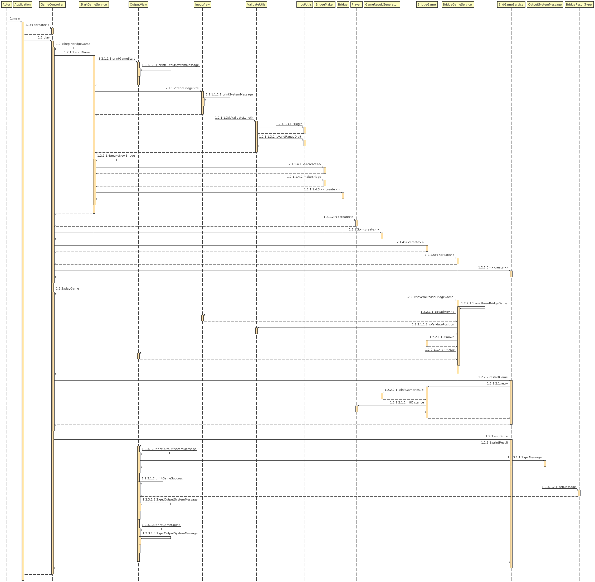

# 프로젝트 소개 
**다리 건너기**
오징어 게임에 나온 다리 건너기 게임을 구현합니다. 위아래 둘 중 하나의 칸만 선택해 다리를 건너가는 게임입니다.
다리의 길이를 정한 뒤, 다리를 건너기 시작합니다. 위쪽을 선택하려면 "U"를, 아래쪽을 선택하려면 "D"를 선택해야 합니다. 
다리를 건너다 실패하면 처음부터 다시 재도전할 수 있습니다. 재도전할 시 시도한 횟수가 증가합니다. 
다리를 끝까지 건너면 게임이 종료됩니다.

 

### 다리 건너기 게임 설계 

### 다이어그램 

 

# 기능 목록
1. 게임을 시작합니다. 
- [x] [출력] 게임 시작 문구를 출력합니다. 
- [x] [출력] 사용자에게 다리 길이를 요청합니다. 
- [x] [입력] 사용자에게 길이를 입력받습니다. 
- [예외 처리]
  - [x] 다리 길이가 숫자 형식인지 확인합니다. 
  - [x] 다리 길이가 3 이상 20 이하의 범위에 속하는지 확인합니다. 

2. 다리 길이에 따라 다리를 생성합니다.
- [x] 무작위로 위 칸, 아래 칸을 설정합니다. 
 
3. 플레이어가 다리를 건넙니다. 
- [x] [출력] 플레이어에게 이동할 칸 입력을 요청합니다. 
- [x] [입력] 플레이어가 이동할 칸을 입력받습니다. (U와 D 중 하나) 
- [x] [예외 처리] 플레이어가 U와 D 이외의 문자를 입력한 경우
- [x] 이동할 칸이 건널 수 있는지 확인합니다. 
- [x] 플레이어 위치를 이동합니다. 
- [x] 이동할 칸을 건널 수 있으면 O로 표시합니다. 건널 수 없으면 X로 표시합니다. 
- [x] 출력할 다리를 생성합니다. 
- [x] [출력] 게임 결과를 출력합니다.

5. 다리를 건너다 실패하면 게임을 재시작하거나 종료합니다.
- [x] [출력] 게임 재시작 여부 확인을 요청합니다. 
- [x] [입력] 게임 재시작 여부를 입력 받습니다.
- [x] [예외 처리] 플레이어가 R과 Q 이외의 문자를 입력한 경우
- [x] [예외 처리] 플레이어가 한 개 이상의 문자를 입력한 경우 

6. 게임을 재시작합니다. 
- [x] 플레이어의 총 시도 횟수를 늘립니다. 
- [x] 생성된 다리는 그대로 사용합니다. 
- [x] 플레이어 위치를 0으로 재설정합니다. (다리는 처음부터 건너기 시작합니다.) 
- [x] 게임을 시작합니다. 

7. 다리를 끝까지 건너거나 게임 종료를 선택하면 게임을 종료합니다.
- [x] [출력] 최종 게임 결과를 출력합니다. 
- [x] [출력] 게임 성공 여부를 출력합니다. 
- [x] [출력] 게임 총 시도 횟수를 출력합니다. 
