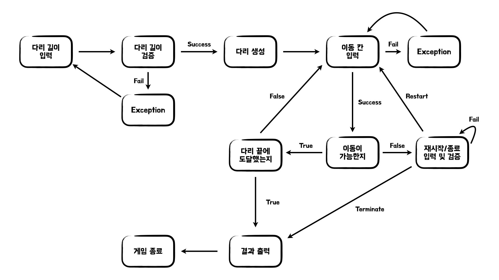

# 🌉 다리 건너기

## 📝 요구 사항 분석

- 위아래 두 칸으로 이루어진 다리를 건너야 한다.
    - 다리는 왼쪽에서 오른쪽으로 건너야 한다.
    - 위아래 둘 중 하나의 칸만 건널 수 있다.
- 다리의 길이를 숫자로 입력받는다.
    - `NULL`이면 예외 처리한다.
    - 숫자가 아닌 문자열이면 예외 처리한다.
    - 가능한 다리 길이가 아닌 경우 예외 처리한다.
- 다리를 생성한다.
    - 건널 수 있는 칸은 `0`과 `1`중 무작위 값을 이용해서 정한다.
    - **무작위 값이 0인 경우** : 아래 칸을 건널 수 있다.
    - **무작위 값이 1인 경우** : 위 칸을 건널 수 있다.
    - 다리를 재사용하기 위해서 처음부터 모든 다리에 대한 정보를 생성한다.
- 플레이어가 이동할 칸을 입력한다.
    - `NULL`이면 예외 처리한다.
    - `U`,`D`이 입력되지 않으면 예외 처리한다.
    - **U를 입력한 경우** : 위 칸으로 이동한다.
    - **D를 입력한 경우** : 아래 칸으로 이동한다.
- 건널 수 있는 여부를 확인한다.
    - **건널 수 있는 경우** : 이동한 위치를 O로 표시하고 계속 진행한다.
    - **건널 수 없는 경우** : 이동한 위치를 X로 표시하고 재시작/종료 여부를 묻는다.
- 다리를 끝까지 건너면 게임이 종료된다.
    - 최종 게임 결과를 출력한다.
    - 성공 여부를 출력한다.
    - 시도한 횟수를 출력한다.
- 다리를 건너다 실패하면 게임을 재시작하거나 종료할 수 있다.
    - `NULL`이면 예외 처리한다.
    - `R`, `Q`가 입력되지 않으면 예외 처리한다.
    - **R을 입력한 경우** : 게임을 재시작한다.
    - **Q를 입력한 경우** : 종료에 대한 정보를 출력하고 게임을 종료한다.
    - 다리를 처음부터 만드는 것이 아닌 생성된 다리를 사용한다.
- 사용자가 잘못된 값을 입력하면 에러 메시지를 출력 후 그 부분부터 입력을 다시 받는다.
    - `IllegalArgumentException`과 같은 명확한 유형을 처리한다.

## 🌊실행 흐름

## ⚙️ 기능 구현

### 방향 정보를 구현한다. ▶️ Direction

- [x] 방향 정보를 생성한다.
- [x] 생성 코드를 생성한다.
- [x] 방향 입력으로부터 방향을 생성한다.
- [x] 생성 코드 입력으로부터 방향을 생성한다.

### 게임 상태 정보를 구현한다. ▶️ GameCondition

- [x] 재시작/종료 정보를 생성한다.
- [x] 상태 정보 입력으로부터 게임 상태를 생성한다.

### 플레이어를 구현한다. ▶️ Player

- [x] 게임 시도 횟수를 증가한다.
- [x] 게임 시도 횟수를 반환한다.
- [x] 이동 방향 정보가 추가된다.
- [x] 이동 방향 목록을 반환한다.

### 다리 생성 기능을 구현한다. ▶️ BridgeMaker

- [x] 길이에 해당하는 다리 모양을 생성한다.

### 다리를 구현한다. ▶️ Bridge

- [x] 플레이어가 이동할 수 있는 상태인지 검증한다.
- [x] 게임 종료 여부를 확인한다.

### 다리 건너기 게임 기능을 구현한다. ▶️ BridgeGame

- [x] 다리를 이동한다.
- [x] 다리 건너기 게임을 재시작한다.

### 다리 건너기 애플리케이션을 구현한다. ▶️ BridgeController

- [x] 다리 건너기 게임을 실행한다.

### 입력 기능을 구현한다.

- [x] 다리 길이를 입력한다.
- [x] 플레이어가 이동할 칸을 입력한다.
- [x] 게임 재시작/종료 여부를 입력한다.

### 출력 기능을 구현한다.

- [x] 메시지를 출력한다.
- [x] 에러 메시지를 출력한다.
- [x] 이동 결과를 출력한다.
- [x] 최종 게임 결과를 출력한다.

### 변환 기능을 구현한다.

- [x] 문자열에서 숫자로 변환한다.