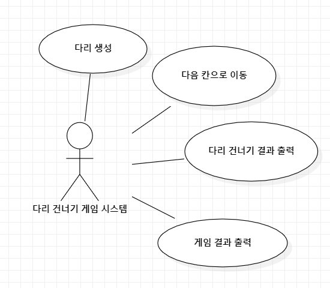
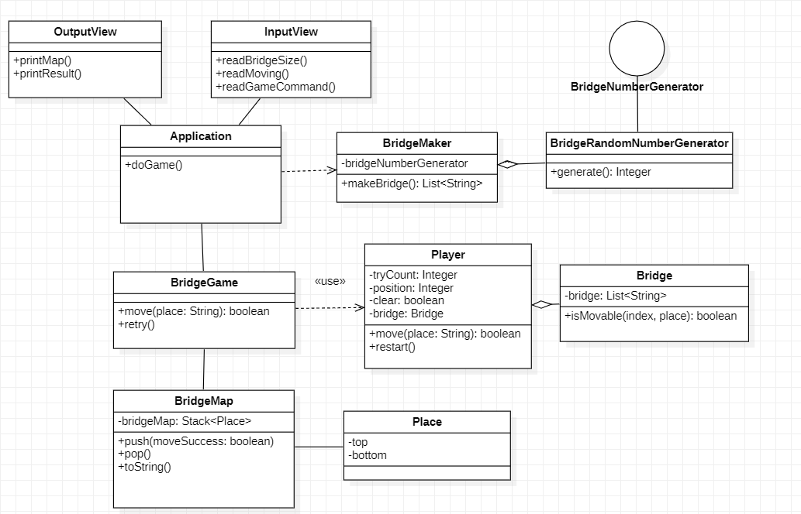
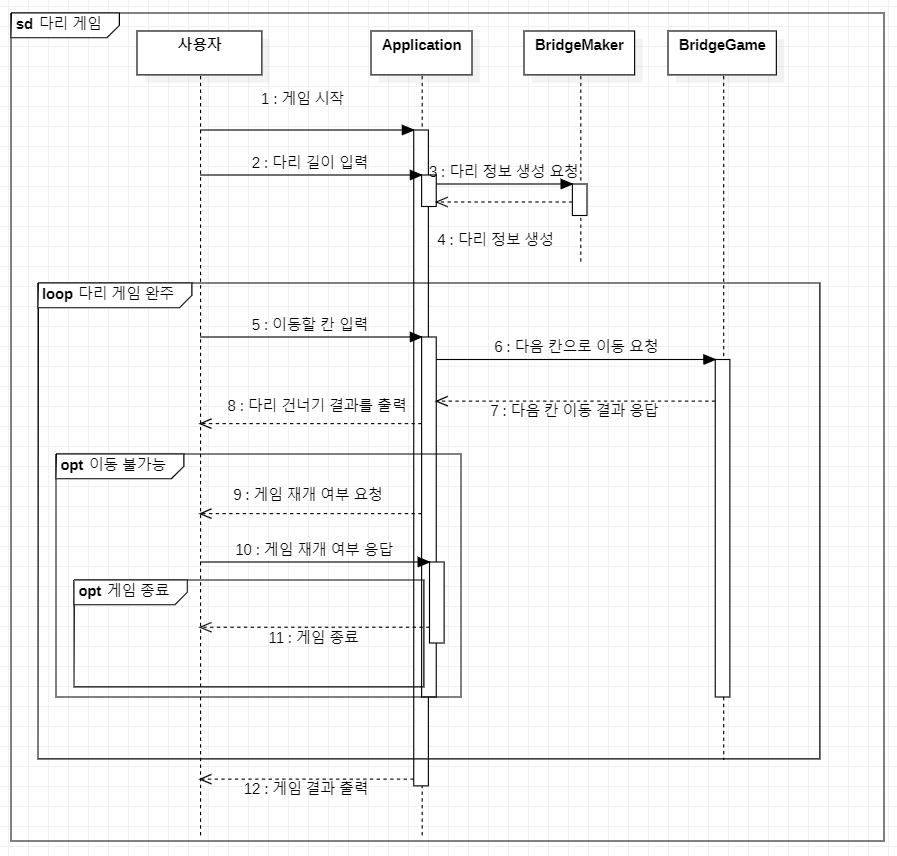

# 기능 구현 리스트

사용자는 다리 건너기 게임을 시작한다. 게임이 시작되면 다리를 생성하기 위해 다리의 길이를 입력한다. 다리의 길이는 3 ~ 20의 값을 가진다. 다리는 행이 2개이고 열이 입력받은 다리의 길이만큼 생성된다. 또한 한 열에 건널수 있는 다리는 딱 1군데 밖에 없다.
사용자는 이동할 칸을 `(위: U, 아래: D)` 형태로 입력한다. 사용자의 입력에 맞는 칸으로 이동한다 만약 X 이면 게임을 다시 할 지 선택하기 위해서 `(재시도: R, 종료: Q)` 형태로 입력한다.  재시도를 하게 된다면 기존의 다리를 재사용하고 종료면 바로 게임을 종료한다.

O 면 게임을 계속 진행한다. 이걸 다리 끝까지 반복한다. 다리 끝에 도착하면 게임을 종료한다.

게임을 종료하면 최종 게임 결과를 출력한다. 사용자가 이동할 때마다 다리 건너기 결과를 출력하고 게임을 성공 했는지 여부, 시도 횟수를 출력하고 시스템을 종료한다.

## 유스케이스 다이어그램

## 클래스 다이어그램

## 시퀀스 다이어그램

## 기능 구현 리스트

1. InputView를 이용한 입력 기능
    1. 다리 길이 입력 ( 2 ~ 30의 값을 가졌는지 검사)
    2. 다음 이동할 칸 입력 (U,D 이외의 입력이 들어왔는지 검사)
    3. 게임을 계속할 것인지 여부 입력 (R,Q 이외의 입력이 들어왔는지 검사)
    4. `camp.nextstep.edu.missionutils.Console`의 `readLine()` 을 활용
2. BridgeMaker를 이용한 다리 정보 생성 기능 구현
    1. `bridge.BridgeRandomNumberGenerator`의 `generate()`를 이용한 숫자 생성 결과를 이용
    2. 1은 위칸(U) , 0은 아래 칸(D)로 생성하여 이용한다
    3. 필드를 변경할 수 없다.
    4. 메소드의 시크니처와 반환 타입을 변경할 수 없다.
    5. `BridgeRandomNumberGenerator`, `BridgeNumberGenerator` 클래스의 코드는 변경할 수 없다.
3.  Bridge 클래스를 만들어 다리 정보 관리 기능 구현
    1. 해당 칸으로 이동할 수 있는지 확인
    2. OutOfIndex, IllegalArgument 검사
4. Player 클래스를 만들어 게임 정보 관리 및 이동 기능 구현
    1. 이동 요청을 받았을때 bridge의 칸과 비교하여 올바른 결과를 출력하는지 확인
    2. 재시작 요청이 왔다면 이전 칸으로 돌아가는지 확인
    3. 잘못된 입력이 있다면 IllegalArgumentException을 발생시키는지
5. BridgeMap 클래스를 만들어 다리 게임의 결과를 관리하는 기능 구현
    1. 다리 게임의 결과가 올바르게 저장이 되는지 확인
    2. 출력을 위한 정보가 정확하게 생성되는지 확인
6. OutputView 클래스를 만들어 게임 정보를 출력하는 기능 구현
    1. printMap , printResult가 요구 사항에 맞게 출력 되는지 확인
7.  BridgeGame 클래스를 만들어 다리 게임 요청을 처리하는 기능 구현
    1. move 요청시 관련 객체에게 올바른 요청을 보내는지 확인
    2. 재시작 요청시 관련 객체에게 올바른 요청을 보내는지 확인
    3. 필드를 추가 가능, 패키지 변경 가능, 인자와 반환 타입 추가, 변경 가능, 필요한 메소드 추가 가능
    4. 기존 메소드 move,retry 의 이름은 변경이 불가능
8. Application을 이용한 다리 건너기 게임 기능을 구현