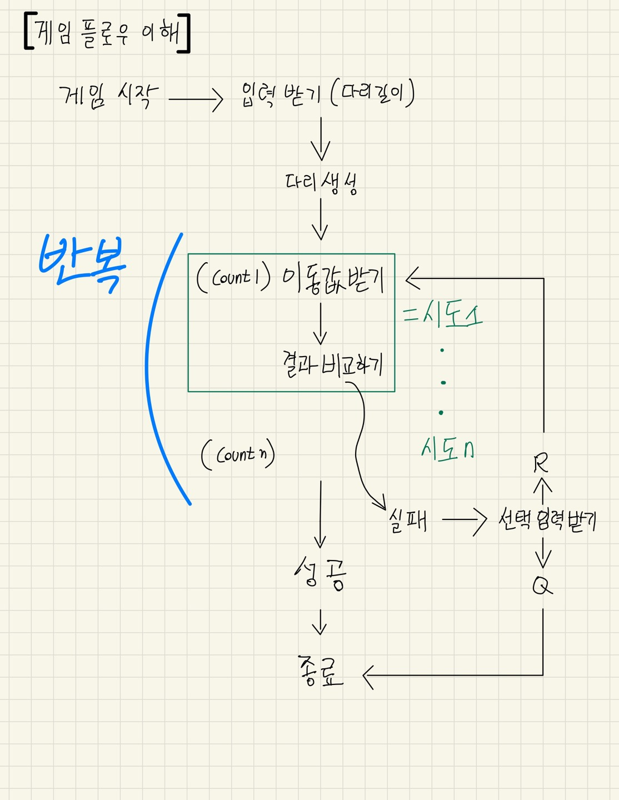

# 기능 구현 목록

---

# 1. 입력 기능

### 다리의 길이 입력
- 플레이어의 입력 
- 3 이상 20이하의 자연수
- 잘못된 값 입력시 다시 입력(그 부분부터)

### 이동할 칸 입력
- 플레이어의 입력
- U 혹은 D 입력 가능

### 재시작 or 종료 입력 기능 
- 플레이어의 입력
- R 혹은 Q 입력 가능

# 2. 출력 기능 

### 출력
- 게임 시작 문구
- 진행 상황 문구
- 결과 출력 문구
    - 최종 게임 결과(건넌 다리)
    - 성공 여부
    - 총 시도 횟수

# 3. 게임 로직

### 다리 생성
- 입력 받은 숫자로 생성
- 위 칸 혹은 아래 칸으로, 이에 대한 결정은 0과 1중 무작위 값을 이용하여 설정
- 0인 경우 아래칸, 1인 경우 위칸이 건너갈 수 있는 칸
- 건너갈 수 있는 칸이 위 칸이면 U, 아래칸이면 D

### 입력한 이동할 칸에 대한 결과 처리 (건너기)
- 생성한 다리와 입력한 값에 대한 비교 
- 건널 수 있다면 O, 없으면 X로 출력 

### 건너기 실패시 처리 
- 재시작 혹은 반복에 대한 플레이어의 입력 
- R 혹은 Q를 입력 가능 

# 4. 예외 처리

### 사용자 입력 오류 처리
- 다리 길이 입력시 3 이상 20 이하의 자연수이어야 함
- 이동할 칸 입력시 U 혹은 D 둘 중에 하나여야 함
- 게임 재시작/종료 선택 입력시 R 혹은 Q 둘 중에 하나여야 함

---

## <설계> 쟁점 및 아이디어

자세히

### **개발을 시작하기 전 설계 단계에서의 쟁점 및 아이디어에 대한 기록이다**

**[ 사전 설계 및 구상 ]**

1. 시작하기에 앞서 게임의 전체 플로우를 이해하고자 손으로 알고리즘 흐름을 작성해보았다.

    

2. 클래스 다이어그램을 만들어 클래스 및 메서드 간의 흐름과 역할을 정리해보았다. 

이 클래스 다이어그램을 작성하면서 집중한 포인트는 객체들 간 메시지를 주고 받으면서 각자 맡은 역할에 대한 임무를 요청/수행하는 관계를 설정한 부분이다. 

또 하나 주목한 점은 객체는 'what he is'라는 점이다([<엘레강트 오브젝트>](https://www.aladin.co.kr/shop/wproduct.aspx?ItemId=258374007)). 무엇을 캡슐화할 것인가? 객체는 무엇이며 어떻게 이름을 붙이고 존재성을 부여할 것인가를 고민하였다.  

3. 이와 같은 사전 설계 구상은 실제 프로그래밍을 진행하면서 바뀔 수 있지만 지난 과제 수행중 깨달은 바, 사전 설계의 중요성에 따라 충분한 구상 작업이 필요하다고 느꼈기 때문에 수행하였다.  

**[ 쟁점 및 아이디어 ]**

1. 사용자 입력을 받을때 `String`으로 입력받는다. 하지만 다리의 길이에서 필요한 타입은 `int`이다. 간단히 `return`시 형변환을 할 수 있긴 하지만 그럴 경우 `input` 메서드는 여러가지 일을 하는 꼴이 된다. 이부분 처리를 고민해보아야 한다.  

2. 사용자 입력 값에 대한 `validation`도 마찬가지이다. 이것을 `inputView`에서 하는 것이 맞을까 아니면 새로운 클래스를 형성해 위임하는 것이 맞을까.  

3. 핵심 로직에서 건너기를 실행할 때 4가지 케이스로 구분되는 것에 주목한다. `U`를 선택하였을 때 맞는 경우와 틀린 경우가 있다. `D`를 선택하였을 때 맞는 경우와 틀린 경우가 있다.  

4. 출력시 처음의 것은 `[ ? ]` 형식이고 두 번째부터는 `| ? ]` 형식이다. 따라서 위 아래 다리를 나눠서 `StringBuilder`로 붙여나가는 방식을 고려해본다.  

5. 마지막 출력 문구에서 게임 성공 여부가 있다. 이를 플래그로 지정해서 출력시 판단하는 로직을 거쳐 출력할 것인가, 아니면 사용자 입력 선택 알고리즘 과정에서 실패후 부터 시작되는 로직에서 이어나가 바로 처리할 것인가.  

6. `input View`와 `outputView`는 나뉘어져 각각 입력과 출력 역할을 담당한다. 그런데 `input`을 요청하는 과정에서 입력에 대한 요청을 메시지로서 '출력' 한다. 여기서의 출력을 단순하게 `System.out.println`으로 할 것인지, 아니면 `outputView`에 역할을 담당하도록 할 것인지 고민한다.  
현재 내린 결론은 일단 `inputView`는 `input`만 하는 것이 맞으며 출력 메시지를 여기서 보내지 않는다. 요청시에 필요한 `print message`는 요청하는 측에서 하는 것이 맞다. 그리고 `print`라는 방법 자체를 `outputView`에 위임한다.  

7. 이번 프로젝트에서는 상수 사용을 객체의 존재와 역할에 맞게 할당한다. 이전에는 상수를 특정 클래스에 몰아넣고 불러오는 방식을 썼는데 그와 같은 방식에서는 상수라는 객체가 가진 의미가 사실상 없고 이용당하는 것에 불과하다고 결론내렸다. 따라서 실제 역할을 담당하는 객체가 상수 역시 지니도록 한다. 

8. 프로그램의 확장성을 고려해보자. 
- 만약 다리가 추가된다면? 즉, 위 아래에 중간이 추가된다면? 
- 다리는 왼쪽에서 오른쪽으로 이동하는데 만약 돌아오는 과정이 추가된다면? 
- 다리를 건널 때 한 칸이 아니라 두 칸, 세 칸 등 복수의 칸 이동이 가능하다면?
 

 

## <개발> 쟁점 및 아이디어

자세히

### **개발 진행 단계에서의 쟁점 및 아이디어에 대한 기록이다**

**[ v1.0 단계 ]**

1. `inputView`의 역할을 어디까지 할 것인지 고민했다. 우선 `inputView`의 본 기능은 `console`의 입력값을 받는 것이므로 `interface`로부터 해당 기능을 `extends`하는 것이 맞다고 결론을 내렸다. 이후, `emptyness`에 대한 검증을 여기서 하는 것이 맞느냐의 문제에 대해 고민했고, 일반론적인 `input` 자체라면 `empty` 검증 기능을 이 클래스가 가질 필요가 없겠지만, 이 게임 상에서 해당하는 룰을 이 클래스에 적용할 수 있다고 생각하여 (즉, `BridgeGameInputView`라고 생각하여) `empty` 검증을 수행하기로 했다.  

2. `InputValidator` 인터페이스를 구현함에 있어서, 불특정 `object` 방식을 사용하는 것이 옳다고 생각하여 `inputValidator<T>`로 작성했고 그 결과 `validation`시 형변환이 필요해졌다. 이렇게 할경우 `String` 함수의 `isEmpty`를 사용하지 못하며, `equals` 메소드를 사용한 `" "` 자체에 대한 검증이 들어간다. 이것이 좀 더 원론적인 검증에 가까운 것이라는 결론에 따라 이 방식을 고수했다.  

3. BridgeSize를 int값이 아니라 객체화하여 반환하도록 했다. 마찬가지로 BridgeSize 역시 자체적인 검증을 본 클래스에서 하도록 한다.  

4. `print` 메소드를 `outputView`에서 처리할 때 `static`으로 해야하는 것인지 고민해보자.  

5. `movementCommand` 역시 객체화하였는데 로직이 단순하기 때문에 `validation`과 `"U"` 혹은 `"D"` 리턴을 `getter` 없이 바로 할 수 있는 방법이 있을지 고민해본다.  

6. 입력이 잘못되었을 때 처리하는 기능을 `Game` 객체에서 하지 않고 `inputView`에 위임하도록 한다. 기존에 `try - catch` 문에서 재시도 하는 메서드를 따로 생성해서 하는 로직을 썼는데 이 경우 `null` 이 반환되는 문제가 생긴다. 단순하게 `try - catch`에서 재귀 호출을 해주는 것으로 해결 가능했다.  

6. `BridgeMaker`에서 다리를 생성하는데 로직은 랜덤 숫자 생성 => 숫자에 따른 `up down` 부여 => `U, D` 스트링으로 변경 => 다시 리스트로 넣기가 기본 로직이었는데 `for`문과 `if`문이 너무 반복되었고 무엇보다 `0`과 `1`, `U`와 `D`가 하드코딩처럼 느껴졌다. 이것은 로또 미션에서 `RANK`를 처리할 때와 비슷한 것이었기 때문에 이번에는 반드시 다른 방법을 찾아보고 싶었고, `Enum` 클래스에서 요소들간의 대응되는 것을 통해 특정 요소를 추출하는 방법에 대해 구글링 하여 `values`를 가져오고 이를 `stream` 반복문에서 대응되는 값으로 뽑아내는 방법을 찾아 구현했다. 파이썬이라면 아마 `dictionary`에서 `map`이나 `람다`를 사용해서 하는 방법을 고민했을 것 같다고 생각했고 이 경험을 토대로 자바에서 방법을 강구한 것이 효과가 있었다. `Enum`과 `Stream`을 사용해서 좀 더 단순화하였다.   

7. 생성한 브릿지를 건너는 방식에서 `retrain`을 써서 리스트를 지워 가는 로직을 구현했는데, `retry`시에 다시 초기화되어 처음의 bridge 부터 다시 불러와야 한다는 문제가 있었다. 해결을 위해 `Clone`하는 방법을 찾느라 상당히 애를 먹었다. 과정에서 `Bridge`를 객체화 시킬 수 있었고, 분리된 클래스 상에서 `clone`을 만드는 방법을 찾을 수 있었다.  

8. 게임이 순환성을 갖는 지점에서 `do-while`문을 자주 사용하게 되는데 반복문 자체가 헷갈리고 어려운 부분이 있다 보니 구현 자체가 쉽지 않은 듯 하다. 이 로직을 `do-while` 문을 사용하지 않고 좀 더 직관적이면서 깔끔하게 하는 법에 대한 고민이 필요하다.  

9. `retry` 선택시에 알고리즘의 첫 상단으로 다시 올라가는 로직을 구현함에 있어서 필요한 객체들이 계속해서 생기는데 마찬가지로 깔끔한 처리 방법을 고민해볼 필요가 있다.  

10. `BridgeGame`의 존재성에 대해 어떤 역할만 갖는지 고민해보면 `crossing` 기능과 `crossingDecision` 기능은 분화해서 객체화시켜도 좋을 듯 싶다. 

**v1.0 release**

___

**[ v2.0 단계 ]**

📌 리팩토링 계획 및 진행 사항 체크

1. [X] `OutputView`에 출력 역할 위임, 개별 메시지를 메서드별로 담당하도록 한다.  
=> 게임을 총괄하는 `BridgeGame`에서 출력의 역할을 맡아야 하는 것이라는 생각으로 `v1.0`에서 구성했다. 이 부분은 여전히 고민이 되는 부분이다.  
=> **밑의 세부 사항에서 결론 정리**  

2. [X] `BridgeGame`의 존재성은 게임의 총괄이다. 그런데 클래스에 필드가 너무 많고 `crossing` 기능, `judging` 기능을 구현하고 있고 출력 역할까지 담당하고 있다. `BridgeGame` 객체에 대한 정의를 명확하고 단순화할 필요가 있다.  

3. [X] 변수명 통일이 필요하다. 현재 `cross`, `pass`, `retry`, `trial`, `command`, `map`, `description` 등 너무 많은 중복 의미의 단어들이 쓰이고 있다.  

4. [X] 필드와 `static`을 사용한 메시지 공유 기능을 정리할 필요가 있다.  

5. [ ] 테스트 기능 구현이 필요하다.  

6. [x] `InputView` 객체를 `Controller`에서 생성해서 계속해서 전달하는 방식을 사용하고 있다. 이 방식에 대해 좀 고민해볼 필요가 있다.  

7. [x] `OutputView` 역시 `interface`를 통해 추상 메소드를 구현화하는 방식으로 하도록 한다. 또한 개별 메시지를 메서드별로 담당하는 기능에 대해서는 그렇게 하지 않고 기존의 방법을 유지한다. 
   => **밑의 세부 사항에서 결론 정리**  

8. [x] `inputValidator`를 인터페이스로 구현했고 `Integer`와 `String`을 함께 처리하기 위해 `rawType(<T>)`를 사용했었다. `warning` 메시지를 검색해본 결과 `raw type`은 지양해야 한다는 주장에 따라 이를 수정하여 두 개의 `validate` 메소드를 구현하도록 한다.    

---

💡 위의 2번 사항에 대한 세부 정리 (기능 분화 및 클래스 리팩토링)  

`domain` 패키지에 `game` 패키지를 생성하여, 전체 게임 로직에서 필요한 객체들을 분화한다. 
   - / `BridgeGame` : 게임 진행 사항을 체크하며 단계를 진행하도록 하고 결과를 `Controller`에게 리턴한다
   - / `CrossingDecision` : 다리를 건널지 말지 여부를 판단하며 `passable` 불리언 값을 리턴한다.
   - / `Crossing` : `CrossingDecision` 메시지를 바탕으로 플레이어가 다리를 건너가는 로직을 주관하며, 건너가고 못 건너가고에 따라서 다리와 플레이어의 현재 위치를 수정한다.
   - / `Map` : `Crossing`의 메시지를 바탕으로 플레이어의 현재 위치를 조정하여 다리의 상황을 리턴한다.  

=> 결과에 대한 `result`는 `BridgeGame` 에서 관장하며 `result` 패키지에 렌더링을 요청한다. 

---

💡 위의 1번, 7번 사항에 대한 세부 정리 (최종 출력 기능에 대한 역할 결정)  

최종 결과 값으로 "성공/실패" 여부와 "횟수"가 필요하다. 이를 소유하는 객체는 `Bridge` 게임으로 결정했다. 또한 역할 분리를 위해 최종 출력 결과는 `Controller`에게 위임하는 것이 맞다고 결론내렸다. 여기서 문제는 2가지 변수를 전달해야 하므로 해시맵이나 리스트형으로 묶어서 리턴하는 것이 바람직할 것인지, 아니면 각각을 `getter`로 리턴하는 것이 나을 것인지에 대한 고민이다.  

세번째 방법으로는 이 값을 `static`으로 바꿔 전역적으로 공유하는 것이다.  

여기서의 로직은 다음과 같다. 

`play`에 대한 결과값 = `Bridgegame`이 보유 => `ResultDescription`에서 렌더링 역할을 맡아 결과를 스트링으로 전환 작업. 이후 이 결과값을 `Controller`에게 전달 => `Controller`는 `OutputView`에 출력을 요청.  

첫번째 방법이 가장 정석적인 방법으로 생각은 되는데, 과연 `play` 메소드가 결과를 리턴하는 것이 맞는가 의문이 든다. `play`의 하는 일은 말 그대로 `play`이기 때문에 `void`로 설정한 것이 나쁘지 않아 보인다.  

=> 결론적으로 첫번째 방법으로 했다. `Game`에서 최종 결과를 보내주는 것까지 역할 범위에 해당한다고 보았다.  

`+`

`OutputView` 문제 관련해서, 결론적으로  

`OutputView`를 객체화했다. 인터페이스의 콘솔 `print` 기능을 구현할 수 있게 했고, 전달 받은 메시지를 고유하게 홀드하면서 호출이 있을 때 프린팅 될 수 있도록 했다. 객체화함으로써 공통 `format`을 구현하는데 있어서 자유도가 올라갔고, 덕분에 출력 형식을 맞추는 데 있어서 `new line`을 공통인자로서 조절할 수 있도록 했다. `Boolean Paragraphing` 인자와 `ENTER`는 시스템 내에서 반복적으로 사용되는 값으로서 별도의 클래스를 만들어 `DTO`처럼 활용하는 것을 고려했으나, 인자로 전달할 때 `IDE`에서 보조로서 인자 이름을 알려주고 있는 기능이 있으므로 단순히 `boolean` 값을 전달하는 것으로 결정했다. 만약 이와 같은 `format` 상수들이 더욱 늘어난다면 별도의 클래스를 만들어`(e.g. MessageFormat)` 사용하는 것도 적절할 것이라 생각한다.  

추가 쟁점은 남아 있는 것 같다. 이를테면,  

객체화 한다고하더라도 그 존재 자체가 기능 역할이라면, 결국 의존성은 여전한 것이 아닌가,   

객체 지향의 원칙으로서 "추상화된 것에 의존하게 만들고 구상 클래스에 의존하지 않는다"는 관점에서 기능 역할을 하는 객체와의 의존성을 어떻게 더 분리할 수 있을 것인가,  

부분으로, 추후 과제로서 남겨두도록 한다. 

---

👀 Q. 인터페이스 `override method`는 왜 항상 `public`이어야 하는가? 

`public`으로 사용하지 않는다는 건 바깥에서 호출하지 못한다는 것을 의미한다. 그런데 인터페이스가 존재하기 때문에 `interface refence`를 통해서 호출이 되는 상황이 발생한다. 이것은 앞뒤가 맞지 않는 상황이므로 `non public`은 허용되지 않는다.  

[refenced by here](https://stackoverflow.com/questions/50720365/why-the-overridden-method-should-be-public-in-this-program)   

---

💡 위의 6번 사항에 대한 세부 정리 (`InputView` 객체를 계속해서 전달하는 방식의 문제)  

프로그램이 돌아가는 많은 플로우에서 `input`이 사용된다. `game` 패키지의 대다수 `method`에서 `input`이 전달되고 있다. 만약 `inputView`의 메서드를 `static`으로 바꾸면 굳이 `inputView` 객체를 전달하지 않고도 필요한 메서드에서 바로 사용해서 쓸 수 있다. 그게 아니면 클래스 자체에서 `Inputview` 객체를 생성하고 자체적으로 전역화시키는 것이다.  

하지만 객체지향에서 `static` 사용은 지양되며 이는 필연적으로 명령형 프로그램을 만들기 때문이다. 지금과 같은 상황에서 분명 `InputView`의 메서드를 `static`으로 바꿔버린다면 보다 프로그램 가독성이 좋아질 수 있을 것이다. `OutputView`도 `static`으로 선언되어 있기 때문에 사용의 자유도가 높은 것이다.  

딱 이거다 싶은 느낌이 들지 않아 석연치 않음이 계속된다.  

`+`

=> Input 기능을 객체화하여 각각의 역할을 담당하도록 했다. `Inputview`는 `ConsoleInput`과 `Inputvalidator`를 구현하며 `string`으로 입력을 받고 이에 대한 `empty`값을 검증하는 기능을 수행한다. 한편 `InputCommandReader`는 `commandReader`를 구현하므로 유저의 입력값에 대한 `Command` 해석이 추가된다. 따라서 입력받은 `input String` 값을 `command`로 객체화하는 기능을 수행한다. 이때 `Enum`으로 각 `command`에 대한 각각의 기능을 보유하며, 시스템에서 호출시 해당 기능을 수행하며 객체를 리턴한다.  
이와 같은 객체화 및 클래스 분화로 기존에 사용하던 static 메서드들을 전부 해제할 수 있고, 생성한 `InputView`를 전달할 필요 없이 필요한 객체에서 필요한 순간에 적절하게 호출될 수 있다. 

기존에 `Inputview`는 순수하게 `input`을 받는 기능과 객체별(`BridgeSize`, `Movement`, `GameProceed`) 입력 및 객체전환 기능을 모두 담당했다.  

현재의 리팩토링으로서 단순히 기능만 수행하던 `InputView`를 객체화하여 존재성을 부여한다. 그럼으로써 1) 객체 기능의 응집력 강화 2) 메시지 전달의 상호성 증가 3) 절친에게만 이야기하는 결합도 조정 4) 확장에는 열려 있으면서 변경에는 닫힌 구조 형성  

과 같은 효과를 보게 되었다.  

---

`+`

추가 쟁점 사항 : 추가 리팩토링 고려 사항  

- `map` 클래스도 객체화하는 것이 바람직할까에 대한 고민 => 현재와 같이 `static List`를 보유하는 것만으로 `DTO`로서의 역할로 인정할 수 있을까에 대한 고민 
- `getter`를 사용하는 문제 => 현재 객체의 정보를 전달하는 메서드에 `"get"`이름을 쓰고 있는 것과 쓰지 않는 것이 혼용되고 있다. 통일하는 것이 바람직할지, `getter`를 아예 쓰지 않고 명명하는 것은 어떨지에 대한 고민

---

**v2.0 release** 

---

**[ v3.0 단계 ]**

📌 리팩토링 계획 및 진행 사항 체크 

1. [X] 테스트 기능 구현이 필요하다.  

2. [x] `map description` 기능 및 클래스 리팩토링  

3. [x] `get`을 사용한 명명법과 이에 대한 고찰  

4. [x] `crossing` 로직 수정  

5. [X] 추가 요구사항인 '`BridgeGame` 클래스에서 `InputView`, `OutputView`를 사용하지 않는다' 준수를 위한 리팩토링  

---

💡 <`map description` 기능 및 클래스 리팩토링 관련 쟁점>  

`map`은 `list`로 존재하나 `string`으로 출력해야 하는 데서 복잡성이 생긴다. 사용자의 선택에 따라 `O, X` 또는 `공백`을 출력해야 하는데서 맵핑의 필요성이 생긴다. 개념적으로 `Game`에서 `List`로 존재하는 맵은 추상화된 구조물이라고 간주했고, 출력되는 모양(`String`)을 `UI`에 표현되는 `description`으로 간주했다. 이렇게 두 개념을 구분하였고 맵의 구조물들을 이루는 요소로서 윗면과 아랫면에 대한 정보, `Command`에 따라 `O, X, 공백`의 정보를 구성할 수 있다. 따라서 이들을 `Map`이라는 패키지로 묶었다. 출력되는 기능은 `Rendering`으로 표현하며 `map` 패키지와는 별도의 기능이라 판단, `game` 패키지로 편입했다. 이와 같은 카테고리의 구분은  추상적인 맵을 구조화하는 작업(리스트로서의 `map` 형성)과 개념으로서 존재하는 `map`을 실제 `description`으로 `rendering`하는 작업(`String`으로서의 `map` 형성)을 구분하는 설계로부터 파생된다고 할 수 있다.  

여기서 한가지 쟁점이 있는데 map 리스트를 `private`로 제한할 경우 사용자 선택에 따른 맵핑 기준을 보유하는 `sideDescription` 클래스(`Enum`)에서 접근하지 못한다는 것이다. 접근 자체에 대한 이슈는 사실 같은 패키지로서 `protected`로 변경하는 것으로 무마할 수 있지만, 그보다는 `Enum` 클래스가 선택에 맵핑되는 `map`의 `sideDescription`을 홀드할 때, 실제로 홀드할 것이냐 아니면 `flag` 형식으로 명목상으로 홀드할 것이냐의 문제가 생긴다. 현재의 설계는 실제로 홀드하기 때문에 본 `Map` 클래스에서 `construction` 작업시 `Enum`에서 전달하는 `list`가 곧 본인이 소유하는 클래스라는 약간의 어색한 상황이 발생하고, 그렇더라도 받은 `list`를 그대로 사용하여 작업할 수 있다는 점에서 수월하다. 만약 명목상으로 보유한다면 `flag` 형식으로써 리스트의 이름을 받아야 할 것이고, 해당 이름을 판별하여 보유하는 실제 `list`에 맵핑하는 추가 작업이 요구된다는 단점이 있는 한편, 플로우 상으로 좀 더 정직해지는 장점은 있는 듯 싶다.  

두 클래스 간의 상호 호환성을 고려할 때, 현재와 같은 실제 `list`를 `Enum`에서 보유하며 전달하는 방식이 괜찮다는 판단하에 이를 유지하고 있다.  

---

💡 < `crossing` 로직 수정> 

기존 `crossing` 로직에서의 문제점은 `do-while`문을 통한 반복으로서, 반복문 안에서 얻은 객체의 정보를 기반으로 `continuation`을 결정해야 하기 때문에 이 정보를 다시 `get`하기 위해서는 해당 클래스의 `getter`를 `static` 메서드로 열어 별도의 호출이 가능하도록 했어야 한다는 점이었다. `isContinue`를 통해서 판단을 했는데 처음 구현시 논리적인 흐름상 `depiction`이 완료되고 그 정보에 따라 가부를 결정했다. 그런데 사실 이에 대한 판단은 그 이전 `decision` 클래스에서 맡은 역할이고 이는 반복문 내에서 객체로서 받아오는 메시지다. 문제는 이와 같은 메시지가 `while`문의 조건으로서 사용되지 않는다는 점이고, 여기서 `static`이 남용되는 문제가 발생했다. 이를 해결하고자 `do-while`문의 반복이 아닌 재호출을 통한 로직으로 바꿨다.  

즉, 1회의 `crossing` 이후 발생하는 반복에 대해 `keepCrossing`이라는 새로운 논리를 구상했고 이럼으로써 이전에 `static`을 통해 무분별하게 클래스의 메시지를 꺼내오던 방식을 리팩토링할 수 있었다.  

cf.  

비슷한 구조로 작동하는 `do-while` 문이 `BridgeGame` 클래스에서 `trial`을 실행할 때도 사용된다. 하지만 여기서는 `do-while`문을 그대로 사용하도록 했는데 그 이유는 `trial`을 실행시키는 `do-while`문의 주체는 `play` 메서드이며, 권한 관계에 있어서 `trial`을 주도하는 메서드의 역할이 `play`로서 적절하다고 보았기 때문이다.  

---

💡 <`get`을 사용한 명명법과 이에 대한 고찰>  

`get`이라는 단어를 쓰는 `getter`로 객체는 본인의 인스턴스를 바깥으로 전달할 수 있다. `getter`는 어떻게 보면 컨벤션 혹은 컨센서스로 자리잡은 표현이다. 하지만 이 표현법이 어색한 건 분명한 듯 싶다. [<엘레강트 오브젝트>](https://www.aladin.co.kr/shop/wproduct.aspx?ItemId=258374007&start=slayer)의 저자는 이점을 지적하며, `Cash`라는 클래스에서 `getDollars()` 라는 이름의 명명법은 옳지 않은데 그 이유로 다음과 같이 이야기했다.  

`"getDollars()는 "데이터 중에 dollars를 찾은 후 반환하세요"라고 이야기하는 것이고, dollars()는 "얼마나 많은 달러가 필요한가요?"라고 묻는 것입니다. dollars()는 객체를 데이터의 장소로 취급하지 않고, 객체를 존중합니다."`  

자바 프로그래밍에서 명명법이 중요하다는 사실을 프리코스 과제를 하는 내내 실감을 했다. 이름을 제대로 붙인다면 복잡한 문제도 단순해지고 명료해지면서 풀리지 않던 리팩토링이 풀리는 경험도 있다. 때문에 `getter`에서 `get` 단어를 당연하게 사용하는 컨벤션에 대해서도 고민하게 되었다.  

명명을 잘 해야 하는 이유는 첫 번째, 스스로 설계를 하고 코딩을 하는 과정에서 추상적이고 개념적인 구조를 명료하게 인지함으로써 객체가 한 가지 역할만 충실하게 할 수 있도록 하여 클린 코드 작성에 가까워지기 때문, 두 번째 스스로나 다른 프로그래머들이 추후 코드를 보아도 쉽게 읽히고 금방 해석될 수 있게 도와줌으로써 유지보수성 측면에서 효율성을 높이는데 중요하기 때문이라고 생각한다. 그런 의미를 고려한다면, 컨벤션으로 쓰이는 `getter`라는 용어에 대해서도 다수가 쓰고 있기 때문에 그대로 쓰는 것이 분명히 필요한 부분도 있을 것이다.  

하지만 단순히 그 쓰임이 애매하거나 객체 지향의 근본 원리에 취합하지 않는다면 재고해볼 여지가 있을 것이라는 생각이 든다. 만약 `get`을 굳이 쓰지 않아도 가독성에 해롭지 않을 뿐 아니라 오히려 득이 되는 경우라면 어떨까. 이를테면 모든 메서드가 `private`으로 제한되고 있는 객체의 코드의 위치상으로 제일 밑 부분에 `public`으로 위치하면서 명백하게 그 객체를 반환하고 있는 메서드라면 거기에도 꼳 `get`을 붙여야 할 것인가, 그렇다면 그 대안은 반환하는 객체 그 자체면 될 것인가, 하는 문제들에 대해서 고민해보았다.  

현재의 과제에서는 모든 `getter`의 이름을 `get-`으로 통일하기보다 의미에 중점을 두고자 했고 따라서 반환하는 객체와 다른 이름으로 명명한 경우도 있다. 예를 들어 `Movement`를 `command`로서 리턴하는 부분에서는 `command`의 타입에 보다 중점을 두어 그 의미상의 단어인 `side`로 `getter`를 명명했다. 또 다른 `GameProceedCommand`와 `BridgeSizeCommand`에서는 `get`을 붙인 명명법보다 `command`의 본체인 `gameProceed`와 `bridgeSize`로 명명하는 것이 의미상으로나 가동성으로나 탁월하다고 생각하여 `get`을 제외한 `getter`메서드로 작명했다. 한편, `get-x` 라고 하는 것이나 그냥 `x`라고 하는 것이나 둘다 애매한 경우에는 `get-` 방식을 사용했다.  

이 쟁점은 고민이 계속 필요한 과제라는 생각이 들고 앞으로 프로그래밍 경험치와 실력이 쌓이면 더 좋은 관점으로 설득력 있는 주장을 할 수 있게 되리라 생각하여 추후 과제로 남겨두도록 한다.  

--- 

💡 <추가 요구사항인 '`BridgeGame` 클래스에서 `InputView`, `OutputView`를 사용하지 않는다' 준수를 위한 리팩토링>  

처음 설계시 `Inputview`와 `Outputview`, 즉 사용자 상호작용을 하위 기능 클래스가 아닌 상위의 주도 클래스에서 주관해야 한다고 생각했다. 즉, 게임을 주관하는 `BridgeGame`에서 '요청'의 역할까지 담당하며 하위 클래스는 그 역할 자체, 즉 '입력 청취' '만' 수행하는 것이 맞다고 생각한 것이다.  

제출 전 검토하면서 위와 같은 추가 요구 사항을 놓치고 있음을 깨달았고 이에 대해 생각해보게 되었다.  

결국 요구사항의 포인트는 사용자 상호작용의 기능 전체를 하위 클래스로 위임하라는 것이 아닐까 싶다. 현재 프로그램은 3가지 타입의 사용자 상호작용을 수행한다. 

- 다리의 길이를 입력 받기
- 이동할 칸을 입력 받기
- 다시 시도 여부를 입력 받기 

이 3가지 입력에 대해서 본 설계에서는 `command`라는 단어를 붙여 보다 구체적인 명명을 하였는데, 앞의 설명처럼 요청에 대한 부분은 본 클래스에서 담당하도록 했다.  

`BridgeGame`에 존재하던 요청 출력 역할의 `OutputView` 구문을 각 기능 클래스로 옮겼다. 이럼으로써 각 클래스는 요청 + 입력 청취의 기능을 함께 수행하게 된다. 결국 입력을 받는 역할의 범위를 '내가 스스로 묻고 답까지 얻는다'로 보는 개념일 것이며, 이것이 더 깔끔하고 맞는 관점일 수 있겠다 싶다.  

즉, 이전에는 `BridgeGame : movementCommand 클래스야, 내가 물어봐줄게 너는 받아서 나한테 알려만 줘` 였다면, 리팩토링한 방식은 `BridgeGame : movementCommand 클래스야. 알아서 받아와 그게 네 역할이야`와 같은 관계 설정이라고 할 수 있겠다. 

 

