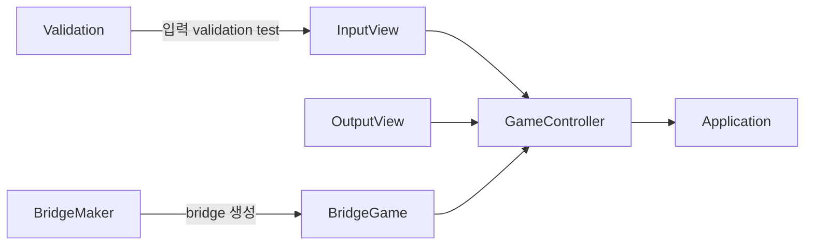
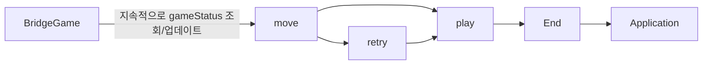
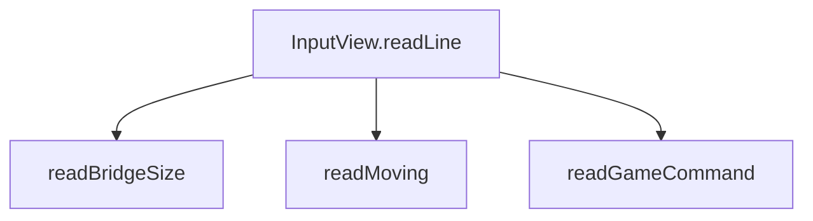
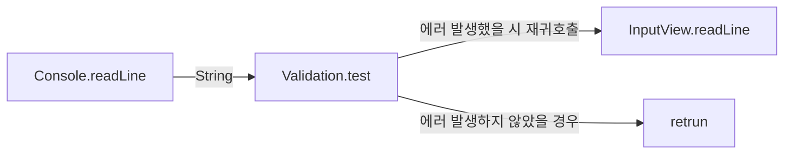

# Application 구조

# code

게임 진행에 필요한  static 변수들과 enum객체를 가지고 있는 package

## BridgeMap

지정된 입력값에 따라서 해당되는 문자열을 반환하는 enum 객체

| FOR_CREATE | key:1,0 / value: ”U”, ”D” | 랜덤으로 생성된 1,0을 U/D 문자열로 반환 |
| --- | --- | --- |
| FOR_MOVE | key:true,false / value: “O”, “X” | move의 사용자 입력이 정답인지에 따라서 O/X 반환 |
| FOR_TOTAL | key:true,false / value: “성공”, “실패” | 전체 게임의 성공 여부에 따라 성공/실패 반환 |

## BridgePosition

사용자의 move 입력의 결과를 업데이트 하기 위한 boolean 값을 가지고 있는 클래스

| UP | true |
| --- | --- |
| DOWN | false |

## GameStatus

Bridge 게임의 진행 상태를 정의해놓은 static 변수를 가지고 있는 클래스

| PLAY | 1 |
| --- | --- |
| SUCCESS | 2 |
| FAIL | 3 |

# Util

## Validation

사용자 입력에 대해서 유효성 검증을 진행하는 클래스

### validationTest

입력타입에 따라서 각기 다른 validationTest를 진행한다.

| BRIDGE | 숫자가 아닌 문자열이 발생하거나 3-20까지의 범위에서 벗어날 경우 에러 발생 |
| --- | --- |
| MOVE | U,D 외의 다른 문자열이 들어오면 에러발생 |
| RETRY | R,Q 외의 다른 문자열이 들어오면 에러발생 |

# Controller

## GameController

view와 BridgeGame를 조작하는 컨트롤러

- 기능목록
  - [ ]  게임 시작: 객체 생성
  - [ ]  게임 플레이
    - [ ]  move-> 게임 상태가 플레이가 아닐 때까지
    - [ ]  retry -> move 결과가 실패일 때
    - [ ]  end-> 최종 결과 출력시 부르는 함수

# domain

## BridgeGame

- 기능목록
  - [ ]  move, retry 구현
  - [ ]  게임 상태 조회, 관리를 위한 status변수와 관리 함수들 추가
  - [ ]  결과 조회를 위한 함수 추가

## BridgeMaker

입력받은 `BridgeNumberGenerator` 를 통해서 1,0을 랜덤하게 생성하고 이를 `BridgeMap` 를 이용하여 문자열로 반환한다.

## GameResult

게임의 결과를 저장하는 객체. move와 retry가 진행될때마다 업데이트된다.

- 기능목록
  - [ ]  다리의 결과를 저장하고 있는 해쉬 맵 업데이트
  - [ ]  retry시 마다 해쉬맵과 인덱스를 초기화하고 시도횟수를 증가시킨다.
  - [ ]  결과값을 반환하는 함수들

# View

## InputView

사용자에게서 입력을 받은 후 유효성 검사에 통과하는 문자열들만 String return

- 기능목록
  - [ ]  사용자 입력받고 유효성 검사
    - [ ]  에러발생시 catch에서 재귀
  - [ ]  미리 정의된 함수들 구현

### InputView.readLine()

## OutputView

- 기능 목록
  - [ ]  printMap: 위의 다리와 아래의 다리를 출력한다.
  - [ ]  printResult:결과 출력
