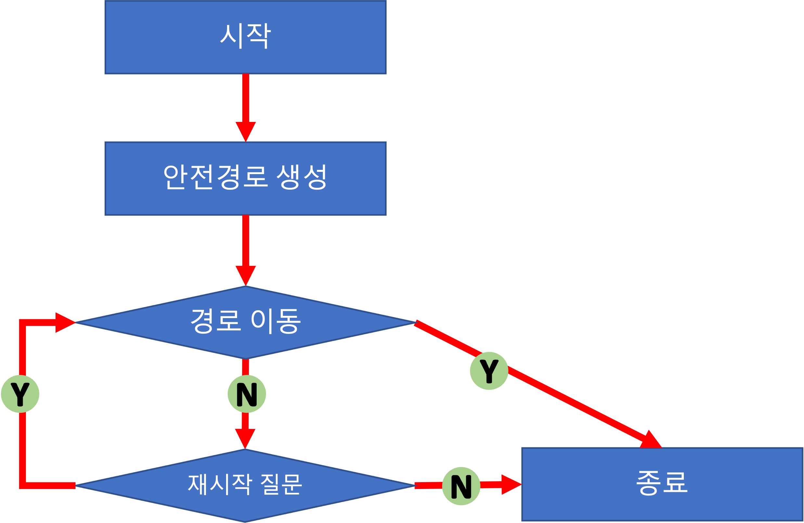

# 구현 기능 목록

## 프로그램 흐름 및 페이즈 구분

## 프로그램 흐름 및 이벤트 처리 관련 (Controller)

### Application

- BridgeGameController 실행

### BridgeGameController

- 전체 페이즈를 관리하는 기능
- 시작 페이즈 관리 기능
- 안전경로 생성 페이즈 관리 기능
- 경로 이동 페이즈 관리 기능
- 재시작 질문 페이즈 관리 기능
- 종료 페이즈 관리 기능

## 데이터 처리 관련 (Model)

### PlayerPath (Entity-Repository)
- 유효한 사용자의 이동 경로를 저장하는 기능
  - 유효성: 다리 길이와 이동 경로 리스트의 길이는 동일

### Bridge (Entity-Repository)
- 다리의 안전경로를 유효하게 캡슐화하는 기능
  - 유효성: 다리 길이와 방향 리스트의 길이는 동일
- 다리의 안전경로와 사용자의 이동경로의 일치 여부를 확인하는 기능

### BridgeMaker (Random)

- 주어진 다리 길이만큼 안전경로를 만드는 기능

### BridgeGame (Service)

- 안전경로 및 사용자 이동 경로 초기화 기능
- 사용자를 다리 다음 칸으로 이동하는 기능
- 사용자의 생존 여부 확인 기능
- 사용자의 현재 이동경로 반환 기능
- 사용자의 총 시도 횟수 반환 기능

### Direction (enum)

- 입출력와 데이터 처리의 이동 방향(위/아래) 식별 기능

### GameRetry (enum)

- 입출력과 데이터 처리의 재시작/종료 식별 기능

## 입출력 관련 (View-Front)

### InputView

- 유효한 다리 길이를 입력받는 기능
  - 유효성: 자바 정수 범위 내의 숫자
- 유효한 이동을 입력받는 기능
  - 유효성: 자바 String으로 취급할 수 있는 문자
- 유효한 게임 재시작/종료 여부를 입력받는 기능
  - 유효성: 자바 String으로 취급할 수 있는 문자

### OutputView

- 게임 시작 메시지 출력 기능
- 사용자의 현재 이동 경로 출력 기능
- 최종 게임 결과 출력 기능
    - 사용자의 최종 이동 경로, 성공 여부, 총 시도 횟수

## 예외처리 관련

### 입력 예외처리 필요사항

- 다리 길이 입력
    - 숫자값이 3 이상 20 이하 범위의 숫자가 아닌 경우
- 이동 칸 입력
    - U 또는 D의 문자가 아닌 경우
- 게임 재시작/종료 여부 입력
    - R 또는 Q의 문자가 아닌 경우
