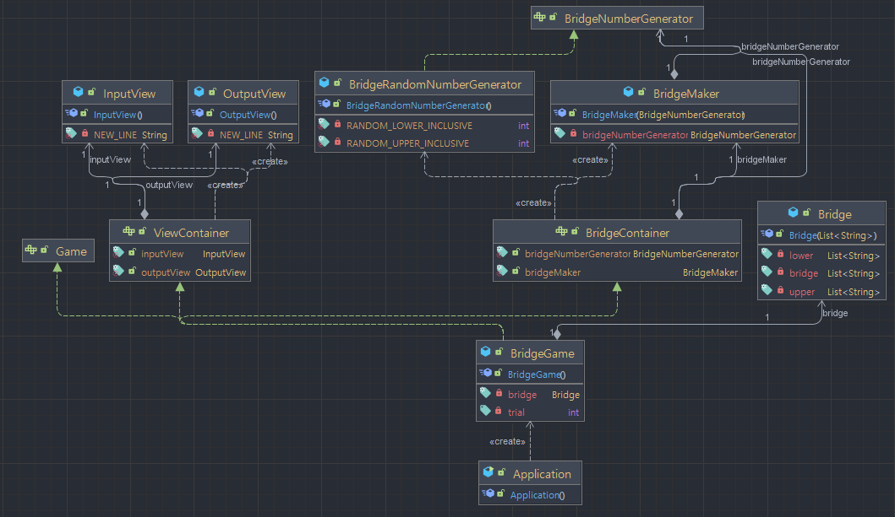
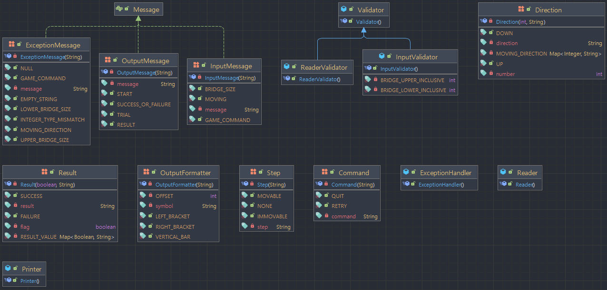

# 🔍 구현 기능 목록

## ✅ 게임 실행

- 다리 건너기 게임을 실행한다.
- `다리 건너기 게임을 시작합니다.` 문구를 출력한다.

## ✅ 다리의 길이 입력

- `다리의 길이를 입력해주세요.` 문구를 출력한다.
- **다리의 길이**를 입력받는다.
- 입력값이 올바른지 검증한다.

## ☑️ 다리의 길이 입력값 검증

- 입력값은 정수이어야 한다.
- 입력값은 3이상 20이하 범위 내 값이어야 한다.

## ✅ 다리 생성

- 0 또는 1을 무작위로 추출한다.
- 0이 추출된 경우 해당 칸을 `D`로 설정한다.
- 1이 추출된 경우 해당 칸을 `U`로 설정한다.
- **다리의 길이**에 따라 반복해서 칸을 설정한다.

## ✅ 이동할 칸 입력

- `이동할 칸을 선택해주세요. (위: U, 아래: D)` 문구를 출력한다.
- **이동할 칸**을 입력받는다.
- 입력값이 올바른지 검증한다.

## ☑️ 이동할 칸 입력값 검증

- 입력값은 `U` 또는 `D`이어야 한다.

## ✅ 이동 가능 여부 계산

- **해당 칸의 값**과 **이동할 칸 입력값**이 동일한 경우 **이동 가능**하다.
- 그렇지 않을 경우 **이동 불가능**하다.
- **시도한 횟수**를 1 증가시킨다.

## ✅ 이동 가능 여부 계산 결과 출력

- 건너온 칸을 누적한 다리를 출력한다.
  - **이동 가능**한 칸을 선택한 경우 `O` 표시한다.
  - **이동 불가능**한 칸을 선택한 경우 `X` 표시한다.
  - 선택하지 않은 칸은 `공백 한 칸`으로 표시한다.
  - 다리의 시작은 `[`, 다리의 끝은 `]`으로 표시한다.
  - 다리 칸의 구분은 `|`(앞뒤 공백 포함) 문자열로 구분한다.
  - 현재까지 건넌 다리를 모두 출력한다.
- 예시

    ```
    [ O |   | X ]
    [   | O |   ]
    ```


## ✅ 진행/재시도 계산

- **이동 가능**한 경우 게임을 계속 진행한다.
- **이동 불가능**한 경우 **재시도** 기능으로 이동한다.

## ✅ 재시도/종료 입력

- `게임을 다시 시도할지 여부를 입력해주세요. (재시도: R, 종료: Q)` 문구를 출력한다.
- **재시도** 여부를 입력받는다.
- 입력값이 올바른지 검증한다.

## ☑️ 재시도/종료 입력값 검증

- 입력값은 `R` 또는 `Q`이어야 한다.

## ✅ 재시도/종료 계산

- 입력값이 `R`일 경우 게임을 다시 시작한다.
- 입력값이 `Q`일 경우 게임을 종료한다.

## ✅ 게임 재시도

- 건너온 칸을 누적한 다리를 초기화한다.
- **이동할 칸 입력 기능**으로 이동하고, 게임을 재개한다.

## ✅ 게임 종료

- 게임 결과 계산의 결과에 따라 `성공` 또는 `실패` 문구를 출력한다.
- **게임 실행**부터 누계된 **시도한 횟수**를 출력한다.
- 게임을 종료한다.

## ☑️ 예외 처리

- **검증 결과**에 따른 모든 예외를 처리한다.
- 예외 타입에 따른 메시지를 출력한다.
- **예외를 throw** 한다.

# 📖 프로젝트 구조

- ▶️`Application` : 게임을 시작하고, 예외를 catch한다.
- 🧩`BridgeNumberGenerator` : 다리 생성을 위한 `generate` 메소드를 선언한다.
- ©️`BridgeRandomNumberGenerator` : `BridgeNumberGenerator`를 구현하여 다리를 생성한다.
- ©️`Validator` : 기본적인 검증 메소드들을 정의한다. 검증이 필요한 도메인에서 확장된다.
- 📁bridge
  - ©️`Bridge` : 다리의 상태를 관리하고 진행 상황과 다리 이동 로직을 수행한다.
  - ©️`BridgeMaker` : `BridgeNumberGenerator` 를 주입받아 다리를 초기화(생성)한다.
  - 🧩`BridgeContainer` : `BridgeNumberGenerator`와 `BridgeMaker`를 **싱글톤**으로 생성한다.
  - 🔢`Direction` : `U`와 `D`를 열거형으로 정의하고, 생성된 다리의 `0`과 `1`을  변환한다.
  - 🔢`Step` : `O`, `X`, `공백`을 열거형으로 정의한다.
- game
  - ©️`BridgeGame` : 다리 건너기 게임을 관리한다. `Game` 의 기능들을 구현한다.
  - 🧩`Game` : 게임의 핵심 기능들을 선언한다.
  - 🔢`Command` : 재시작(`R`), 종료(`Q`)를 열거형으로 정의한다.
  - 🔢`Result` : `성공`, `실패`를 열거형으로 정의하고, `true`와 `false`를 변환한다.
- view
  - 🧩`Message` : 모든 메시지 열거형에서 사용될 `text` 메소드를 선언한다.
  - 🧩`ViewContainer` : `InputView`와 `OutputView`를 **싱글톤**으로 관리한다.
  - console
    - ©️`Printer` : `Message`와 `String`형 출력 메소드들을 정의한다.
    - ©️`Reader` : 정수형 및 문자열 입력 메소드들을 정의한다.
    - ©️`ReaderValidator` : 입력값을 1차로 검증한다.
  - input
    - ©️`InputView` : 사용자 입력 기능들을 정의한다.
    - 🔢`InputMessage` : 입력을 위한 메시지들을 열거형으로 정의한다.
    - ©️`InputValidator` : 각 입력값을 기능에 부합하도록 2차로 검증한다.
  - output
    - ©️`OutputView` : 출력 기능들을 정의한다.
    - 🔢`OutputMessage` : 출력을 위한 메시지들을 열거형으로 정의한다.
    - 🔢`OutputFormatter` : 출력 형식에 필요한 상수들을 열거형으로 정의하고, 매핑한다.
- exception
  - ©️`ExceptionHandler` : 예외 메시지를 출력하고 해당 예외를 throw한다.
  - 🔢`ExceptionMessage` : 각 예외에 맞는 예외 메시지들을 열거형으로 정의한다.



