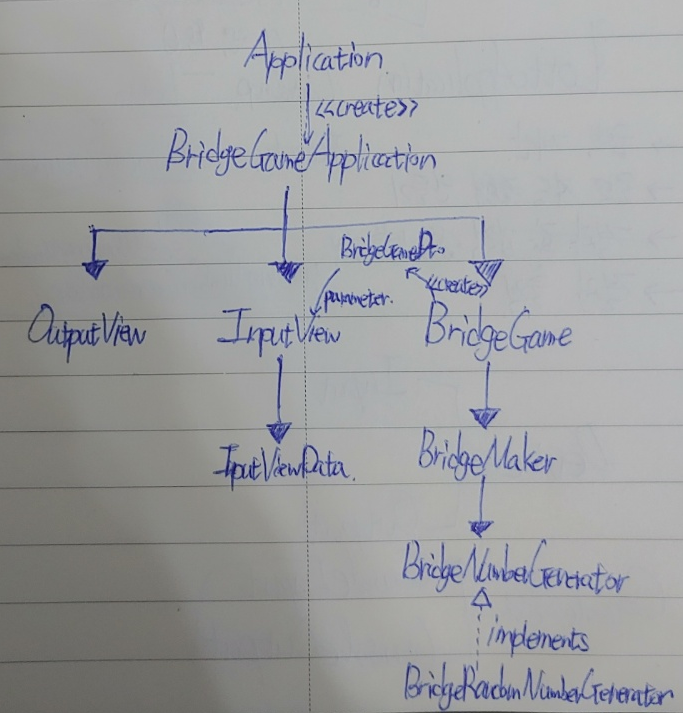

# 구현할 기능 목록

#### [구체화 및 구현 과정](./PROCESS.md)

- InputView
  - [x] 공통 : 에러 발생시, 값을 다시 입력받음
  - [x] 다리의 길이를 입력받음
      - 3 이상 20 이하의 숫자를 입력하지 않으면 `IllegalArgumentException` 에러 발생
  - [x] 플레이어가 이동할 칸을 입력받음
      - 주어진 특정문자(U, D)외의 문자를 입력받으면 `IllegalArgumentException` 에러 발생
  - [x] 게임 재시작 / 종료 여부를 입력 받는다.
      - 주어진 특정문자(R, Q)외의 문자를 입력받으면 `IllegalArgumentException` 에러 발생
  
- OutputView
  - [x] 게임 시작 문구 출력
  - [x] 다리의 현재 진행 상황 출력
  - [x] 게임 종료 및 게임 결과 문구 출력

- BridgeGame
    - [x] 앞으로 움직이는 기능 구현
    - [x] 재시작시 이동한 것을 초기화하는 기능 구현
    - [x] 현재 계속 건널 수 있는 상태인지 확인하는 기능 구현
    - [x] 게임이 성공했는지 확인하는 기능
- BridgeMaker
    - [x] bridge를 만듦
      - BridgeNumberGenerator 에서 0을 전달하면 아래를 추가, 1을 전달하면 위를 추가함
      - 위는 'U' 아래는 'D'를 넣어서 StringList 형태로 구현

- BridgeApplication
  - [x] 전반적인 실행 과정 구현
    - 다른 객체(InputView, OutputView, BridgeGame)들을 이용하여 전반적인 진행 과정 구현
      - 다리 길이를 입력받아 BridgeGame을 만듦
      - 이동할 곳을 입력받아 이동함
      - 다리 끝까지 이동했거나 이동하는 데 실패할 경우 중단함
      - 이동에 실패했을 경우, 재시도 여부를 입력받음
      - 끝까지 이동했거나 실패했을 때 끝낸 경우, 게임 결과를 출력함

- 최종 Class 구조
  - 아무것도 적어지지 않은 화살표는 의존성을 나타냄
  - 화살표를 2개 이상 지나간 객체들은 서로 의존하지 않도록 함 
    - ex) BridgeGameApplication과 InputViewData의 인터페이스를 몰라도 되도록 함

  

