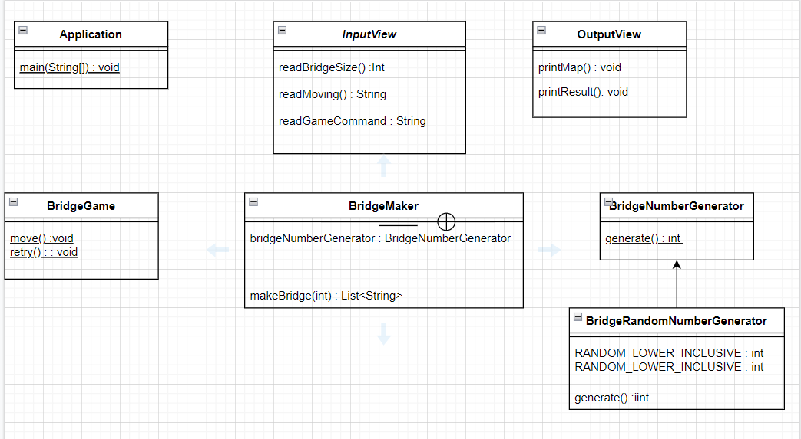

# 다리 건너기 요구 사항 분석 🦑🦑

********************

<h2> 1. 기능적 요구 사항 </h2>

## 기능 명세 사항 🎮

- 입력받은 숫자크기 만큼의 다리가 생성되어야한다. [✔]
    - 무작위 값이 0인 경우 아래칸, 1인 경우 위의칸이 건널 수 있는 칸이된다. [✔]
- 게임 재시작시에도 맨 처음 생성된 다리를 재사용해야 된다. [✔]
- 끝나는 종류는 총 두가지가 존재하게 된다. 이를 enum으로 타입을 만들어 분기를 만든다 [✔]
    - 다리를 온전히 건너 게임이 종료되는 경우 [✔]
    - 다리를 건너지 못한 경우 [✔]
- 한 번 생성된 다리는 final로 불변성을 보장해야한다. [✔]
- static 사용을 지양한다. [✔]
- 출력은 클래스에서 관리하기 때문에 StringBuilder 클래스를 활용하여 한번에 출력한다. [✔]

## 예외 처리 사항 🎮

- 다리의 길이는 3이상 20이하의 숫자여야한다. [✔]
- 플레이어가 이동할 칸은 U 또는 D 중 하나의 문자만 입력받을 수 있다. [✔]
- 게임 재시작 종료 여부를 입력받는다. R 과 Q 중 하나의 문자만 입력 받을 수 있다. [✔]
- 에러의 유형을 명확히 사용해야한다. 에러가 날 수 있는 부분에 명확한 에러처리를 한다. [✔]
- 옳바르지 못한 값이 입력된 경우 다시 값을 입력받아야 한다. [✔]

******************************

<h2> 2. 비기능적 요구 사항 </h2>

## 설계 관련 숙지사항 🔒
- 함수(또는 메서드)의 길이가 10라인을 넘어가지 않도록 구현한다.
- 함수(또는 메서드)가 한 가지 일만 잘하도록 구현한다.
- 메서드의 파라미터 개수는 최대 3개까지만 허용한다.
- 아래 있는 InputView, OutputView, BridgeGame, BridgeMaker, BridgeRandomNumberGenerator 클래스의 요구사항을 참고하여 구현한다.
    - InputView 클래스에서만 camp.nextstep.edu.missionutils.Console 의 readLine() 메서드를 이용해 사용자의 입력을 받을 수 있다.
    - BridgeGame 클래스에서 InputView, OutputView 를 사용하지 않는다.
    - BridgeRandomNumberGenerator, BridgeNumberGenerator 클래스의 코드는 변경할 수 없다.
    - Random 값 추출은 제공된 bridge.BridgeRandomNumberGenerator의 generate()를 활용한다.
- 패키지 네이밍을 의미있게 지어 분리한다.

## 컨벤션 숙지 사항 🔒

- 프로그래밍 요구 사항에서 달리 명시하지 않는 한 파일, 패키지 이름을 수정하거나 이동하지 않는다.
- indent(인덴트, 들여쓰기) depth를 3이 넘지 않도록 구현한다. 2까지만 허용한다.
- 3항 연산자를 쓰지 않는다.
  = 함수(또는 메서드)가 한 가지 일만 하도록 최대한 작게 만들어라.
- else 예약어를 쓰지 않는다.
- Java 코드 컨벤션 가이드를 준수하며 프로그래밍한다.

## 테스트 숙지 사항 🔒

- JUnit 5와 AssertJ를 이용하여 본인이 정리한 기능 목록이 정상 동작함을 테스트 코드로 확인한다.
- 도메인 로직에 단위 테스트를 구현해야 한다. 단, UI(System.out, System.in, Scanner) 로직은 제외한다.
- 작은 단위부터 시작하여 큰 단위의 테스트를 만든다.

***************************************************

<h2> 3. 기능 구상도 상세 </h2>

### 구현 기능 상세

최초 구현리스트는 다음과 같다

- 수를 입력받아 그 크기 만큼의 다리를 만든다 [✔]
- 사용자에게 값을 입력받아 그를 비교해야한다 [✔]
- 반복성을 가지게 됨으로 생성된 다리를 제외하곤 변경에 유연해야한다 [✔]

