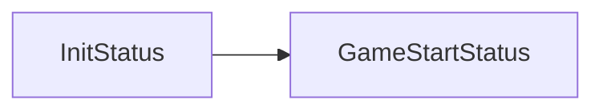
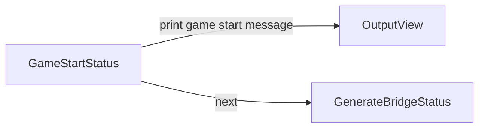
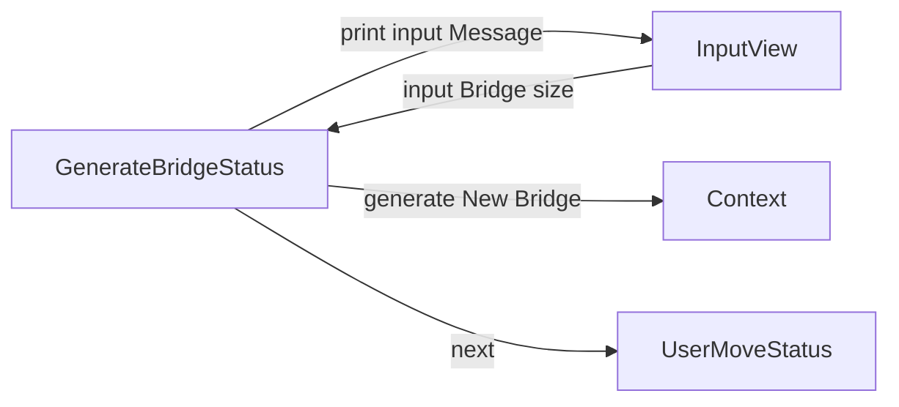
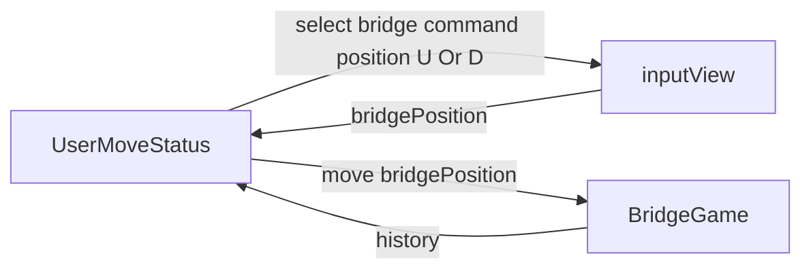

## 세부 진행 흐름
- initStatus

- GameStartStatus

- GenerateBridgeStatus

# 상태별 요구사항
- BridgeGameLauncher
  - [ ] 다리 건너기 게임 런처로 게임의 전반적인 실행 흐름을 제어 합니다.
 

## 도메인 요구사항

- BridgeSize
    - [ ] [검증] 다리의 길이는 3이상 20이하여야만 합니다.
    - [ ] [검증] 다리의 길이는 숫자이 외의 값을 가질 수 없습니다.
    - [ ] 다리의 길이는 자신의 값을 전달할 수 있습니다.
- BridgePosition
    - [ ] [검증] 1과 0을 제외한 값은 생성될 수 없습니다.
    - [ ] 1은 U 0는 B 입니다.
    - [ ] code 를 입력받으면 위치 값으로 변경해줍니다.
    - [ ] position을 통해서 BridgePosition을 만들 수 있습니다.
- SurviveStatus (생존 여부)
    - [ ] O는 생존 성공 상태입니다.
    - [ ] X는 생존 실패 상태입니다.
    - [ ] 생존 여부를 출력할 수 있습니다.
- History 기록
    - [ ] 단계별 진행사항을 기록합니다.
    - [ ] 기록한 결과를 출력할 수 있습니다.
- Stage 단계
    - [ ] 매 단계를 기록할 수 있습니다.
    - [ ] 윗 다리에 대한 결과를 출력할 수 있습니다.
    - [ ] 아랫다리에 대한 결과를 출력할 수 있습니다.
- LiveOrDie 위치에 대한 상태
    - [ ] 죽었을 경우에 대한 상태를 반환할 수 있습니다.
    - [ ] 생존했을 경우에 대한 상태를 반환할 수 있습니다.
- Bridge 다리
    - [ ] 생성자를 통해서 문자열로 이루어진 다리가 만들어집니다.
    - [ ] 정수를 입력받으면 해당 다리의 위치를 반환합니다.
- BridgeMaker
    - [ ] 다리는 3과 20사이의 길이로 이루어집니다.
#
