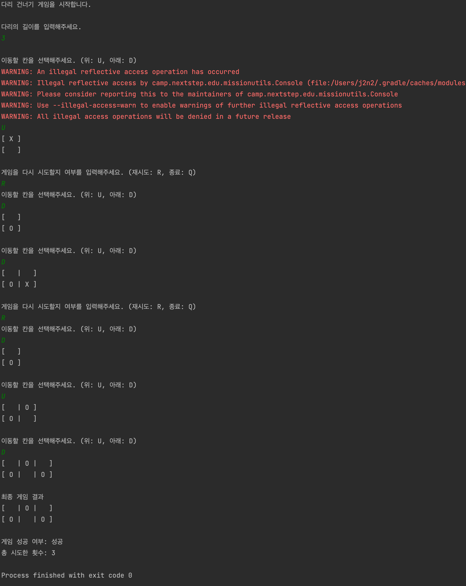
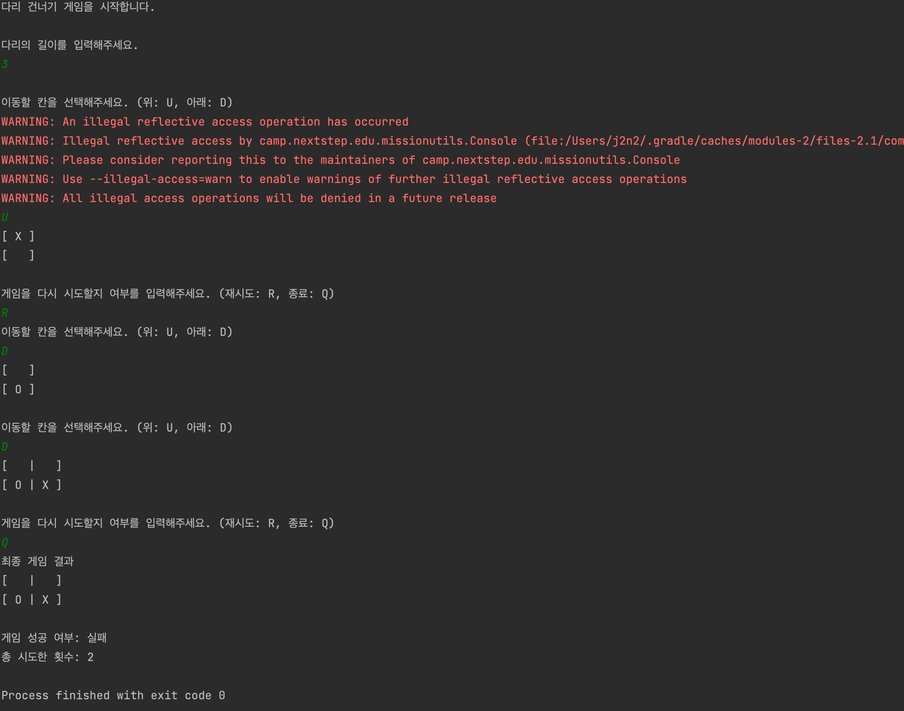

## 프리코스 4주차 미션 - 다리 건너기 

> 사용자로부터 입력을 받아 위 아래 둘 중 하나의 칸만 건널 수 있는 다리를 생성하고 이 다리를 끝까지 건너가는 게임이다.

<br>

### 🌉 다리 건너기 게임 규칙

```
- 위아래 두 칸으로 이루어진 다리를 건너야 한다.
- 다리의 길이를 숫자로 입력받고 생성한다.
- 다리가 생성되면 플레이어가 이동할 칸을 선택한다.
    - 이동할 때 위 칸은 대문자 U, 아래 칸은 대문자 D를 입력한다.
    - 이동한 칸을 건널 수 있다면 O로 표시한다. 건널 수 없다면 X로 표시한다.
- 다리를 끝까지 건너면 게임이 종료된다.
- 다리를 건너다 실패하면 게임을 재시작하거나 종료할 수 있다.
- 사용자가 잘못된 값을 입력할 경우 `IllegalArgumentException`를 발생시키고, "[ERROR]"로 시작하는 에러 메시지를 출력 후 그 부분부터 입력을 다시 받는다.
```

<br>

### 💻 실행 예시

```
다리 건너기 게임을 시작합니다.

다리의 길이를 입력해주세요.
3

이동할 칸을 선택해주세요. (위: U, 아래: D)
U
[ O ]
[   ]

이동할 칸을 선택해주세요. (위: U, 아래: D)
U
[ O | X ]
[   |   ]

게임을 다시 시도할지 여부를 입력해주세요. (재시도: R, 종료: Q)
R
이동할 칸을 선택해주세요. (위: U, 아래: D)
U
[ O ]
[   ]

이동할 칸을 선택해주세요. (위: U, 아래: D)
D
[ O |   ]
[   | O ]

이동할 칸을 선택해주세요. (위: U, 아래: D)
D
[ O |   |   ]
[   | O | O ]

최종 게임 결과
[ O |   |   ]
[   | O | O ]

게임 성공 여부: 성공
총 시도한 횟수: 2
```

<br>

### 📝 구현 기능 목록

```
1. InputView 이용해서 다리 길이 입력받는 기능 ✅
2. 입력받은 다리 길이가 유효한 값인지 검증하는 기능 ✅
   1. 입력받은 문자열이 숫자인지 검증하기
   2. 입력받은 값이 3~20의 값인지 검증하기
   3. 유효하지 않은 값을 받았다면 1번부터 다시 진행하기
3. 입력받은 사다리 길이 만큼 다리 객체 생성하는 기능 ✅
   1. 무작위로 다리 모양 생성하기
4. InputView 이용해서 이동할 칸 입력받는 기능 ✅
5. 입력받은 이동할 칸이 유효한 값인지 검증하는 기능 ✅
   1. 입력받은 문자열이 U or D 인지 검증하기
   2. 유효하지 않은 값을 받았다면 4번부터 다시 진행하기
6. 다리 이동하는 기능 ✅
7. 이동할 다리 칸 입력이 틀렸다면, 다시 시도할 지, 종료할 지 입력받는 기능 ✅
8. 입력받은 문자열이 유효한 값인지 검증하는 기능 ✅
    1. 입력받은 문자열이 R or Q 인지 검증하기 
    2. 유효하지 않은 값을 받았다면 7번부터 다시 진행하기
9. R을 입력받았다면, 해당 다리로 게임을 다시 시작하는 기능 ✅
10. 현재까지 이동한 다리 결과 출력하는 기능 ✅
11. 4~10번 반복하는 기능 ✅
12. 최종 게임 결과 출력하는 기능 ✅
```

<br>

### 👩🏻‍💻 실행 결과



<br>

