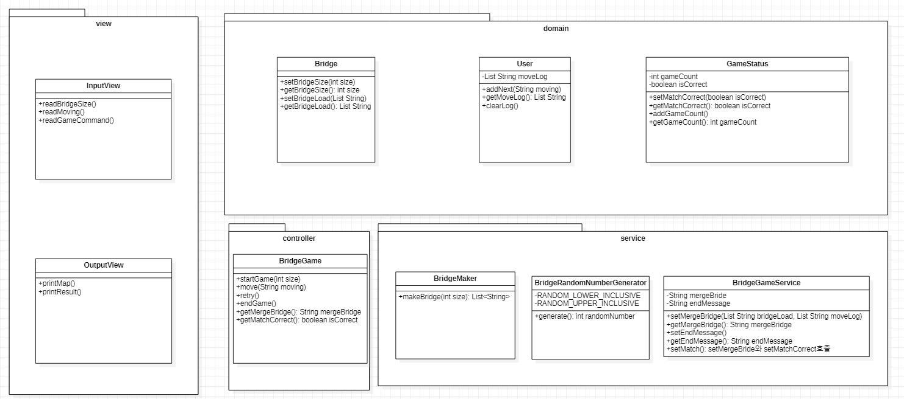

**# 다리 건너기 게임 주요 프로그래밍 요구 사항
- 함수(또는 메서드)의 길이가 10라인을 넘어가지 않도록 구현한다.
  - 함수(또는 메서드)가 한 가지 일만 잘하도록 구현한다.
- 메서드의 파라미터 개수는 최대 3개까지만 허용한다.
- 아래 있는 `InputView`, `OutputView`, `BridgeGame`, `BridgeMaker`, `BridgeRandomNumberGenerator` 클래스의 요구사항을 참고하여 구현한다.
  - 각 클래스의 제약 사항은 아래 클래스별 세부 설명을 참고한다.
  - 이외 필요한 클래스(또는 객체)와 메서드는 자유롭게 구현할 수 있다.
  - `InputView` 클래스에서만 `camp.nextstep.edu.missionutils.Console` 의 `readLine()` 메서드를 이용해 사용자의 입력을 받을 수 있다.
  - `BridgeGame` 클래스에서 `InputView`, `OutputView` 를 사용하지 않는다.

### InputView 클래스
- 제공된 `InputView` 클래스를 활용해 구현해야 한다.
- `InputView`의 패키지는 변경할 수 있다.
- `InputView`의 메서드의 시그니처(인자, 이름)와 반환 타입은 변경할 수 있다.
- 사용자 값 입력을 위해 필요한 메서드를 추가할 수 있다.
```java
public class InputView {

    public int readBridgeSize() {
        return 0;
    }

    public String readMoving() {
        return null;
    }

    public String readGameCommand() {
        return null;
    }
}
```
### OutputView 클래스
- 제공된 `OutputView` 클래스를 활용해 구현해야 한다.
- `OutputView`의 패키지는 변경할 수 있다.
- `OutputView`의 메서드의 이름은 변경할 수 없고, 인자와 반환 타입은 필요에 따라 추가하거나 변경할 수 있다.
- 값 출력을 위해 필요한 메서드를 추가할 수 있다.
```java
public class OutputView {

    public void printMap() {
    }

    public void printResult() {
    }
}
```

### BridgeGame 클래스
- 제공된 `BridgeGame` 클래스를 활용해 구현해야 한다.
- `BridgeGame`에 필드(인스턴스 변수)를 추가할 수 있다.
- `BridgeGame`의 패키지는 변경할 수 있다.
- `BridgeGame`의 메서드의 이름은 변경할 수 없고, 인자와 반환 타입은 필요에 따라 추가하거나 변경할 수 있다.
- 게임 진행을 위해 필요한 메서드를 추가 하거나 변경할 수 있다.

```java
public class BridgeGame {

    public void move() {
    }

    public void retry() {
    }
}
```

### BridgeMaker 클래스
- 제공된 `BridgeMaker` 클래스를 활용해 구현해야 한다.
- `BridgeMaker`의 필드(인스턴스 변수)를 변경할 수 없다.
- `BridgeMaker`의 메서드의 시그니처(인자, 이름)와 반환 타입은 변경할 수 없다.
```java
public class BridgeMaker {

    public List<String> makeBridge(int size) {
        return null;
    }
}
```

### BridgeRandomNumberGenerator 클래스

- Random 값 추출은 제공된 `bridge.service.BridgeRandomNumberGenerator`의 `generate()`를 활용한다.
- `BridgeRandomNumberGenerator`, `BridgeNumberGenerator` 클래스의 코드는 변경할 수 없다.


# 다리 건너기 게임 기능 목록 작성
# 게임은 다리를 다 만든 뒤 유저가 확인하는 느낌으로 구현
### 🟧 domain package
**Bridge**
>- [x] 다리의 길이를 저장하는 기능 ( setBridgeSize )
>- [x] 다리의 길이를 조회하는 기능 ( getBridgeSize )
>- [x] 다리의 값을 저장하는 기능 ( setBridgeLoad )
>- [x] 다리의 값을 조회하는 기능 ( getBridgeLoad )

**User**
>- [x] 이동할 칸을 입력 받는 기능 ( addNext )
>- [x] 이동한 기록을 살펴보는 기능 ( getMoveLog )
>- [x] 이동한 기록을 초기화하는 기능 ( clearLog )

**GameStatus**
>- [x] Bridge와 User의 일치 여부를 저장하는 기능 ( setMatchCorrect )
>- [x] Bridge와 User의 일치 여부를 조회하는 기능 ( getMatchCorrect )
>- [ ] 게임 시작 횟수를 더하는 기능 ( addGameCount )
>- [ ] 게임 시작 횟수를 조회하는 기능 ( getGameCount )


*****
### 🟧 service package
**BridgeRandomNumberGenerator**
>- [x] 0 또는 1을 랜덤으로 골라 반환하는 기능 ( generate )

**BridgeMaker**
>- [ ] size를 토대로 다리를 만드는 기능 ( makeBridge )

**BridgeGameService**
>- [ ] User 기록과 Bridge의 값으로 출력 값을 만드는 기능  ( setMergeBridge )
>- [ ] 출력값을 조회하는 기능 ( getMergeBridge )
>- [ ] 게임 종료 메시지를 만드는 기능 ( setEndMessage )
>- [ ] 게임 종료 메시지를 조회하는 기능 ( getEndMessage )
>- [ ] User 기록과 Bridge의 기록이 알맞은지 결정하는 기능 ( setMatch )

*****
### 🟧 controller package
**BridgeGame**
>- [ ] Game을 시작하는 기능 ( startGame )
>- [ ] 움직이는 기능 ( move )
>- [ ] Game을 재시작하는 기능 ( retry )
>- [ ] Game을 종료하는 기능 ( endGame )
>- [ ] 만들어진 User의 Map을 가져오는 기능 ( getMergeBrdige )
>- [ ] Bridge요소와 User요소가 같은지 가져오는 기능 ( getMatchCorrect )

*****
### 🟧 view package
**InputView**
>- [ ] 다리 길이를 입력받는 기능 ( readBridgeSize )
>- [ ] 이동할 칸을 입력받는 기능 ( readMoving )
>- [ ] 게임 재시도 여부를 입력받는 기능 ( readGameCommand )

**OutputView**
>- [ ] 만들어진 User의 Map을 출력하는 기능 ( printMap )
>- [ ] 최종 Game 결과를 출력하는 기능 ( printResult )


## 다리 건너기 게임 Diagram 작성
 </a> </a>