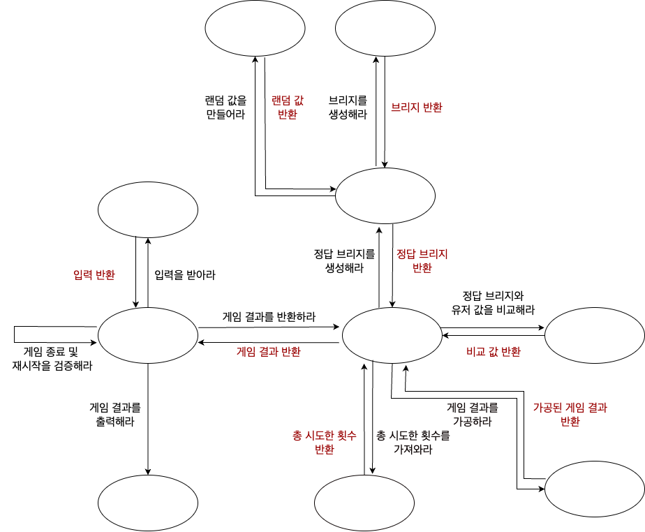

###  메세지 다이어그램 고안 
 

    

---
###  기능 목록

#### - 입력
> [기능] 다리 길이를 입력받는 기능  
> [기능] 플레이어가 이동할 칸을 입력받는 기능  
> [기능] 게임 재시작 및 종료 여부를 입력받는 기능  
> [기능] 예외가 발생하면 다시 입력을 받는 기능  

 

#### - 출력
- <strong> 정적인 렌더링 </strong>
> [기능] 게임 시작 문구를 출력하는 기능  
> [기능] 게임 진행 문구를 출력하는 기능   
> [기능] 게임 종료 문구를 출력하는 기능  

- <strong> 동적인 렌더링 </strong>
> [기능] 게임 성공 여부를 출력하는 기능  
> [기능] 총 시도한 횟수를 출력하는 기능  
> [기능] 브리지 상태를 출력하는 기능  
> [기능] 최종 게임 결과를 출력하는 기능  

  

#### - 도메인
- <strong> 유저 관련 </strong>
> [기능] 유저 입력 정보를 저장하는 기능  
> [기능] 유저 입력 정보를 초기화하는 기능  
> [기능] 유저 입력 정보를 통해 유저 브리지를 만들어내는 기능  

- <strong> 게임 진행 관련 </strong>
> [기능] 정답 브리지를 생성하는 기능  
> [기능] 브리지를 생성하는 기능  
> [기능] 랜덤 값을 만들어내는 기능  
> [기능] 정답 브리지와 유저 값을 비교하는 기능  

- <strong> 게임 결과 관련 </strong>
> [기능] 게임 결과를 반환하는 기능  
> [기능] 총 시도한 횟수를 저장하는 기능  
> [기능] 총 시도한 횟수를 반환하는 기능  

- <strong> 게임 제어 관련 </strong>
> [기능] 게임이 종료되었는지 체크하는 기능  
> [기능] 게임을 재시작하는 기능  

 

#### - 예외
- <strong> 다리 길이 입력 관련 </strong>
> [예외] 다리 길이가 숫자인지 체크하는 기능  
> [예외] 다리 길이가 정수형의 범위를 넘는지 체크하는 기능  
> [예외] 다리 길이가 3 이상 20 이하의 수가 아닌지 체크하는 기능  

- <strong> 게임 입력 관련 </strong>
> [예외] 순수 알파벳으로 이루어졌는지 체크하는 기능  
> [예외] 입력이 U 혹은 D가 아닌지 체크하는 기능  

- <strong> 게임 제어 관련 </strong>
> [예외] 순수 알파벳으로 이루어졌는지 체크하는 기능  
> [예외] 게임 재시작/종료 여부가 R 혹은 Q인지 체크하는 기능  

- <strong> 시스템 내부 관련 </strong>
> [예외] 다리가 올바르게 구성되어 있는지 상태를 지속적으로 모니터링하는 기능  

