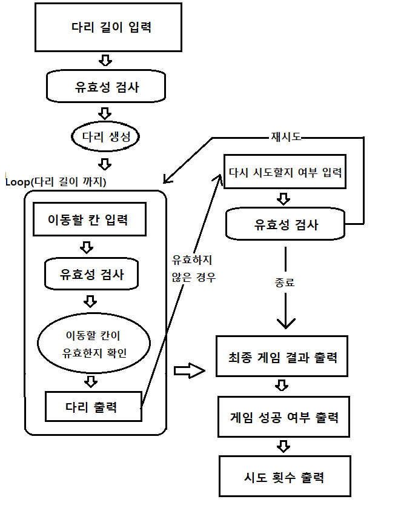

# 🚀 구현할 기능 목록

--- 

- [x] 다리 생성
  - 다리를 생성할 때 위, 아래 칸 중 건널 수 있는 칸은 0과 1중 무작위 값 이용 
  - 무작위 값이 0인 경우 아래 칸 - D 저장, 1인 경우 위 칸 - U 저장
- [x] 이동할 칸이 유효한 칸인지 확인

입력
- [x] 다리 길이 입력
  - 3이상 20이하 숫자 입력
  - 그 외의 경우 예외 처리
    - 입력 크기가 1보다 작거나 2보다 큰 경우 예외 처리
    - 숫자가 아닌 경우 예외 처리
    - 3보다 작거나 20보다 큰 경우 예외 처리
- [ ] 이동할 칸 입력
  - 라운드 마다 위(U), 아래(D) 중 입력 
  - 그 외의 경우 예외 처리
    - U(위) 혹은 D(아래)가 아닌 경우 예외 처리
  - 다리를 건널 때까지 혹은 실패할 때 까지 매 라운드 입력
    - 성공한 경우 -> 게임 결과 출력 -> 게임 종료
    - 실패한 경우 -> 다시 시도할지 여부 입력
- [ ] 다시 시도할지 여부 입력
  - 재시작 시 처음에 만든 다리로 게임 재시작
  - 종료 입력 시 결과 출력 후 게임 종료
  - R(재시작)과 Q(종료)중 하나의 문자를 입력
  - 그 외의 경우 예외 처리

출력
- [x] 게임 시작 문구
- [x] 다리 출력
  - 이동할 칸을 건널 수 있다면 O, 건널 수 없다면 X로 표시
  - 선택하지 않은 칸은 공백 한 칸으로 표시
  - 다리 칸의 구분은 | 문자열로 구분
  - 현재까지 건넌 다리를 모두 출력
- [ ] 최종 게임 결과 출력
- [ ] 게임 성공 여부 출력
- [ ] 시도 횟수 출력

게임 종료
- 다리를 끝까지 건너면 종료된다.
- 다리를 건너다 실패하고 추가 게임 여부에서 종료를 입력한 경우

사용자가 잘못된 값을 입력한 경우(예외 처리)
- IllegalArgumentException을 발생
- "[ERROR]"로 시작하는 메시지를 출력 후 그 부분부터 입력을 다시 받는다.
- Exception이 아닌 IllegalArgumentException, IllegalStateException 등과 같은 명확한 유형을 처리한다.

--- Flow 도식화

