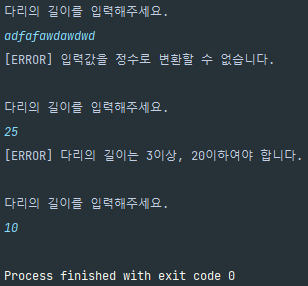

# 구현할 기능 목록

- [x] 게임 시작 문구 출력
- [x] 다리 길이 요구 문구 출력
- [x] 다리 길이 입력
  - [x] 입력받은 문자열을 Int형으로 전환
    - [x] 전환 불가할 시 예외 처리
- [x] 다리 생성
  - [x] 3 이상 20 이하가 아닐 경우 예외 처리
  - [x] 입력받은 값만큼 다리 생성
    - [x] `bridge.BridgeRandomNumberGenerator`의 `generate()`를 활용하여 건널 수 있는 칸 결정
    - [x] 자료구조에 맞게끔 생성된 int값을 String으로 변환
    - [x] 변환된 값을 기반으로 다리 생성
- [x] 게임 시도 횟수 증가
- [x] 이동할 칸(다리) 요구 출력
- [x] 이동할 다리 선택
  - [x] `U` 또는 `D`가 아닐 경우 예외 처리
  - [x] 글자와 순서에 따른 다리가 건널 수 있는 곳인지 확인
  - [x] 해당 다리를 건넌 기록을 남김
- [x] 이동 결과 출력
  - [x] 이동한 칸이 건널 수 있다면 `O`, 아니라면 `X` 출력
- [x] 게임 종료 파악
  - [x] 모든 칸을 이동했을 경우(성공)
  - [x] 건널 수 없는 칸으로 이동했을 경우(실패)
    - [x] 게임 다시 시도 여부 문구 출력
    - [x] 게임 다시 시도 여부 입력
      - [x] `R` 또는 `Q`가 아닐 경우 예외 처리
    - [x] 게임 재시작
      - [x] 다리 건넌 기록을 초기화하며 게임 시도 횟수를 증가
- [x] 최종 게임 결과 문구 출력


# 구현 전

## 피드백 수용

> 피어 리뷰, 아고라, 3주 차 공통 피드백에서 굉장히 배울 게 많았다. 내가 고민하며 지켰던 것도 있지만, 고민했으나 해당 방향성을 지니지 못 한 것도 있고, 생각치 못 한 점도 분명 있었다. 해당 사항들을 되짚으며 성장하고, 이번 과제에서 잘 지켜보기로 했다.

### 객체를 객체스럽게

- 객체의 데이터를 꺼내지 말고, 객체가 일하도록 메시지를 던지자
- 해당 메서드의 책임이 어디에 있는지 계속 생각하자. 혹여나 역할의 범주를 넘어버린 건 아닐까?
- `getter`를 무조건 쓰지 말라는 건 아니다. 출력을 위한 값 획득 등에서는 허용된다.

### 일급 컬렉션을 사용하자

- 컬렉션을 Wrapping하며, 그 외의 다른 멤버 변수가 없는 상태를 칭한다.
- 내부 값들의 규칙을 위한 자료구조 설정이 아닌, 해당 컬렉션에 대한 Validation을 작성해 보자.
- 컬렉션의 불변을 보장할 수 있다.
- 값과 로직이 함께 존재하므로, `객체를 객체스럽게` 사용할 수 있다.

### MVC 구조를 잘 지키자

- Model은 Controller와 View에 의존하지 말아야 한다.
- View는 Model에만 의존해야 하고, Controller에는 의존하면 안된다.
- View가 받는 데이터는 변동 가능성이 있는 데이터여야 한다. 고정된 값들은 받아선 안 된다.
- Controller는 Model과 View에 의존해도 된다.
- View가 데이터를 받을 때는, 반드시 Controller를 통해 받아야 한다.


# 초기 구현

## 예외 시 반복하여 값을 처리하는 메서드

사용자의 모든 입력 중, 예외가 발생하면 어디서 처리할 지 고민했다.

입력을 받는 곳은 `InputView`였고, 예외사항을 출력하려면 `OutputView`를 사용해야 했다.

헌데 `InputView`에서 `OutputView`를 지정하여 실행하는 건 마음에 들지 않았기에, `BridgeGameController`부분에 반복 메서드를 작성하기로 했다.

### 재사용할 수 없나?

해당 메서드는 `예외가 발생한다면 이전의 코드를 반복 실행`시키기만 하면 됐다. 상당히 간편할 것이라 생각했다.

헌데 구조를 생각하면 `반복 - 원하는 코드 실행 및 결과 반환 - 예외 시 처리` 순이었다.

원하는 코드를 실행하는 부분은 콜백 구조를 사용하려 했다. Python과 달리 구조를 직접 구성해야 가능했으나 그 정도야 뭐 구현할 수 있을 거라 생각했다. 하지만 첫번째 문제는 결과 반환 부분이었다.

사용자의 입력을 받는 값 중 `다리의 길이 / 이동할 칸, 게임 재시작 여부`는 `정수 / 문자` 형태였다. 이를 통일시키기 위해서는 다리의 길이를 입력받을 때도 문자 형태로 받아야 했다. 뭐.. 이것도 가능은 했다. 구조를 `반복 - 입력 받음, 유효성 검사 - 예외 시 처리 `로 묶어주면 되니까.

하지만 이렇게 되면 유효성 검사 부분에서 정수로 전환할 수 있는지 미리 살펴본 후, 이동하여 원하는 형태로 전환시켜야 했다. 별로 마음에 들지 않았다. 그렇다고 반환형만 다른 메서드를 따로 2개 작성하자니 그것도 별로였다. 따라서 원래 생각한 구조를 지니되, 제네릭을 써서 유동적으로 사용할 수 있게 하기로 했다.


```java
public interface Callback <T> {
    T run();
}
```

메소드 하나만 있는 인터페이스를 작성했다.


```java
public class ExceptionHandle {

    private final OutputView outputView;

    public ExceptionHandle(OutputView outputView) {
        this.outputView = outputView;
    }

    public <T> T getCorrectInput(Callback<T> callback) {
        while (true) {
            try {
                return callback.run();
            } catch (IllegalArgumentException e) {
                outputView.printExceptionMessage(e.getMessage());
            }
        }
    }
}
```

생성 시 기존에 지닌 `OutputView`를 넘겨주고, 해당 인스턴스를 이용해 출력할 수 있도록 했다.

예외가 발생하지 않는, 옳은 값을 반환해 올 것이기에 `getCorrectInput`이라고 메서드명을 지었다.

`callback`을 인자로 받은 후 `run()` 을 통해 `IllegalArgumentException`이 뜨지 않는지 확인한다. 예외가 없다면 그대로 return이 동작할 것이고, 예외가 있다면 계속해서 `run()`을 실행할 것이다.


```java
private List<String> createBridge() {
    return exceptionHandle.getCorrectInput(() -> {
        outputView.printRequestBridgeLength();
        int bridgeSize = inputView.readBridgeSize();
        return bridgeMaker.makeBridge(bridgeSize);
    });
}
```

인터페이스에 인자가 하나였기에, 간단하게 람다식으로 쓸 수 있었다. (`@Override` 하니까 코드가 조금 더러웠었는데, IntelliJ가 없앨 수 있다고 친절히 알려줬다!)

다리의 길이를 입력해달라고 출력한 후, 값을 입력받는다. `inputView.readBridgeSize()` 내에는 정수로 변환할 수 없을 시, `bridgeMaker.makeBridge(bridgeSize)` 내에는 입력받은 `bridgeSize`가 3 미만, 20 초과일 때 예외를 발생시키도록 했다.




두 가지 예외 사항에 따라 잘 동작하는 것을 확인할 수 있었다.


## 게임 진행 상황을 어떻게 남길 것인가?

게임은 미리 정해진 다리를 기반으로, 위쪽 다리와 아래쪽 다리를 선택함에 따라 정답(O, X) 또는 미선택(공백)을 표현하여야 한다.

즉, 선택했을 시 해당하는 기록이 남아야 하며 이는 게임 진행에 따라 작성될 수 있어야 한다.

### 일급 컬렉션

3주차 과제 관련하여 [아고라에 Discussion](https://github.com/orgs/woowacourse-precourse/discussions/969#discussioncomment-4157936)을 남긴 게 있는데, 한 분이 회고문을 링크 걸어 주셨다. 해당 글을 읽고 `일급 컬렉션`에 대해 생각해보게 되었다.

게임할 때의 진행 상황을 게임 내에 담아두는 게 아닌, 로그 자체에게 메시지를 던질 수 있도록 일급 컬렉션으로 생성하여 작업해보고자 하였다.

3주차 공통 피드백의 `객체는 객체스럽게 사용한다` 부분과 `객체에 메시지를 보내자`를 바탕으로 게임을 진행하며 일어난 일들을 로그에 넘겼을 때, 알아서 동작하게끔 구성했다.


```java
public class BridgeMoveLog {

    private final Map<TypeOfBridge, List<String>> moveLog;

    private static final String EMPTY = " ";

    public BridgeMoveLog(int size) {
        this.moveLog = initLog(size);
    }

    private Map<TypeOfBridge, List<String>> initLog(int size) {
        return new EnumMap<>(TypeOfBridge.class) {{
            for (TypeOfBridge bridgeType : TypeOfBridge.values()) {
                put(bridgeType, new ArrayList<>(size));
            }
        }};
    }

    public void writeLog(TypeOfBridge selectBridgeType, String status) {
        for (TypeOfBridge bridgeType : moveLog.keySet()) {
            if (selectBridgeType == bridgeType) {
                moveLog.get(bridgeType).add(status);
                continue;
            }

            moveLog.get(bridgeType).add(EMPTY);
        }
    }

    public void resetLog() {
        for (List<String> log : moveLog.values()) {
            log.clear();
        }
    }

    public Map<TypeOfBridge, List<String>> getMoveLog() {
        return moveLog;
    }
}
```

게임에서 직접적으로 로그 데이터를 건드릴 수 없게끔 클래스로 감쌌으며, 게임 진행 상황과 매칭될 수 있도록 `로그 작성`과 `로그 리셋`을 작성하였다. 또한 로그 출력을 위해 `get` 메서드도 선언.


## 패키지 이동 불가?

프로그래밍 요구사항을 보면, `InputView`, `OutputView`, `BridgeGame`은 패키지의 변경이 가능하다고 나와있다.

그러나 `BridgeMaker`, `BridgeRandomNumberGenerator`, `BridgeNumberGenerator`는 해당하는 조건이 나와있지 않다.

따라서 이동시키지 않기로 했다.. 조건에 나와있지 않은 사항이다보니 굉장히 조심스럽다.


# 리팩터링

## 값 검색을 위한 static Map과 Static Method

이전 과제에서 `stream`을 사용해 Enum 값을 검색하는 방법, `Map`을 이용하여 미리 검색할 대상을 등록하여 사용하는 방법 둘 다 고려했었다.

전자는 코드가 간편하고, 검색을 위한 Map을 사용할 필요가 없었다. 프로젝트 실행 중 Enum이 추가적으로 생성된다면 유연하게 대처할 수도 있었다.

후자는 프로젝트 실행 중 Enum이 추가될 경우에 대비해야하고, 미리 Map을 생성해둬야 하지만, 검색 속도를 O(1)으로 가져갈 수 있었다.

이전 과제와 이번 과제 모두 Enum의 새 값 추가가 없을 거라는 가정 하에 진행된 상태로, 검색 속도를 조금이라도 빠르게 해보기 위해 `Map`을 사용했다.

그러나 이전 과제는 로또를 대량구매했을 경우 일치하는 Enum값을 빠르게 찾아보자는 목표가 있었던 반면 이번 과제는 다리와 유저의 선택 모두 2가지로만 나뉘는 형태이며, 이를 위한 `Map`을 지니는 건 메모리적으로 낭비가 아닐까 하는 생각이 들었다.

따라서 `Map` 없이 `stream`으로 값을 찾으며, 값을 찾지 못 한 경우 예외를 발생하는 코드를 작성하기로 했다.


```java
private static final Map<String, BridgeType> textBridge = new HashMap<>() {{
    for (BridgeType type : BridgeType.values()) {
        put(type.text, type);
    }
}};

public static BridgeType searchBridgeToText(String text) {
    BridgeType bridge = textBridge.get(text);

    if (bridge == null) {
        throw new IllegalArgumentException("허용되지 않는 글자입니다. 일치하는 다리를 찾을 수 없습니다.");
    }

    return bridge;
}
```

수정 전. `Map`을 초기에 작성하며, 이후 검색에 사용했다.


```java
public static BridgeType searchBridgeToText(String text) {
    return Arrays.stream(BridgeType.values())
        .filter(bt -> bt.getText().equals(text))
        .findFirst()
        .orElseThrow(
        () -> new IllegalArgumentException("허용되지 않는 글자입니다. 일치하는 다리를 찾을 수 없습니다."));
}
```

수정 후. `Map`을 제거하였으며, values()를 순회하며 값을 찾은 후 반환한다. 만약 찾지 못 할 경우 예외를 발생시킨다.


## 로그 형태가 출력 데이터와 일치하는 방식이 과연 맞을까?

현재 로그의 구조는 다리마다 하나씩 내부 리스트를 지닌 형태다. 유저가 어떤 다리의 칸으로 이동할지를 고르면, 해당 다리에 해당하는 리스트에 정답 유무를 기록하고 나머지 다리에는 공백을 입력한다.

현재는 다리가 단 2개이니 상관없지만, 만약 다리가 30개라면 30개의 리스트가 생기는 꼴이다.

즉, 현재 로그의 내부 형태는 출력하는 방식에 맞춰 작성되어있고, 이는 곧 출력 방식에 의존하는것과 마찬가지라는 생각이 들었다.

따라서 로그를 현재 생성되는 다리의 형태와 같게 만들어지도록 하며, 출력 시 현재 정해진 출력 양식에 맞게 변경시킬 수 있도록 하려 했다.

헌데 코드를 수정하려 하니 문득 의구심이 들었다. 만약 다리 갯수와 최대 길이가 지금보다 증가한다면, 오히려 출력 과정에서 더 많은 연산을 해야 했다. 이는 기존의 직접 로그를 남기는 방식보다 더 비효율적인 선택이 아닐까? 지금과 같이 리스트를 유지하는 방식이, 오히려 게임의 진행과 출력을 위해 나은 선택일 수 있지 않을까?

출력하기 전, 데이터를 출력에 맞는 형식으로 살짝 변형시키는 건(공백 추가, 쉼표 구분 등) 있을 수 있다. 하지만, 그러한 출력문 자체를 만들기 위해 직접 데이터를 만드는 과정은 객체지향에 맞지 않다고 판단했다. View는 어디까지나 데이터를 기반으로 출력을 하기 위함이지, 출력을 하기 위해 데이터를 만드는 건 View의 역할이 아니라는 생각이 들었다.

만약 다른 형식으로 출력문을 바꾸게 된다면, 차라리 Log 인터페이스를 만들고 그에 맞는 클래스를 생성하여 넘겨주는 것이 더 옳은 해결법이라 생각했다.

따라서 지금과 같은 Log 형식을 유지하기로 했다.


# 느낀 점

## MVC 패턴

지난주까지만 해도 `MVC패턴을 왜 지켜야 하는가`라는 의문이 있었다. 클래스를 잘 분리해두면 알아서 MVC 구조가 만들어지는데, 어떤 의의가 있을까 상당히 고민했다.

헌데 아고라에서 의견을 나누며, 또 따로 이것저것 찾아보며  `본질은 객체지향`이라는 결론에 다다랐다.

클래스의 역할과 기능을 잘 나누다 보면 (꼭 MVC가 아니더라도)특정 패턴의 모습과 비슷한 양상을 보일 수는 있다. 하지만 패턴을 알고, 해당 패턴을 지키며 코드를 작성하는것은 프로그래머에게 `내가 지금 객체지향을 잘 지키고 있나`라는 물음을 계속 던지고, 결과적으로 `객체를 객체답게` 작성할 수 있도록 돕는다.

즉 `패턴은 방법론일 뿐, 본질은 객체지향`이라는 결론을 얻을 수 있었다.
