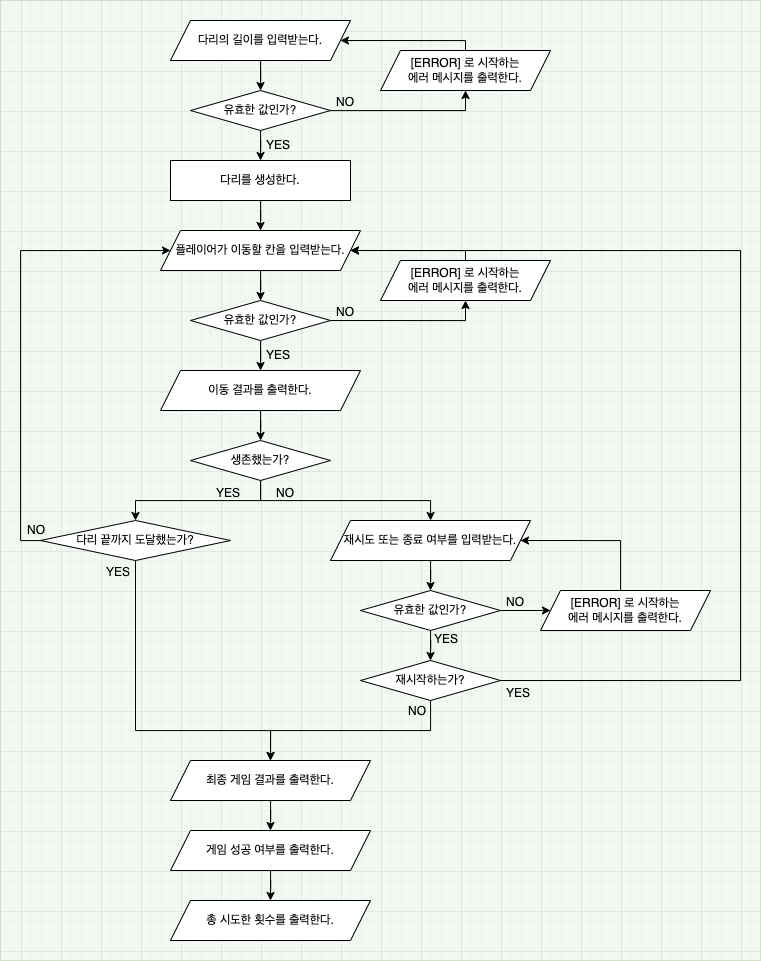

## 🗺 설계
* [x] 애플리케이션 흐름 구상하기

* [x] 의존성 주입 컨테이너 구현하기

## 🐳 기능 구현
* [x] 게임 시작을 알리는 메시지를 출력한다.
* [x] 다리의 길이를 입력받는다.
  * [x] 다리 길이 입력을 유도하는 메시지를 출력한다.
  * [x] 유효한 값인 지 검증한다.
    * 자연수만 입력했는가?
    * 3 이상 20 이하의 숫자를 입력했는가?
* [x] 다리를 생성한다.
  * [x] 0 또는 1의 랜덤한 숫자를 생성한다.
  * [x] 숫자에 해당하는 U 또는 D의 대문자로 치환한다.
  * [x] 대문자 배열을 가진 리스트에 차례대로 담는다.
* [x] 플레이어가 이동할 칸을 입력받는다.
  * [x] 이동할 칸 입력을 유도하는 메시지를 출력한다.
  * [x] 유효한 값인 지 검증한다.
* [x] 이동한 칸이 정답과 일치하는 지 비교한다.
* [x] 이동 결과를 출력한다.
  * [x] 다리를 표현하는 메시지를 만든다.
    * [x] 다리의 시작을 표시한다.
    * [x] 이동할 수 있는 칸을 선택한 경우를 표시한다.
    * [x] 이동할 수 없는 칸을 선택한 경우를 표시한다.
    * [x] 다리 칸의 구분을 표시한다.
    * [x] 다리의 끝을 표시한다.
* [x] 생존했는가?
  - NO
  * [x] 재시도 또는 종료 여부를 입력받도록 유도하는 메시지를 출력한다.
  * [x] 재시도 또는 종료 여부를 입력받는다.
    * [x] 유효한 값인 지 검증한다.
* [x] 다리 끝까지 도달했는가?
* [x] 최종 게임 결과를 출력한다.
  * [x] 게임 성공 여부를 출력한다.
  * [x] 총 시도한 횟수를 출력한다.
  
* 잘못된 검증 값 공통 핸들링 
  * [x] 잘못된 값이면 IllegalArgumentException을 발생한다.
  * [x] 예외는 어딘가에서 잡아야 하고, [ERROR] 로 시작하는 메시지를 출력한다.
  * [ ] 잘못된 입력이 들어간 단계부터 다시 입력을 받는다.