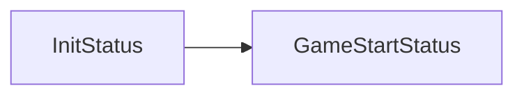
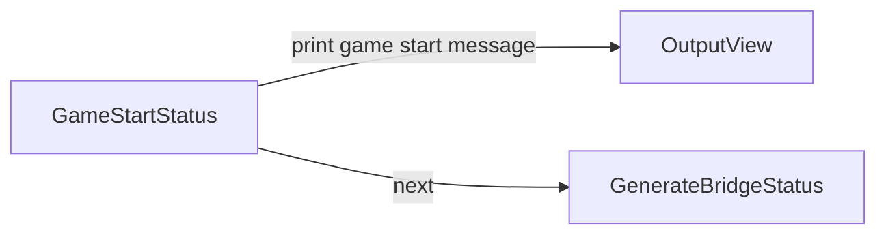
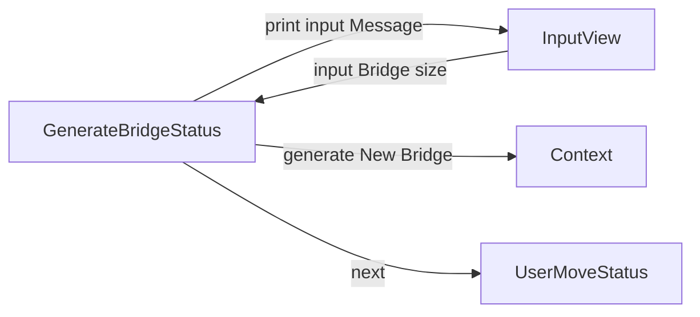
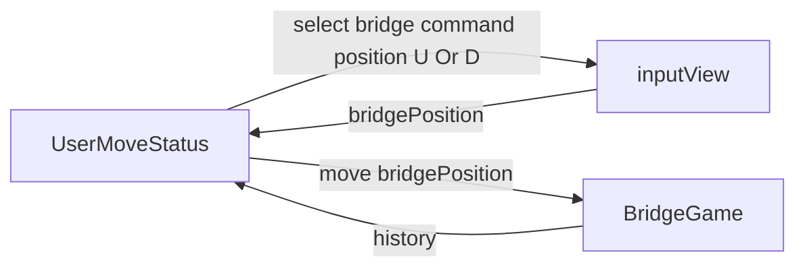

## 세부 진행 흐름

- initStatus

- GameStartStatus

- GenerateBridgeStatus

# 상태별 요구사항

- BridgeGameLauncher
    - 다리 건너기 게임 런처로 게임의 전반적인 실행 흐름을 제어 합니다.
- BridgeGameContext
    - 다리 건너기 게임의 데이터의 제어를 담당합니다.
- View
    - inputView, ouputView에 대한 전달할 책임을 가집니다.
- BridgeGameStatus
    - 다리 건너기 게임의 실행 순서를 제어하는 인터페이스 입니다.
        - InitStatus
            - 게임의 준비 상태입니다.
            - [O] 게임의 준비 상태로 next를 호출하면 다음 단계로 넘어갑니다.
        - GameStartStatus
            - 게임의 시작을 알리는 상태입니다.
            - [ ] 게임의 시작 메시지를 출력합니다.
        - GenerateBridgeStatus
            - 다리 건너기 게임의 다리를 만드는 상태입니다.
                - [ ] 사용자로 부터 다리의 길이를 입력받습니다.
                - [ ] 입력받아진 다리의 길이로 랜덤한 다리를 만들어서 컨텍스트로 전달합니다.
        - PlayerUnitMoveStatus
            - 사용자의 장기말이 움직이는 상태입니다.
                - [ ] 

## 도메인 요구사항

- BridgeSize
    - [x] [검증] 다리의 길이는 3이상 20이하여야만 합니다.
    - [x] [검증] 다리의 길이는 숫자이 외의 값을 가질 수 없습니다.
    - [x] 다리의 길이는 자신의 값을 전달할 수 있습니다.
- BridgePosition
    - [X] [검증] 1과 0을 제외한 값은 생성될 수 없습니다.
    - [X] 1은 U 0는 B 입니다.
    - [X] code 를 입력받으면 위치 값으로 변경해줍니다.
    - [X] position을 통해서 BridgePosition을 만들 수 있습니다.
- SurviveStatus (생존 여부)
    - [X] O는 생존 성공 상태입니다.
    - [X] X는 생존 실패 상태입니다.
    - [X] 생존 여부를 출력할 수 있습니다.
- History 기록
    - [X] 단계별 진행사항을 기록합니다.
    - [X] 기록한 결과를 출력할 수 있습니다.
- Stage 단계
    - [X] 매 단계를 기록할 수 있습니다.
    - [X] 윗 다리에 대한 결과를 출력할 수 있습니다.
    - [X] 아랫다리에 대한 결과를 출력할 수 있습니다.
- Bridge 다리
    - [X] 생성자를 통해서 문자열로 이루어진 다리가 만들어집니다.
    - [X] 정수를 입력받으면 해당 다리의 위치를 반환합니다.
- BridgeMaker
    - [X] 1과 0이 입력되면 U와 D로 변경합니다.
- RestartCommand
    - 게임의 재시작 혹은 종료에 대한 상태 코드입니다
    - [X] R은 재시작 Q는 종료 상태입니다.
    - [X] [검증] R과 Q가 아닌 값은 가질 수 없습니다.

#
