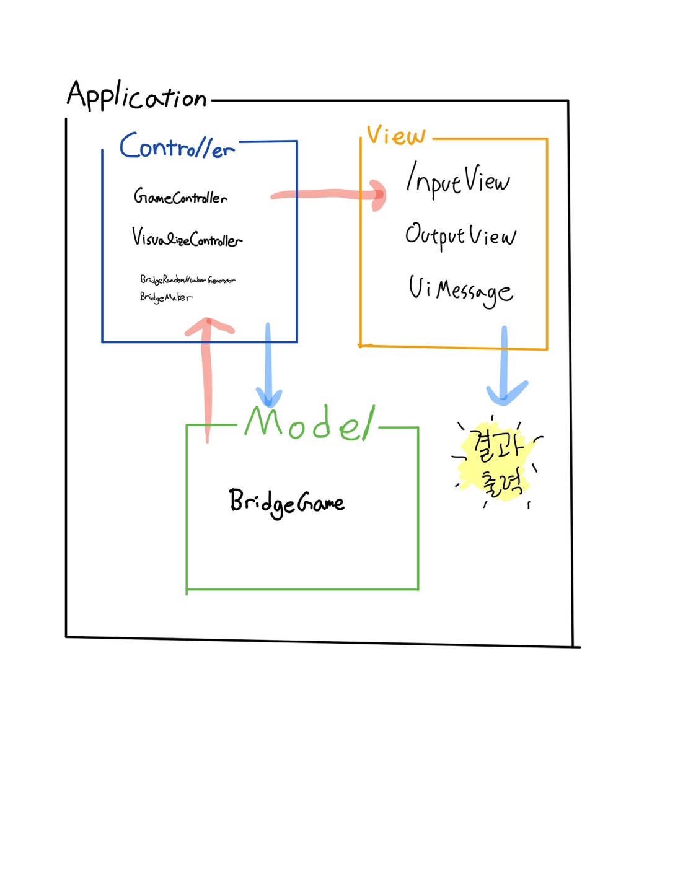

# 미션 - 다리건너기
## 주요 목표
- [x] MVC 패턴을 익히고 지키기
- [x] indent(인덴트, 들여쓰기) depth를 3이 넘지 않도록 구현하기
- [x] 함수(또는 메서드)의 길이가 10라인을 넘어가지 않도록 구현.(함수(또는 메서드)가 한 가지 일만 하도록 만들기.)
- [ ] 도메인 로직에 단위 테스트를 구현.
- [x] 메서드의 파라미터 개수는 최대 3개까지 사용하기
---
## 기능 흐름도


---

## 세부 기능 요구 사항
- [x] 다리의 길이를 숫자로 입력받고 자동으로 생성
  - 3이상 20이하의 숫자를 입력, 올바른 값이 아니면 예외처리
- [x] 라운드마다 플레이어가 이동할 칸을 입력받아 선택
  - U,D 둘 중 하나를 선택, 올바른 값이 아니면 예외처리
- [x] 게임 재시작/종료 여부를 입력
  - R,Q 둘 중 하나를 선택, 올바른 값이 아니라면 예외처리
- [x] 게임 시작 문구를 출력
  - ```다리 건너기 게임을 시작합니다.```
- [x] 게임 진행 및 종료 문구를 출력
  - 출력 형식은 실행 결과 예시를 참고하여 출력
    - 이동할 수 있는 칸을 선택한 경우 O 표시
    - 이동할 수 없는 칸을 선택한 경우 X 표시
    - 선택하지 않은 칸은 공백 한 칸으로 표시
    - 다리의 시작은 `[`, 다리의 끝은 `]`으로 표시
    - 다리 칸의 구분은 ` | `(앞뒤 공백 포함) 문자열로 구분
    - 현재까지 건넌 다리를 모두 출력[
- [x] 예외상황시, "[ERROR]"로 시작하는 에러 문구를 출력

---
