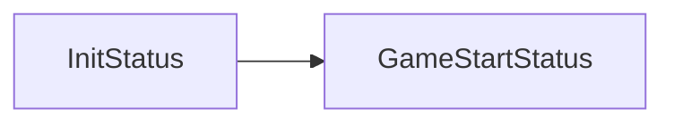
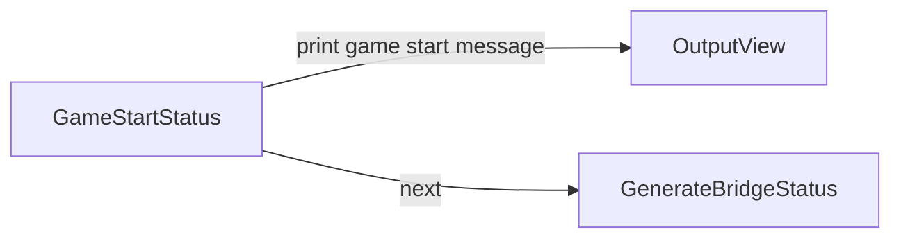
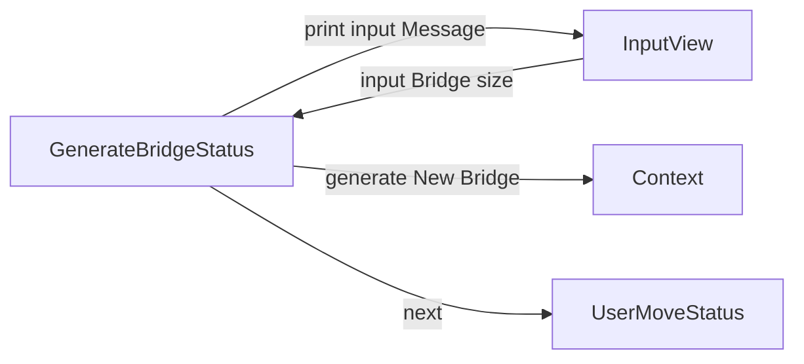
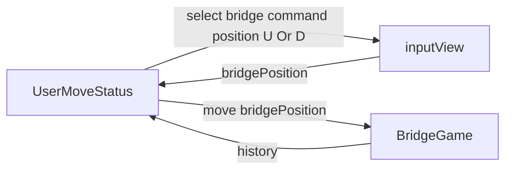

## 세부 진행 흐름

- initStatus



- GameStartStatus



- GenerateBridgeStatus





# 상태별 요구사항

- BridgeGameLauncher
    - 다리 건너기 게임 런처로 게임의 전반적인 실행 흐름을 제어 합니다.
- BridgeGameContext
    - 다리 건너기 게임의 데이터의 제어를 담당합니다.
- View
    - inputView, ouputView에 대한 전달할 책임을 가집니다.
- BridgeGameStatus
    - 다리 건너기 게임의 실행 순서를 제어하는 인터페이스 입니다.
        - InitStatus
            - 게임의 준비 상태입니다.
            - [X] 게임의 준비 상태로 next를 호출하면 다음 단계로 넘어갑니다.
        - GameStartStatus
            - 게임의 시작을 알리는 상태입니다.
            - [X] 게임의 시작 메시지를 출력합니다.
        - GenerateBridgeStatus
            - 다리 건너기 게임의 다리를 만드는 상태입니다.
            - [X] 사용자로 부터 다리의 길이를 입력받습니다.
            - [X] 입력받아진 다리의 길이로 랜덤한 다리를 만듭니다.
        - PlayerUnitMoveStatus
            - 사용자의 장기말이 움직이는 상태입니다.
            - [X] 게임 진행을 하며 실행 가능할때까지 진행하고 이동한 경로를 출력합니다.
            - [X] 클리어 한경우 결과 상태가 됩니다.
            - [X] 클리어 실패 상태의 경우 재시작 여부를 묻는 상태가 됩니다.
        - RestartGameStatus
            - 게임 재시작 상태
            - [X] 게임 재시작 명령어가 입력되면 장기말 이동 상태가 됩니다.
            - [X] 게임 종료 상태면 게임 결과 상태가 됩니다.
        - ResultVerificationStatus
            - 게임 결과 상태
                - [X] 게임 최종 결과를 출력합니다.

## 도메인 요구사항

- BridgeSize
    - [x] [검증] 다리의 길이는 3이상 20이하여야만 합니다.
    - [x] [검증] 다리의 길이는 숫자이 외의 값을 가질 수 없습니다.
    - [x] 다리의 길이는 자신의 값을 전달할 수 있습니다.
- BridgePosition
    - [X] [검증] 1과 0을 제외한 값은 생성될 수 없습니다.
    - [X] 1은 U 0는 B 입니다.
    - [X] code 를 입력받으면 위치 값으로 변경해줍니다.
    - [X] position을 통해서 BridgePosition을 만들 수 있습니다.
- SurviveStatus (생존 여부)
    - [X] O는 생존 성공 상태입니다.
    - [X] X는 생존 실패 상태입니다.
    - [X] 생존 여부를 출력할 수 있습니다.
- History 기록
    - [X] 단계별 진행사항을 기록합니다.
    - [X] 기록한 결과를 출력할 수 있습니다.
- Stage 단계
    - [X] 매 단계를 기록할 수 있습니다.
    - [X] 윗 다리에 대한 결과를 출력할 수 있습니다.
    - [X] 아랫다리에 대한 결과를 출력할 수 있습니다.
- Bridge 다리
    - [X] 생성자를 통해서 문자열로 이루어진 다리가 만들어집니다.
    - [X] 정수를 입력받으면 해당 다리의 위치를 반환합니다.
- BridgeMaker
    - [X] 1과 0이 입력되면 U와 D로 변경합니다.
- RestartCommand
    - 게임의 재시작 혹은 종료에 대한 상태 코드입니다
    - [X] R은 재시작 Q는 종료 상태입니다.
    - [X] [검증] R과 Q가 아닌 값은 가질 수 없습니다.
- GameStatus
    - 게임의 진행 상황을 나타냅니다.
        - [X] 진행 상태와 클리어 상태 실패상태를 가집니다.
        - [X] 게임이 진행중인지 확인할 수 있습니다.

#

## 요구사항 최종 정검

- [ ] 위아래 두 칸으로 다리는 왼쪽에서 오른쪽으로 가도록 구현하였는가
- [ ] 위아래 둘 중 하나의 칸만 건널 수 있도록 구현하였는가
- [ ] 다리의 길이를 숫자로 입력받도록 구현하였는가
- [ ] 다리를 생성할때 위 칸과 아래 중 건널 수 있는 칸은 0과 1중 무작위로 값을 입력받도록 구현하였는가
- [ ] 다리가 생성된 이후에 플레이어가 건널 수 있도록 구현하였는가
- [ ] 이동한 칸을 건널 수 있다면 O로 표시하고 그럴 수 없는 경우는 X로 표시하였는가
- [ ] 다리를 끝까지 건너면 게임이 종료되도록 구현하였느가
- [ ] 다리를 건너다 실패하면 게임을 재시작 하거나 종료할 수 있도록 구현하였는가
- [ ] 재시작을 하여도 처음 만든 다리를 사용하도록 구현하였는가
- [ ] 게임 결과의 총 시도한 횟수는 첫 시도를 포함해 게임을 종료할 때까지 시도한 횟수를 나타내는가
- [ ] 사용자가 잘못된 값을 입력할 경우 IllegalArgumentException을 발생시키고 [ERROR] 로 시작하는 에러 메시지를 출력 한 후 다시 입력받도록 구현하였는가
- [ ] 다리는 3아성 20이하의 숫자를 입력할 수 있도록 구현하였는가
- [ ] 올바른 값이 아니면 예외 처리하도록 구현하였는가
- [ ] 매 라운드마다 플레이어가 이동한 칸을 입력받을 수 있도록 구현하였는가
- [ ] U를 위칸으로 정의했는가
- [ ] D를 아래칸으로 정의했는가
- [ ] U와 D가 아닌 다른 값을 입력받으면 예외를 처리하도록 구현하였는가
- [ ] R을 재시작 Q를 문자열로 입력받을 수 있도록 구현하였는가
- [ ] R과 Q가 아난 다른 값을 입력받으면 에러를 발생시키도록 구현하였는가.
- [ ] 다리의 시작은 ```[``` 다리의 끝은 ```]```으로 표시하였는가
- [ ] 다리 칸의 구분은 |(앞뒤 공백 포함) 문자열로 구분하였는가
- [ ] 현재까지 건넌 다리를 모두 출력하였는가
- [ ] 예외 상황시 에러 문구를 출력하였는가
- [ ] InputView의 클래스를 활요하였는가
- [ ] InputView의 패키지를 변경해서 구현하였는가
- [ ] InputView의 메서드의 시그니처를 변경하지 않았는가
- [ ] InputView의 반환 타입을 변경하였는가
- [ ] OutputView 클래스를 활용하였는가
- [ ] OuputView의 패키지를 변경하였는가
- [ ] OuputView의 메서드의 이름을 변경하지 않았는가
- [ ] OuputView의 인자와 반환 타입은 필요에 따라 추가하거나 변경하였는가
- [ ] 값 출력을 위해 필요한 메서드를 추가하였는가
- [ ] BridgeGame을 활용하여 구현하였는가
- [ ] BridgeGame에 필드를 필요에 의해 추가하였는가
- [ ] BridgeGame의 패키지를 필요에 의해 변경하였는가
- [ ] BridgeGame의 메서드의 이름을 변경하지 않았는가
- [ ] BridgeGamed의 메서드의 인자와 반환 타입을 필요에 따라 변경하거나 추가하였는가
- [ ] BridgeGame의 진행을 위해 필요한 메서드를 추가 하거나 변경하였는가
- [ ] BridgeMaker를 활용하였는가
- [ ] BridgeMaker를 변경하지 않았는가
- [ ] BridgeMaker의 메서드 시그니와 반환 타입을 변경하지 않았는가
- [ ] BridgeRandomNumberGeneratord의 클래스 코드를 변경하지 않았는가
- 