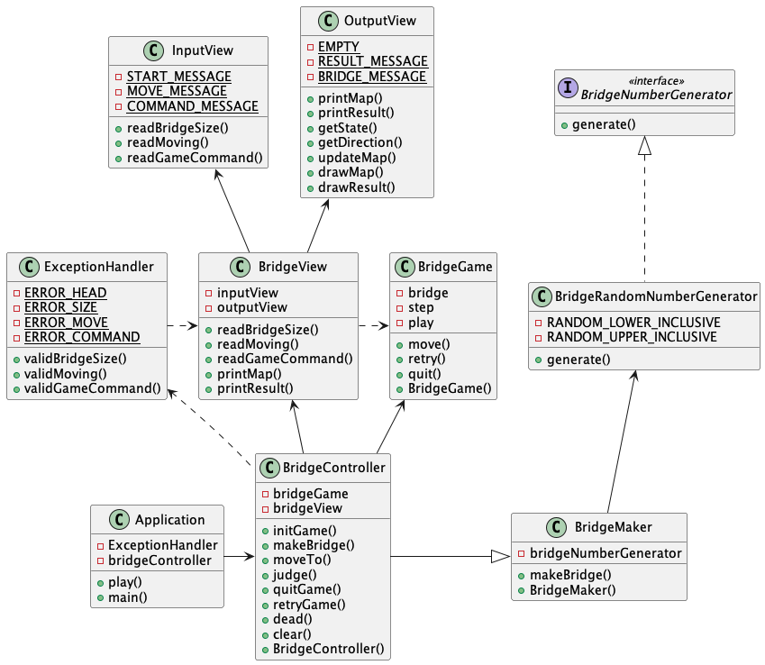

# 🦑 다리 건너기

> ## 🧭 OverView
>
> 
> 
> 아래와 같은 MVC 패턴으로 설계
>
> | Model    |                   View                    |              Controller                |
> ----------|:-----------------------------------------:|:-------------------------------------:|
>  BridgeGame | BridgeView   InputView OutPutView | BridgeController ExceptionHandler| 

>### 🏗 BridgeGame
> * Bridge 관련 정보를 저장하는 모델
>
> 
> ### Method List
> 
>| No. | 함수명    | 기능                                   | 
> -----|:-------|:-------------------------------------|
>  1   | retry()| 재시작                                  |
> | 2   | quit() | 종료                                   |
>| 3   | move() | Controller로부터 전달받은 칸으로 이동            | 

>### 👁 BridgeView
>
> * 입출력을 수행하는 UI
> * **InputView**와 **OutputView**를 상속
> ### Method List
>
>| No.          | 함수명               | 기능                      |   분류   |
>------------|:------------------|:------------------------|:------:|
>1 | readBridgeSize()  | 유저로부터 Bridge의 길이를 입력 받음 | INPUT  |
>2| readMoving()      | 유저로부터 이동할 칸을 입력 받음      | INPUT  |
>3| readGameCommand() | 유저로부터 게임 진행 여부를 입력 받음   | INPUT  |
>4| printMap()        | 현재까지 진행한 Bridge 현황 출력   | OUTPUT |
>5| printResult()     | 최종 결과 출력                | OUTPUT |

>### 🕹 BridgeController
> * Bridge 게임을 진행하는 도메인 로직
> * BridgeGame과 BridgeView를 조작
> * BridgeMaker를 상속
>
> ### Method List
>
>| No.         | 함수명          | 기능             | 
>------------|:-------------|:---------------|
>1 | initGame()   | 게임 시작          | 
>2| makeBridge() | Bridge 제작      |
>3 | playGame()   | 게임 진행          | 
>4| moveTo()     | 다음 칸으로 이동      |
>5| judge()      | 이동한 칸이 유효한지 판정 |
>6| quitGame()   | 게임 종료          | 
>7| retryGame()  | 게임 재시작         | 
>8| dead()       | 빈 칸으로 이동해 사망   | 

>### 💣 ExceptionHandler
> * 예외처리
>
> ### Method List
>
>| No.          | 함수명                   | 기능                       |      대상       |
>------------|:----------------------|:-------------------------|:-------------:|
>1 | validBridgeSize()     | 다리 사이즈가 올바르게 입럭되었는지 검증   | BridgeView #1 |
>2| validMoving()         | 이동 값이 올바르게 입력되었는지 검증     | BridgeView #2 |
>3| validGameController() | 게임 진행 여부가 올바르게 입력되었는지 검증 | BridgeView #3 |

