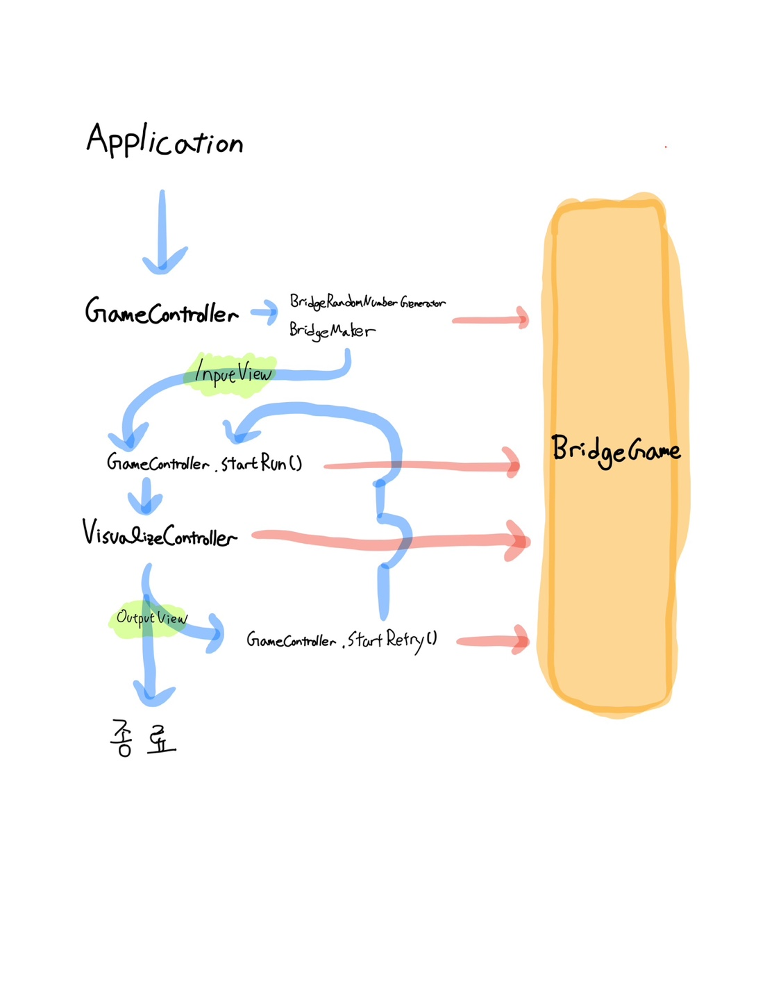

# 🔍다리 건너기 게임

## 📮 게임 소개
과거에 유행했던 드라마 '오징어 게임'의 징검다리와 비슷한 룰을 가진 게임이다.  
다리를 건너갈 때 방향을 잘 선택하여 목표 지점까지 도달하면 게임이 마무리된다.  
방향은 위,아래로 나누어져 있으며 둘 중 한 방향만 선택해서 이동할 수 있다.  
방향을 선택해 이동했을 때, 만약 이동한 지점이 정상인 지점이라면 계속해서 다음 지점으로 이동할 수 있다.  
반대로 잘못된 지점을 선택했을 시 다음 지점으로 이동할 수 없게 되고 처음으로 돌아가 다시 다리를 건너야 한다.  
이동할 다리의 경로는 무작위로 만들어지며 다리의 길이와 이동할 방향은 사용자의 입력을 통해 결정할 수 있다.  
과연 나는 다리를 한 번에 건널 수 있을 것인가?.. 무사히 건널 수 있기를 기대하면서 게임을 한번 시작해 보도록 하자!

---
## 🎯 게임 규칙
1. 건너갈 다리의 길이를 입력한다. 다리의 길이는 3~20 사이에서 선택할 수 있으며 입력받은 만큼의 길이로 무작위 경로 다리를 만들어 낸다.
2. 다리를 건널 때 필요한 이동 방향을 입력한다. 입력은 U(up), D(down) 중에 하나를 선택할 수 있다.
   + 방향을 잘 선택하여 정상인 지점으로 이동했다면 이동 방향을 계속해서 입력받는다. 
   + 무사히 다리를 건넜다면 플레이에 성공했다는 상태와 함께 게임을 종료한다.
3. 만약 잘못된 방향으로 이동해 다리를 건널 수 없게 된다면 진행에 필요한 커맨드를 입력한다. 입력은 R(retry), Q(quit) 중에 하나를 선택할 수 있다.
   + R을 입력받았다면 다리의 처음으로 돌아가 다시 다리를 건너는 과정을 반복한다. 최대 99번까지 재시도를 할 수 있다. 
   + Q를 입력받았다면 플레이에 실패했다는 상태와 함께 게임을 종료한다. 
4. 게임이 종료되었다면 게임의 결과를 확인한다. 결과를 통해 아래 내용을 확인할 수 있다. 
   + 성공, 실패 여부.
   + 지나온 이동 경로.
   + 총 시도 횟수.

---
## 💾 게임 기능에 대한 설명

### 📁 model에 대한 설명.
#### 게임 진행에 필요한 객체들을 담고 있다. Bridge, GameResult, User 세 가지로 나뉜다. 이 객체들은 게임 운영에 필요한 정보들을 저장하는 용도로 사용된다.
+ Bridge : 만들어진 다리의 이동 경로에 대한 정보를 저장해두는 객체이다. 기능 목록은 아래와 같다.
  * 유저가 접근한 지점의 좌표값을 받아 접근 가능한 지점인지 확인해주는 기능.
  * 유저의 이동거리가 다리의 길이보다 작은지 확인해주는 기능.
+ User : 유저의 이동한 경로에 대한 정보를 저장해두는 객체이다. 기능 목록은 아래와 같다.
  * 이동한 지점을 map에 표시해주는 기능.
  * 유저가 이동한 경로를 알려주는 기능.
  * 유저가 이동한 거리를 알려주는 기능. 
+ GameResult : 게임 종료 후 최종 결과를 저장해두는 객체이다. 기능 목록은 아래와 같다.
  * 유저가 이동한 경로를 알려주는 기능.
  * 게임의 성공/실패 여부를 알려주는 기능.
  * 게임의 시도 횟수를 알려주는 기능.

### 📁 controller에 대한 설명.
#### 게임을 운영하는 데 필요한 클래스들을 담고있다. BridgeSystem, GamePlay, BridgeGame, MapConverter 네 가지로 나뉜다. 이 클래스들은 게임 운영에 필요한 흐름을 만들어 내는 역할을 한다.
+ BridgeSystem : 게임을 실행시키는 진입점 역할을 하는 클래스이다. 기능 목록은 아래와 같다.
  * 게임 실행 시 초기 안내 문구를 보여주는 기능.
  * 다리 크기를 입력받아 다리를 만들고 게임 플레이를 진행하는 기능.
  * 게임이 끝나면 최종 게임 결과를 받아 보여주는 기능.
+ GamePlay : 게임의 전반적인 흐름을 관리해주는 클래스이다. 기능 목록은 아래와 같다.
  * 성공하기 전까지 게임 플레이를 시도 가능한 최대 횟수까지 반복시켜주는 기능.
  * 한 번의 게임 플레이를 진행해주는 기능.
+ BridgeGame : 게임 조작에 필요한 기능들을 담고 있는 클래스이다. 기능 목록은 아래와 같다.
  * 입력한 방향에 따라 한 번 이동시켜주고 이동한 지점이 정상인지 확인해주는 기능.
  * 유저의 재시도 입력 커맨드를 확인하여 재시도/종료 여부를 결정해주는 기능.
+ MapConverter : 1차원 배열형태로 되어있는 map을 유저가 보기 편하게 2차원 평면의 map으로 변환해주는 기능을 담고 있는 클래스이다.

### 📁 view에 대한 설명.
#### 게임을 진행하며 발생하는 입,출력들을 처리하기 위한 클래스들을 담고 있다. InputView, OutputView 두 가지로 나뉜다. 이 클래스에는 입,출력과 관련된 모든 안내 문구와 기능들이 들어있다. 
+ InputView : 게임을 진행할 때 필요한 입력들과 입력 안내문을 처리해주는 클래스. 기능 목록은 아래와 같다.
  * 다리의 크기를 입력받는 기능. 3~20 사이의 숫자만 입력받을 수 있도록 하였다.
  * 이동할 방향을 입력받는 기능. U,D 중에서만 입력받을 수 있도록 하였다.
  * 커맨드를 입력받는 기능. R,Q 중에서만 입력받을 수 있도록 하였다.
+ OutputView : 게임을 진행할 때 필요한 출력들과 출력 안내문을 처리해주는 클래스. 기능 목록은 아래와 같다.
  * 유저가 이동한 경로를 2차원 map으로 보여주는 기능.
  * 성공/실패 여부를 알려주는 기능.
  * 시도 가능한 횟수 초과로 게임이 종료됐을시 실패로 처리되며, 결과창의 제일 위에 이에 대한 안내 문구가 나옴.
  * 게임을 몇 번 시도했는지 알려주는 기능.
+ vo : 입력값 포장 역할을 담당하는 객체들이 모여있는 패키지. 객체들의 공통 기능 목록은 아래와 같다.
  * 잘못된 입력값들에 대해 예외를 발생시키는 기능.
  * ★ Size 객체는 입력된 숫자를 정수 자료형으로 바꿔주는 기능도 추가로 담고 있다.

### 📁 exception에 대한 설명.
#### 게임을 진행할 때 발생할 수 있는 예외를 처리하기 위한 클래스를 담고 있다. 클래스에는 발생한 예외에 대한 안내 문구와 예외 처리 기능이 담겨있다.
+ IllegalArgument : 잘못된 입력에 의해 발생한 예외를 처리해주는 클래스. 예외 처리가 되는 조건은 아래와 같다. 
  * 잘못된 다리 길이의 입력이 들어왔을 때.
  * 잘못된 방향 선택 입력이 들어 왔을 때.
  * 잘못된 커맨드 입력이 들어 왔을 때.

### 📁 constants에 대한 설명.
#### 게임을 운영하는 데 필요한 상수들을 저장해둔 클래스들이 담겨 있다. 구조적으로 이해해야 할 부분만 아래 그림을 통해 간단히 소개하도록 하겠다.

+ 입력받은 이동 방향들을 저장한 userMap을 가지고 MapConverter에서 2차원 평면 map을 만들 때, 필요로 되는 데이터에 접근하기 위해 만들어진 Table. 

위 그림처럼 입력받은 이동 방향과 이동한 지점의 접근 가능 여부에 따라 key값을 만들며, 이에 맞는 상숫값(튜플)에 접근할 수 있다.   
하나의 튜플에는 key 값에 따라 필요한 2차원 평면 map 설계 데이터를 담고 있으며, MapConverter는 이 데이터를 이용해 map을 만들어 낸다.

