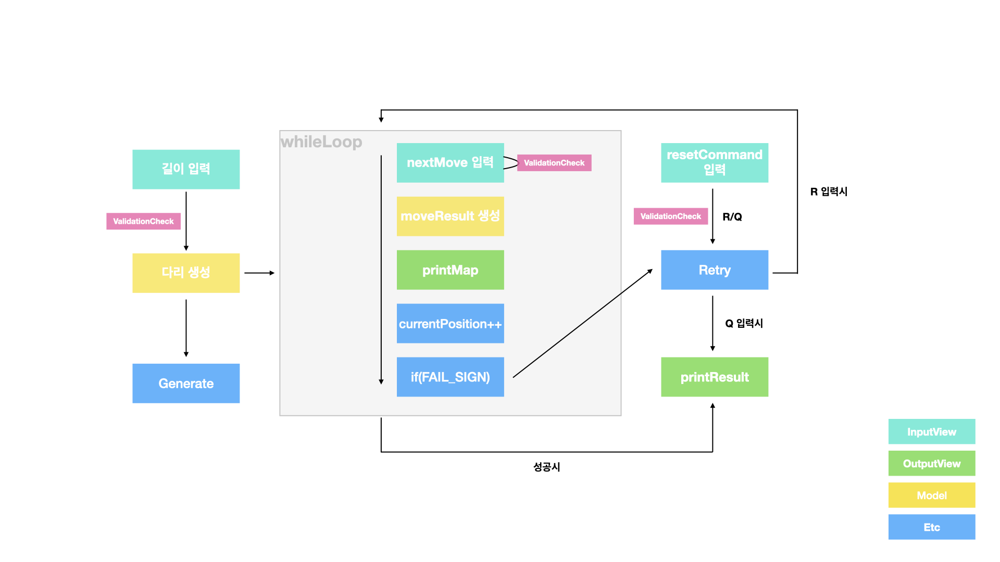
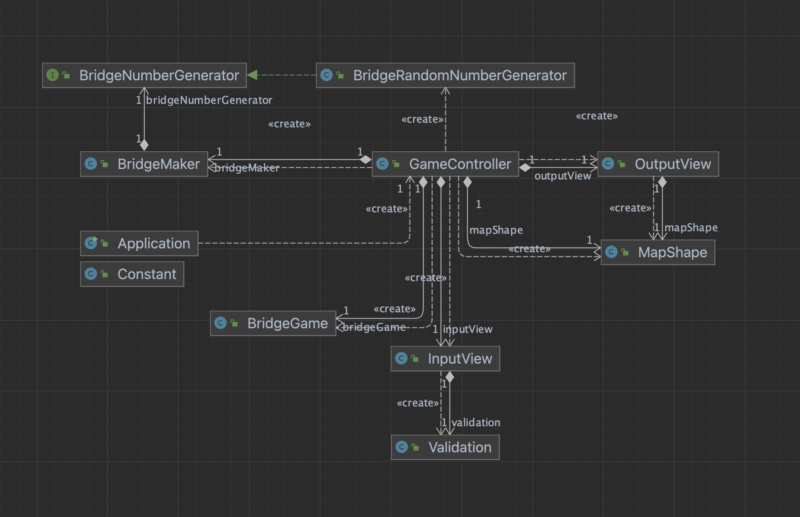

📄 기능 구현 사항
=
1. 길이 입력 및 다리 생성
2. 위 / 아래 선택
3. 결과 출력
4. 실패시 반복 / 종료 선택
    - 종료 선택시 결과 출력
5. 성공시 게임 결과 출력

☑️ 예외 처리 사항
=
1. (다리 길이) 문자가 입력 될 때
2. (다리 길이) 범위를 벗어날 때
3. (위 / 아래) U / D 외에 다른 문자가 입력 될 때
4. (위 / 아래) 숫자가 입력될 때
5. (위 / 아래) 문자열의 길이가 잘못 되었을때 (공백 포함)
6. (반복 / 종료) R / Q 외에 다른 문자가 입력 될 때
7. (반복 / 종료) 숫자가 입력 될 때
8. (반복 / 종료) 문자열의 길이가 잘못 되었을때 (공백 포함)

# 👩‍💻 Flow Chart

# 🧾 Diagram

🤯 예상되는 어려움
=
1. 객체를 객체답게 사용하기
   - 서로의 의존 관계를 확실히 하기
   - getter 남용하지 않기
2. 메서드 길이 10줄 이하
3. 제어 흐름 정돈