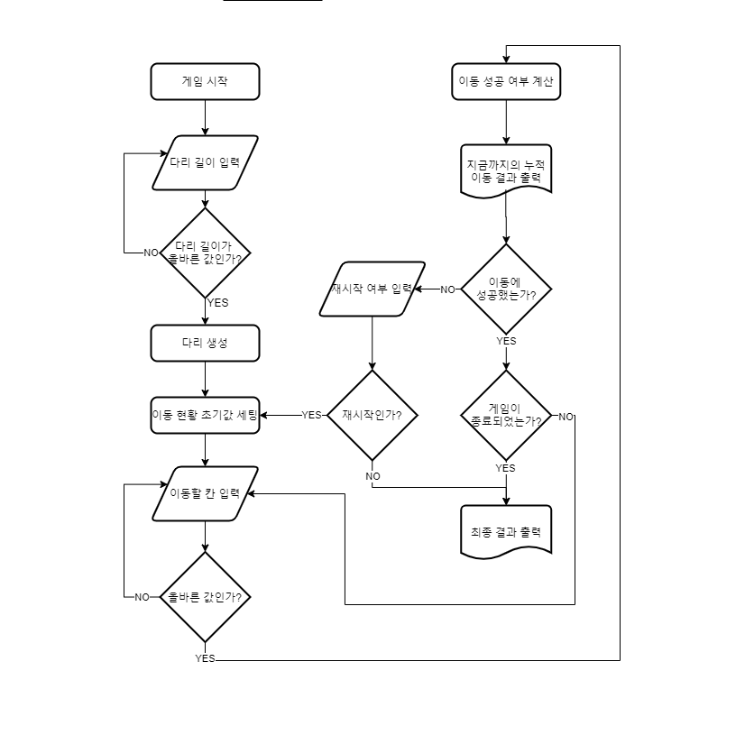
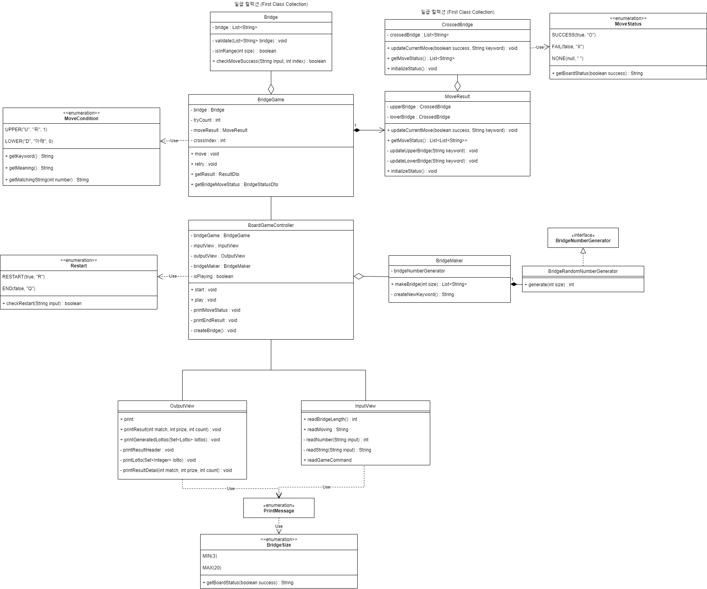

# 프리코스 4주차 미션 - 다리 건너기

## 🚩 구현 목표

- 우아한 테크코스 5기 프리코스 - [다리 건너기](https://github.com/woowacourse-precourse/java-bridge) 미션의 기능 요구 사항, 프로그래밍 요구 사항, 진행 **요구
  사항을 만족시키며 프로그래밍** 한다.
- 초기의 완벽한 설계보다는 구현 후의 **리팩터링**을 목표로 한다. 
- 다양한 케이스의 **단위 테스트**를 작성하여 구현한 기능의 정상 동작을 확인한다.
- **MVC 패턴** 을 적용하여 클래스의 책임을 분리한다.
- **클린 코드 (Clean Code)** 를 적용한다.

## 📄 프로젝트 요약
**플레이어가 위, 아래 두 칸 중 한 칸으로만 건널 수 있는 다리를 건너는 게임이다.**  
<br/>
프로그램의 전반적 진행 흐름은 다음과 같다.
1. 플레이어가 원하는 길이의 다리를 생성한다.
2. 플레이어가 위/아래 중 건널 칸을 선택한다.
3. 입력값에 따라 해당 칸의 성공 여부를 안내한다. 
4. 게임 실패 시, 재시작을 하거나 종료를 선택할 수 있으며 종료의 경우 최종 결과와 함께 시도 횟수를 안내한다.

## ✅ 기능 목록

- [X] 플레이어로부터 생성할 다리의 길이 입력받기
- [X] 다리 생성과 함께 각 칸의 이동 가능한 위치를 **랜덤으로** 결정
- [X] 플레이어로부터 이동할 칸 입력받기
- [X] 이동한 칸의 이동 성공 여부 계산
- [X] 현재 칸 까지의 누적 이동 결과 출력
- [X] 개임 실패, 성공 여부 판단
- [X] 게임 재시작, 종료 여부 판단
- [X] 게임 종료 후 최종 결과 출력
- [X] 플레이어 입력 값 예외 처리
- [X] 예외 및 유의 사항 처리

## 🚨 예외 사항 및 유의 사항

* **예외 사항** - 플레이어 입력
    * 생성할 다리 길이 입력
        * 입력값에 숫자 외의 값이 포함된 경우
        * 입력값이 3 ~ 20 사이의 숫자가 아닌 경우  
          <br/>
    * 이동할 칸 입력
        * 입력값에 알파벳 문자 외의 값이 포함된 경우
        * 입력한 문자가 지정된 문자 (U, D) 가 아닌 경우   
          <br/>
    * 게임 재시작 여부 입력
        * 입력값에 알파벳 문자 외의 값이 포함된 경우
        * 입력한 문자가 지정된 문자 (R, Q) 가 아닌 경우  


* **유의 사항**
    * 게임 재시작
        * 게임 재시작 시, 다리는 **초기 생성했던 다리를** 동일하게 사용한다
        * 재시작 횟수에 따라 시도 횟수가 업데이트 된다
        * 재시작 시 기존에 플레이어가 이동했던 칸의 결과는 모두 초기화 된다  
          <br/>
    * 칸 이동 결과 출력
        * **이번에 이동한 칸 까지** 의 결과만 출력한다
        * 이동 결과는 위 칸과 아래 칸을 모두 표시한다
        * 각 칸은 `{공백}|{공백}` 으로 분리한다  
          <br/>
    * 예외 처리
        * 예외 발생 시, `IllegalArugmentException` 을 발생시킨 후 "[ERROR]" 로 시작되는 예외 문장을 출력한다. 
        * **에러가 발생한 부분을 재입력 받는다** (즉 예외가 발생한 후에도 게임이 진행되어야 한다)
        * `Exception` (모든 예외의 부모 클래스) 가 아닌, 세부 예외 클래스 (`IlleagalArugmentException`)로 에러를 처리해야 한다
        
## Diagram
<details>
<summary>Flow Chart</summary>
<div markdown="1">       



</div>
</details>

<details>
<summary>Class Diagram</summary>
<div markdown="1">       



</div>
</details>


## 📝 커밋 메시지

> Reference : [AngularJS Git Commit Message Coventions](https://gist.github.com/stephenparish/9941e89d80e2bc58a153)

* 커밋 타입
    * feat : 새로운 기능 구현
    * fix  : 버그 수정
    * docs : ReadMe 업데이트
    * style : 포매팅
    * refactor : 리팩토링
    * test : 테스트 구현  
      <br/>
* 커밋 메시지 포맷

```
<커밋 타입>(<수정한 클래스/메서드>): <커밋 내용 요약>
<빈 줄>
<body: 커밋 작업 내용 (변경 사항, 변경 이유)>
<빈 줄>
<footer: 필요시 주요 변경 사항 작성>
```
