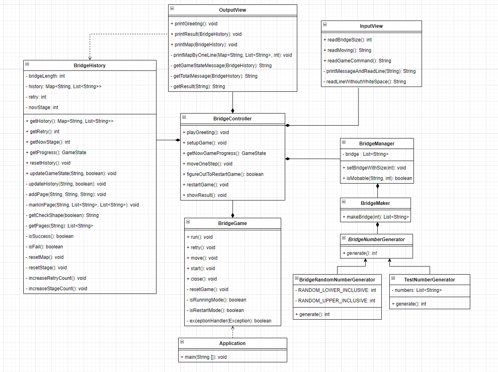

# 미션 - 다리 건너기 기능 리스트

## TOC

<!-- TOC -->

* [미션 - 다리 건너기 기능 리스트](#미션---다리-건너기-기능-리스트)
    * [TOC](#toc)
    * [1. 기능 요구 사항 💻](#1-기능-요구-사항-💻)
    * [2. 기능 리스트 만들기전 숙지 사항 💻](#2-기능-리스트-만들기전-숙지-사항-💻)
        * [설계전 숙지사항](#설계전-숙지사항)
        * [컨벤션 숙지사항](#컨벤션-숙지사항)
        * [테스트 숙지사항](#테스트-숙지사항)
    * [3. 기능 리스트를 만들기전, 메시지를 찾아보자.](#3-기능-리스트를-만들기전-메시지를-찾아보자)
        * [참여자 목록](#참여자-목록)
        * [메시지 리스트](#메시지-리스트)
            * [인사 구간](#인사-구간)
            * [시작 구간](#시작-구간)
            * [게임의 현재 진행상황을 물어보는 구간](#게임의-현재-진행상황을-물어보는-구간))
            * [다리를 건너는 구간 (게임이 종료될 때까지 반복)](#다리를-건너는-구간-게임이-종료될-때까지-반복)
            * [재시작 여부를 물어보는 구간 (건너기 실패의 경우)](#재시작-여부를-물어보는-구간-건너기-실패의-경우)
            * [결과를 보여주는 구간(게임이 종료됐을 경우)](#결과를-보여주는-구간게임이-종료됐을-경우)
    * [4. 기능 리스트](#4-기능-리스트)
        * [Domain](#domain)
        * [Controller](#controller)
        * [View](#view)
        * [Model](#model)
    * [5. 구현 클래스 다이어그램](#5-구현-클래스-다이어그램)

<!-- TOC -->

## 1. 기능 요구 사항 💻

위아래 둘 중 하나의 칸만 건널 수 있는 다리를 끝까지 건너가는 게임이다.

- 위아래 두 칸으로 이루어진 다리를 건너야 한다.
    - 다리는 왼쪽에서 오른쪽으로 건너야 한다.
    - 위아래 둘 중 하나의 칸만 건널 수 있다.
- 다리의 길이를 숫자로 입력받고 생성한다.
    - 다리를 생성할 때 위 칸과 아래 칸 중 건널 수 있는 칸은 0과 1 중 무작위 값을 이용해서 정한다.
    - 위 칸을 건널 수 있는 경우 U, 아래 칸을 건널 수 있는 경우 D값으로 나타낸다.
    - 무작위 값이 0인 경우 아래 칸, 1인 경우 위 칸이 건널 수 있는 칸이 된다.
- 다리가 생성되면 플레이어가 이동할 칸을 선택한다.
    - 이동할 때 위 칸은 대문자 U, 아래 칸은 대문자 D를 입력한다.
    - 이동한 칸을 건널 수 있다면 O로 표시한다. 건널 수 없다면 X로 표시한다.
- 다리를 끝까지 건너면 게임이 종료된다.
- 다리를 건너다 실패하면 게임을 재시작하거나 종료할 수 있다.
    - 재시작해도 처음에 만든 다리로 재사용한다.
    - 게임 결과의 총 시도한 횟수는 첫 시도를 포함해 게임을 종료할 때까지 시도한 횟수를 나타낸다.
- 사용자가 잘못된 값을 입력할 경우 IllegalArgumentException를 발생시키고, "[ERROR]"로 시작하는 에러 메시지를 출력 후 그 부분부터 입력을 다시 받는다.
    - Exception이 아닌 IllegalArgumentException, IllegalStateException 등과 같은 명확한 유형을 처리한다.

## 2. 기능 리스트 만들기전 숙지 사항 💻

### 설계전 숙지사항

- 핵심 로직을 구현하는 코드와 UI를 담당하는 로직을 분리해 구현한다.
- 함수(또는 메서드)가 한 가지 일만 잘하도록 구현한다.
- 아래 있는 InputView, OutputView, BridgeGame, BridgeMaker, BridgeRandomNumberGenerator 클래스의 요구사항을 참고하여 구현한다.
  각 클래스의 제약 사항은 아래 클래스별 세부 설명을 참고한다.
- 이외 필요한 클래스(또는 객체)와 메서드는 자유롭게 구현할 수 있다.
- InputView 클래스에서만 camp.nextstep.edu.missionutils.Console 의 readLine() 메서드를 이용해 사용자의 입력을 받을 수 있다.
- BridgeGame 클래스에서 InputView, OutputView 를 사용하지 않는다.
- 핵심 로직을 구현하는 코드와 UI를 담당하는 로직을 분리해 구현한다.
- 객체의 상태를 보기 위한 로그 메시지 성격이 강하다면 toString을 통해 구현한다.
- View에서 사용할 데이터라면, getter 메서드를 통해 데이터를 전달한다.
- 연관성이 있는 상수는 static fianl 대신 enum을 활용한다.

### 컨벤션 숙지사항

- 함수(또는 메서드)의 길이가 10라인을 넘어가지 않도록 구현한다.
- 메서드의 파라미터 개수는 최대 3개까지만 허용한다.
- else, switch/case를 사용하지 않는다.
- 3항 연산자를 쓰지 않는다.
- indent 는 2까지만 허용한다.

### 테스트 숙지사항

- 성공하는 케이스 뿐만 아니라 예외에 대한 케이스도 테스트한다
- 테스트 코드도 코드이므로 리팩터링을 통해 개선해나가야 한다.
- 반복적으로 하는 부분을 중복되지 않게 만들어야 한다.
- 테스트를 위한 편의 메서드를 구현 코드에 구현하지 마라.

## 3. 기능 리스트를 만들기전, 메시지를 찾아보자.

> 메시지 목록을 작성한 이후, 기능 리스트를 작성한다. 이후에 각 메시지 별로 대응되는 인터페이스를 대입시켜보자.

### 참여자 목록

- `다리 게임`
- `다리 매니저`
- `다리 게임 도우미`
- `다리 게임 기록`
- `다리 생성기`
- `난수 생성기`
- `UI`

### 메시지 리스트

> 후자 객체의 인터페이스가 생긴다. 메시지를 요청받을 적절한 객체를 찾지 못했다면, 참여자 목록을 다시 한번 살펴보고 새로운 등장인물이 나와야하는 지 고민하자.

#### 인사 구간

1. `게임`은 `게임 도우미`에게 인사를 하라고 요청한다. `BridgeController#playGreeting`
2. `게임 도우미`는 `UI`에게 인사말을 출력하라 요청한다.`OutputView#printGreeting`

#### 시작 구간

1. `게임`은 `게임 도우미`에게 게임의 시작 준비를 요청한다. `BridgeController#setupGame`
2. `게임 도우미`는 다리의 사이즈를 알기 위해서 `UI`에게 입력을 받아오라고 요청한다. `InputView#readBridgeSize`
3. `게임 도우미`는 `다리 매니저`에게 다리를 준비하라고 요청한다.  `BridgeManager#setBridgeWithSize`
4. `다리 매니저`는 `다리 생성기`에게 다리를 제작하라고 요청한다. `BridgeMaker#makeBridge`
5. `다리 생성기`는 `난수 생성기`에게 다리의 사이즈 만큼 난수를 요청한다. `BridgeRandomNumberGenerator#generate`

#### 게임의 현재 진행상황을 물어보는 구간

1. `게임`은 진행 플로우를 결정하기 위해서 `게임 도우미`에게 다리 건너기 게임의 현재 상태를 요청한다. `BridgeController#getNowGameProgress`
2. `게임 도우미`는 `게임 기록`에게 현재 게임 진행상황을 요청한다. `BridgeHistory#getProgress`

#### 다리를 건너는 구간 (게임이 종료될 때까지 반복)

1. `게임`은 `게임 도우미`에게 다리 건너기를 요청한다. `BridgeController#moveOneStep`
2. `게임 도우미`는 (위 아래 중) 어디로 이동할지 알기 위해서 `UI`에게 사용자 입력을 받아오라고 요청한다. `InputView#readMoving`
3. `게임 도우미`는 `다리 매니저`에게 사용자가 가고 싶은 곳을 건널 수 있는 지 판별하라고 요청한다. `BridgeManager#isMovable`
4. `게임 도우미`는 `게임 기록`에게 현재 게임의 상태를 갱신하라고 요청한다. `BridgeHistory#updateGameState`
5. `게임 도우미`는 `UI`에게 다리를 건넌 기록을 출력하라고 요청한다. `OutputView#printMap`

#### 재시작 여부를 물어보는 구간 (건너기 실패의 경우)

1. `게임`은 사용자가 다리 건너기 게임을 다시 진행할지 알기 위해서 `게임 도우미`에게 요청한다. `BridgeController#figureOutToRestartGame`
2. `게임 도우미`는 게임을 다시 진행할지, 아니면 종료할지 알기위해서 `UI`에게 사용자 입력을 받아오라고 요청한다.`InputView#readGameCommand`
3. `게임 도우미`는 `게임 기록`에게 현재 게임의 상태를 갱신하라고 요청한다. `BridgeHistory#updateGameState`

#### 결과를 보여주는 구간(게임이 종료됐을 경우)

1. `게임`은 사용자의 게임 결과를 보여주기 위해서 `게임 도우미`에게 요청한다. `BridgeController#showResult`
2. `게임 도우미`는 `UI`에게 게임의 결과를 출력하라고 요청한다. `OutputView#printResult`

## 4. 기능 리스트

> 설계를 간단히 끝내고 최대한 빨리 구현에 돌입하라. 머릿 속에 객체의 협력 구조가 번뜩인다면 그대로 코드를 구현하기 시작하라.
> 설계가 제대로 그려지지 않는다면 고민하지 말고 실제로 코드를 작성해가면서 협력의 전체적인 밑그림을 그려보라.

### Domain

- BridgeManager
    - [ ✔ ] 다리를 준비한다. `BridgeManager#setBridgeWithSize`
    - [ ✔ ] 사용자가 가고 싶은 곳이 지나갈 수 있는지 판별한다. `BridgeManager#isMovable`

- BridgeMaker
    - [ ✔ ] 다리를 생성한다. `BridgeMaker#makeBridge`

- BridgeRandomNumberGenerator
    - [ ✔ ] 난수를 생성한다. `BridgeRandomNumberGenerator#generate`

- BridgeGame
    - [ ✔ ] 게임을 시작한다. `BridgeGame#run`
    - [ ✔ ] 다리를 건넌다. `BridgeGame#move`
    - [ ✔ ] 다리를 건너다 실패하면 게임을 재시작할 수 있다. `BridgeGame#retry`
    - [ ✔ ] 인사 기능을 수행한다 `BridgeGame#start`
    - [ ✔ ] 게임이 종료되면 결과를 출력한다. `BridgeGame#close`

### Controller

- BridgeController
    - [ ✔ ] 인사말을 출력하도록 제어한다. `BridgeController#playGreeting`
    - [ ✔ ] 게임 시작 준비를 한다. `BridgeController#setupGame`
    - [ ✔ ] 게임 진행 여부를 파악한다. `BridgeController#getNowGameProgress`
    - [ ✔ ] 다리 건너기를 수행한다. `BridgeController#moveOneStep`
    - [ ✔ ] 재시작 여부를 파악한다. `BridgeController#figureOutToRestartGame`
    - [ ✔ ] 사용자에게 결과를 보여준다. `BridgeController#showResult`
    - [ ✔ ] 게임을 재시작한다. `BridgeController#restartGame`

### View

- InputView
    - [ ✔ ] 다리의 크기를 입력받는다. `InputView#readBridgeSize`
    - [ ✔ ] 어디로 이동할지 입력받는다. `InputView#readMoving`
    - [ ✔ ] 재시작 여부를 입력받는다. `InputView#readGameCommand`

- OutputView
    - [ ✔ ] 시작 메시지를 출력한다. `OutputView#printGreeting`
    - [ ✔ ] 다리를 출력한다. `OutputView#printMap`
    - [ ✔ ] 게임의 결과를 출력한다. `OutputView#printResult`

### Model

- BridgeHistory
    - [ ✔ ] 현재 게임의 진행상태를 알려준다. `BridgeHistory#getProgress`
    - [ ✔ ] 현재 게임의 상태를 갱신한다. `BridgeHistory#updateGameState`
    - [ ✔ ] 현재 게임의 상태를 초기화한다. `BridgeHistory#resetHistory`
    - [ ✔ ] 현재 게임의 스테이지를 알려준다. `BridgeHistory#getNowStage`
    - [ ✔ ] 게임의 재시작 횟수를 알려준다. `BridgeHistory#getRetry`
    - [ ✔ ] 게임의 기록을 알려준다. `BridgeHistory#getHistory`

## 5. 구현 클래스 다이어그램

  

