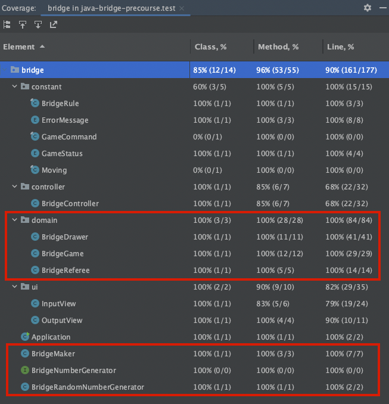

# 프로그램 설명
### 기능 설명
>- 위아래 둘 중 하나의 칸만 건널 수 있는 다리를 끝까지 건너가는 게임이다.
>- 사용자의 입력을 통해 다리의 길이를 결정한다.
>- 위 칸과 아래 칸 중 이동할 칸을 결정한다.
>- 이동에 실패한 경우 재시작할 수 있다.
>- 재시작하는 경우, 동일한 다리의 처음으로 돌아간다.
>- 끝까지 이동하거나 이동 실패 후 재시작하지 않은 경우, 최종 결과를 출력하고 게임을 종료한다.
>- 자세한 기능에 대한 설명은, 루트 디렉토리의 `README.md` 파일을 참고한다.

### 구현 코드 내 용어 설명
>- Bridge : 게임 진행에 사용되는 다리. 위아래 둘 중 하나의 칸만 건널 수 있음.
>- Moving : 위아래 둘 중 하나를 나타내는 방향값.
>- GameCommand : 게임 재시작 여부를 나타내는 값.
>- Sketch : 현재 다리 이동 현황을 그림으로 표현하는 문자열.

### 특이사항
>- 규칙(다리 길이 제한, 이동 방향 및 게임 재시작 여부 입력값) 변경 시, 도메인 로직 변경 없이 상수만 수정하면 됩니다.
>  - --> (일부 테스트 코드 수정 필요)
---

# 도메인 모델링

>- BridgeController : 다리 생성과 게임 진행 동작(이동, 재시작)을 요청
>- BridgeMaker : 규격에 맞는 다리를 생성
>- BridgeNumberGenerator : 다리 생성에 필요한 숫자를 생성
>- BridgeGame : 게임 진행 동작(이동, 재시작)을 수행
>- BridgeReferee : 이동 결과, 게임 성공 여부를 판단
>- BridgeDrawer : 화면(콘솔) 출력 용 다리 이동 현황 기록
---

# 기능 구현 목록

## UI
### InputView
- [x] 다리 길이 입력
  - [x] 다리 길이 자료형 변환 
  - [x] 예외 처리
- [x] 이동할 방향(moving) 입력
- [x] 게임 재시작 여부(game command) 입력

### OutputView
- [x] 게임 시작 안내
- [x] 다리 이동 현황 출력
- [x] 최종 게임 결과 출력
- [x] 게임 종료 안내
---

## Controller
### BridgeController
- [x] 게임 시작
  - [x] 다리 게임 생성
  - [x] 한 턴의 이동 요청
    - [x] 실패 확인
      - [x] 재시작 요청
  - [x] 최종 결과 출력 요청
---

## Domain
### BridgeMaker
- [x] 다리 생성

### BridgeRandomNumberGenerator
- [x] 랜덤 숫자 생성 (기작성된 코드)

### BridgeGame
- [x] 한 턴의 이동
- [x] 재시작 여부 판단 및 처리
  - [x] 재시작
- [x] 성공 여부 확인
- [x] 게임 상태 확인
  - [x] 진행 중인지 확인
  - [x] 실패 상태인지 확인
  - [x] 종료 상태인지 확인
- [x] 이동 현황 반환
- [x] 총 시도한 횟수 반환
- [x] 예외 처리
  - [x] 이동할 방향(moving)
  - [x] 게임 재시작 여부(game command)

### BridgeReferee
- [x] 이동 결과 판단 후 게임 상태 반환
  - [x] 이동 방향이 해당 위치에서의 옳은 방향이 맞는지 확인
- [x] 다리 건너기 성공 여부 반환
- [x] 위치 초기화

### BridgeDrawer
- [x] 한 턴의 이동에 대한 현황 기록
  - [x] 괄호 열기
  - [x] 괄호 닫기
  - [x] "|" 추가를 위해 공백으로 끝나는지 확인
  - [x] "|" 추가
  - [x] 한 줄의 마지막 인덱스 반환
  - [x] 실패한 이동 기록
  - [x] 성공한 이동 기록
- [x] 이동 현황 반환
- [x] 이동 현황 초기화
---

## Constant
### (enum) GameStatus : 게임 진행 상황
- [x] 구현하기

### Moving : 이동 방향
- [x] 구현하기

### GameCommand : 게임 재시작 여부
- [x] 구현하기

### (enum) ErrorMessage : 에러 메시지
- [x] 구현하기

### BridgeRule : 다리 게임 규칙 관련 수
- [x] 구현하기
- [x] 랜덤 숫자를 이동 방향 값으로 변환
---

## Test
- [x] 도메인 로직 단위 테스트 작성 완료

>- BridgeController의 단위 테스트는 Application의 통합 테스트로 대체했습니다.
>  - --> BridgeController의 유일한 public 메서드가 Application에서 호출됩니다.
---

# 프로그램 실행 예시
### 예시 1) 1회 실패 후 성공하는 경우
```
다리 건너기 게임을 시작합니다.

다리의 길이를 입력해주세요.
3

이동할 칸을 선택해주세요. (위: U, 아래: D)
U
[ O ]
[   ]

이동할 칸을 선택해주세요. (위: U, 아래: D)
U
[ O | X ]
[   |   ]

게임을 다시 시도할지 여부를 입력해주세요. (재시도: R, 종료: Q)
R
이동할 칸을 선택해주세요. (위: U, 아래: D)
U
[ O ]
[   ]

이동할 칸을 선택해주세요. (위: U, 아래: D)
D
[ O |   ]
[   | O ]

이동할 칸을 선택해주세요. (위: U, 아래: D)
D
[ O |   |   ]
[   | O | O ]

최종 게임 결과
[ O |   |   ]
[   | O | O ]

게임 성공 여부: 성공
총 시도한 횟수: 2
```

### 예시 2) 1회 실패 후 종료하는 경우
```
다리 건너기 게임을 시작합니다.

다리의 길이를 입력해주세요.
3

이동할 칸을 선택해주세요. (위: U, 아래: D)
U
[ O ]
[   ]

이동할 칸을 선택해주세요. (위: U, 아래: D)
U
[ O | X ]
[   |   ]

게임을 다시 시도할지 여부를 입력해주세요. (재시도: R, 종료: Q)
Q
최종 게임 결과
[ O | X ]
[   |   ]

게임 성공 여부: 실패
총 시도한 횟수: 1
```
---