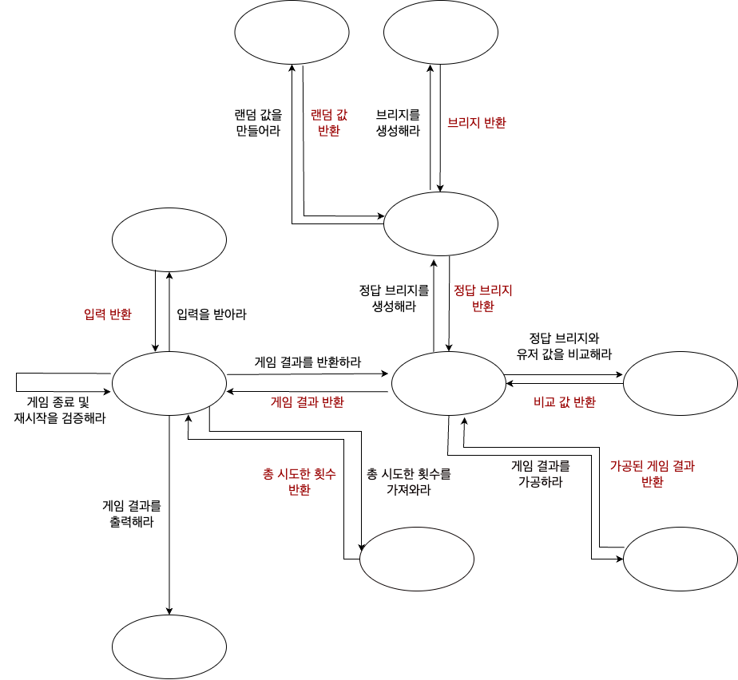

### - 메세지 다이어그램 고안 

    

---
### - 기능 목록

- 입력
> [기능] 다리 길이를 입력받는 기능  
> [기능] 플레이어가 이동할 칸을 입력받는 기능  
> [기능] 게임 재시작 및 종료 여부를 입력받는 기능  

- 출력
> [기능] 게임 시작 문구를 출력하는 기능  
> [기능] 게임 진행 문구를 출력하는 기능   
> [기능] 게임 종료 문구를 출력하는 기능  
> [기능] 게임 성공 여부를 출력하는 기능  
> [기능] 총 시도한 횟수를 출력하는 기능  
> [기능] 브리지 상태를 출력하는 기능  

- 도메인
> [기능] 게임 결과를 반환하는 기능  
> [기능] 총 시도한 횟수를 저장하는 기능  
> [기능] 총 시도한 횟수를 반환하는 기능  
> [기능] 정답 브리지를 생성하는 기능  
> [기능] 브리지를 생성하는 기능  
> [기능] 유저 입력 정보를 저장하는 기능  
> [기능] 유저 입력 정보를 초기화하는 기능  
> [기능] 유저 입력 정보를 통해 게임 결과를 만들어내는 기능  
> [기능] 랜덤 값을 만들어내는 기능  
> [기능] 정답 브리지와 유저 값을 비교하는 기능  
> [기능] 게임 결과를 적당한 형태로 가공하는 기능  
> [기능] 게임을 재시작하는 기능   
> [기능] 게임 종료를 검사하는 기능  

- 예외
> [예외] 다리 길이가 3 이상 20 이하의 수가 아닐 때  
> - 다리 길이가 정수형의 범위를 넘는지 체크하는 기능  
> - 다리 길이가 3 이상 20 이하의 수가 아닌지 체크하는 기능  
>
> [예외] 이동할 칸이 U 혹은 D가 아닐 때  
> [예외] 게임 재시작/종료 여부가 R 혹은 Q가 아닐 때  